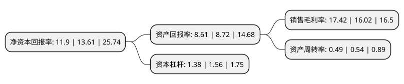

> 本页面由自动化程序生成于 2022年5月20日 01:28
> 内容可能存在错误，如有bug请提交issue至：https://github.com/Eroleice/doc-pi/issues
{.is-warning}

# 上市公司基本情况

## 基本资料

中国船舶重工集团海洋防务与信息对抗股份有限公司（以下简称“中国海防”）成立于1993年11月18日，北京市。于1996年11月04日在上交所主板上市。

中国海防注册资本71,062.939万元，各类军民用水声信息传输装备，水下武器系统专项设备等军品领域产品，以及压载水电源等民品领域产品。以下是详细信息：

- 公司名称: 中国船舶重工集团海洋防务与信息对抗股份有限公司
- 股票代码: 600764.SH
- 所在地: 北京 - 北京市
- 成立日期: 1993年11月18日
- 注册资本: 71,062.939万元
- 法定代表人: 范国平
- 主营业务: 各类军民用水声信息传输装备，水下武器系统专项设备等军品领域产品，以及压载水电源等民品领域产品
- 公司官网: www.cmie.csic.com.cn
- 公司介绍: 公司原是一家电子行业类高科技公司，以集成电路(IC)卡及模块封装、计算机系统集成与分销业务为主.2017年通过重大资产重组,公司置出原有资产和负债,并置入长城电子100%股权.长城电子是国内水声信息传输装备的专业科研生产企业，是海军军用通信声纳装备的核心供应商。多年来，长城电子相继承担了水声信息传输技术领域多项国防重点工程的型号研制任务，在设计、生产、测试、试验等方面有深厚的技术储备。

## 股东及高管情况

上市公司第一大股东为中国船舶重工集团有限公司，持股329,032,461股，占比46.3%，为上市公司实际控制人。

截至2022年03月31日，上市公司的前十大股东中，共有7名机构股东，3个产品账户，其中5%以上大股东共有3名。上市公司前十大股东明细如下：

> 截至2022年03月31日，上市公司前十大股东信息如下：

| 股东名称 | 持股数量（股） | 持股比例 |
| --- | --- | --- |
| 中国船舶重工集团有限公司 | 329,032,461 | 46.3% |
| 中国船舶重工集团公司第七一五研究所 | 54,028,216 | 7.6% |
| 江苏杰瑞科技集团有限责任公司 | 49,896,152 | 7.02% |
| 国新投资有限公司 | 30,269,058 | 4.26% |
| 中国船舶重工集团投资有限公司 | 26,355,612 | 3.71% |
| 国家军民融合产业投资基金有限责任公司 | 26,130,533 | 3.68% |
| 国新央企运营投资基金管理(广州)有限公司-国新央企运营(广州)投资基金(有限合伙) | 15,797,832 | 2.22% |
| 中国国有资本风险投资基金股份有限公司 | 14,583,717 | 2.05% |
| 中国船舶重工集团公司第七二六研究所 | 10,944,430 | 1.54% |
| 中国船舶重工集团公司第七一六研究所 | 5,253,399 | 0.74% |

## 利润表分析

上市公司2021年总收入为48.74亿元，净利润为8.48亿元，实现盈利。

## 杜邦分析

> 数据列示周期：2021年 | 2020年 | 2019年
{.is-info}

上市公司的净资产收益率在近一年有所下降，下降幅度为-12.56%，其变化情况分解如下：
- 上市公司的销售毛利率在近一年上升了8.74%，可能是生产效率的提升、商品原材料价格下跌或商品价格的上涨所致。
- 上市公司的资产周转率在近一年下降了-9.26%，可能是源自于更慢的销售回款或库存管理效果下降。
- 上市公司的财务杠杆比率在近一年下降了-11.54%，可能是减少负债降低财务费用。

