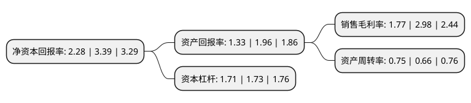

> 本页面由自动化程序生成于 2022年5月20日 01:28
> 内容可能存在错误，如有bug请提交issue至：https://github.com/Eroleice/doc-pi/issues
{.is-warning}

# 上市公司基本情况

## 基本资料

南京熊猫电子股份有限公司（以下简称“南京熊猫”）成立于1992年04月29日，南京市。于1996年11月18日在上交所主板上市。

南京熊猫注册资本91,383.853万元，主要产品:移动通信产品，卫星通信产品，机电仪产品，电子信息产品。以下是详细信息：

- 公司名称: 南京熊猫电子股份有限公司
- 股票代码: 600775.SH
- 所在地: 江苏 - 南京市
- 成立日期: 1992年04月29日
- 注册资本: 91,383.853万元
- 法定代表人: 夏德传
- 主营业务: 主要产品:移动通信产品，卫星通信产品，机电仪产品，电子信息产品
- 公司官网: www.panda.cn
- 公司介绍: 公司以智能制造、智慧城市和电子制造服务为主业，大力发展智能制造核心装备和智能工厂系统集成业务；大力发展智能交通、平安城市、智能建筑和信息网络设备这四大核心智慧城市业务；大力发展具有一流的供应链管理能力和能够实现智能化、柔性化、精益化生产制造的电子制造服务业务。公司积极开展国际合作，与瑞典爱立信等建立了多家知名合资企业。公司构建了完整的技术创新体系，建成1个国家级研发中心、8个省级研发中心，科研开发水平居全国领先地位。公司通过ISO-9001认证，建立了完整的质量管理体系和先进的企业管理信息系统。公司承担多个国家重点工程项目，多次荣获国家科学技术进步奖、江苏省人民政府科学技术奖等奖项。公司是国家工商局公示的“守合同、重信用”企业和江苏省优秀企业。公司所属主要子企业均被认定为高新技术企业或软件企业。

## 股东及高管情况

上市公司第一大股东为香港中央结算(代理人)有限公司，持股244,390,901股，占比26.74%，**疑似为**上市公司实际控制人。

截至2022年03月31日，上市公司的前十大股东中，共有4名自然人股东，4名机构股东，2个海外主体，其中5%以上大股东共有5名。上市公司前十大股东明细如下：

> 未能通过持股比例判定出上市公司实际控制人（持股30%以上）
> 可能存在通过间接持股、联合持股、协议控制等方式拥有实际控制权的主体，具体请参考上市公司定期公告！
{.is-warning}

> 截至2022年03月31日，上市公司前十大股东信息如下：

| 股东名称 | 持股数量（股） | 持股比例 |
| --- | --- | --- |
| 香港中央结算(代理人)有限公司 | 244,390,901 | 26.74% |
| 香港中央结算(代理人)有限公司 | 244,055,983 | 26.71% |
| 熊猫电子集团有限公司 | 210,661,444 | 23.05% |
| 中国华融资产管理股份有限公司 | 52,155,524 | 5.7073% |
| 中国华融资产管理股份有限公司 | 52,155,524 | 5.71% |
| 国新投资有限公司 | 21,720,941 | 2.38% |
| 吕平 | 9,386,600 | 1.03% |
| 林加团 | 6,150,292 | 0.67% |
| 张德胜 | 5,466,582 | 0.6% |
| 李蓉 | 3,143,559 | 0.34% |

## 利润表分析

上市公司2021年总收入为45.31亿元，净利润为0.8亿元，实现盈利。

## 杜邦分析

> 数据列示周期：2021年 | 2020年 | 2019年
{.is-info}

上市公司的净资产收益率在近一年有所下降，下降幅度为-32.74%，其变化情况分解如下：
- 上市公司的销售毛利率在近一年下降了-40.6%，可能是生产效率的下降、商品原材料价格上涨或商品价格的下跌所致。
- 上市公司的资产周转率在近一年上升了13.64%，可能是源自于更快的销售回款或库存管理效果提升。
- 上市公司的财务杠杆比率在近一年下降了-1.16%，可能是减少负债降低财务费用。

