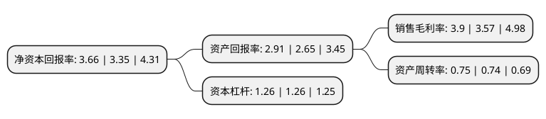

> 本页面由自动化程序生成于 2022年5月20日 01:28
> 内容可能存在错误，如有bug请提交issue至：https://github.com/Eroleice/doc-pi/issues
{.is-warning}

# 上市公司基本情况

## 基本资料

东方通信股份有限公司（以下简称“东方通信”）成立于1996年08月01日，杭州市。于1996年11月26日在上交所主板上市。

东方通信注册资本125,600.006万元，主要业务:移动通信业务，传输设备业务，IC卡话机业务，电信及电源设备业务。以下是详细信息：

- 公司名称: 东方通信股份有限公司
- 股票代码: 600776.SH
- 所在地: 浙江 - 杭州市
- 成立日期: 1996年08月01日
- 注册资本: 125,600.006万元
- 法定代表人: 郭端端
- 主营业务: 移动通信业务，传输设备业务，IC卡话机业务，电信及电源设备业务
- 公司官网: www.eastcom.com
- 公司介绍: 公司是一家集通信和金融电子网络于一体的行业应用整体解决方案提供商。公司致力于技术积累与持续创新，在金融电子、无线集群通信、通信增值业务、电子制造与网络服务等领域都确立了全面专业的领先覆盖及融合优势。目前公司的产品和解决方案已经应用于全球多个国家与地区，通过全方位的专业信息网络服务，有效支持全球不同客户的差异化需求以及不断创新的追求。公司拥有国家级企业技术中心和博士后工作站，承担着多项国家重点研发项目，并多次获得国家科技进步奖。公司在科技创造价值，共筑美好生活的使命下，坚持诚信、务实、创新、共赢，致力于为客户提供优质的产品、便利的体验、完美的方案和满意的服务，致力于成为在国际市场中拥有优势品牌、持续创新和发展的领先企业。

## 股东及高管情况

上市公司第一大股东为普天东方通信集团有限公司，持股545,615,552股，占比43.4407%，为上市公司实际控制人。

截至2022年03月31日，上市公司的前十大股东中，共有2名自然人股东，2名机构股东，2个产品账户，4个海外主体，其中5%以上大股东共有2名。上市公司前十大股东明细如下：

> 截至2022年03月31日，上市公司前十大股东信息如下：

| 股东名称 | 持股数量（股） | 持股比例 |
| --- | --- | --- |
| 普天东方通信集团有限公司 | 545,615,552 | 43.4407% |
| 中电科东方通信集团有限公司 | 545,615,552 | 43.4407% |
| VANGUARD TOTAL INTERNATIONAL STOCK INDEX FUND | 4,633,259 | 0.3689% |
| NOMURA SINGAPORE LIMITED | 4,262,206 | 0.3393% |
| 香港中央结算有限公司(陆股通) | 4,143,114 | 0.3299% |
| NORGES BANK | 2,935,960 | 0.2338% |
| 殷浩 | 2,909,601 | 0.2317% |
| 银华基金-农业银行-银华中证金融资产管理计划 | 2,543,700 | 0.2025% |
| 周晓萍 | 2,458,700 | 0.1958% |
| 中国农业银行股份有限公司-中证500交易型开放式指数证券投资基金 | 2,346,988 | 0.1869% |

## 利润表分析

上市公司2021年总收入为30.37亿元，净利润为1.18亿元，实现盈利。

## 杜邦分析

> 数据列示周期：2021年 | 2020年 | 2019年
{.is-info}

上市公司的净资产收益率在近一年有所上升，上升幅度为9.25%，其变化情况分解如下：
- 上市公司的销售毛利率在近一年上升了9.24%，可能是生产效率的提升、商品原材料价格下跌或商品价格的上涨所致。
- 上市公司的资产周转率在近一年上升了1.35%，可能是源自于更快的销售回款或库存管理效果提升。
- 上市公司的财务杠杆比率在近一年下降了0%，可能是减少负债降低财务费用。

