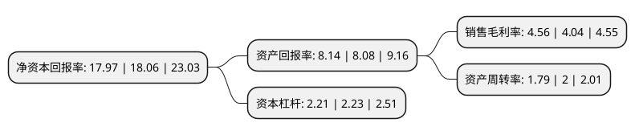

> 本页面由自动化程序生成于 2022年5月20日 01:30
> 内容可能存在错误，如有bug请提交issue至：https://github.com/Eroleice/doc-pi/issues
{.is-warning}

# 上市公司基本情况

## 基本资料

富士康工业互联网股份有限公司（以下简称“工业富联”）成立于2015年03月06日，深圳市。于2018年06月08日在上交所主板上市。

工业富联注册资本1,986,510.401万元，主要从事各类电子设备产品的设计，研发，制造与销售业务，依托于工业互联网为全球知名客户提供智能制造和科技服务解决方案。公司主要产品涵盖通信网络设备，云服务设备，精密工具和工业机器人。以下是详细信息：

- 公司名称: 富士康工业互联网股份有限公司
- 股票代码: 601138.SH
- 所在地: 广东 - 深圳市
- 成立日期: 2015年03月06日
- 注册资本: 1,986,510.401万元
- 法定代表人: 李军旗
- 主营业务: 主要从事各类电子设备产品的设计，研发，制造与销售业务，依托于工业互联网为全球知名客户提供智能制造和科技服务解决方案公司主要产品涵盖通信网络设备，云服务设备，精密工具和工业机器人
- 公司官网: www.fii-foxconn.com
- 公司介绍: 公司是全球领先的通信网络设备、云服务设备、精密工具及工业机器人专业设计制造服务商，为客户提供以工业互联网平台为核心的新形态电子设备产品智能制造服务。公司致力于为企业提供以自动化、网络化、平台化、大数据为基础的科技服务综合解决方案，引领传统制造向智能制造的转型；并以此为基础构建云计算、移动终端、物联网、大数据、人工智能、高速网络和机器人为技术平台的“先进制造+工业互联网”新生态。公司主要从事各类电子设备产品的设计、研发、制造与销售业务，依托于工业互联网为全球知名客户提供智能制造和科技服务解决方案。公司主要产品涵盖通信网络设备、云服务设备、精密工具和工业机器人。相关产品主要应用于智能手机、宽带和无线网络、多媒体服务运营商的基础建设、电信运营商的基础建设、互联网增值服务商所需终端产品、企业网络及数据中心的基础建设以及精密核心零组件的自动化智能制造等。

## 股东及高管情况

上市公司第一大股东为China Galaxy Enterprise Limited，持股7,293,115,611股，占比36.7132%，为上市公司实际控制人。

截至2022年03月31日，上市公司的前十大股东中，共有5名机构股东，5个海外主体，其中5%以上大股东共有4名。上市公司前十大股东明细如下：

> 截至2022年03月31日，上市公司前十大股东信息如下：

| 股东名称 | 持股数量（股） | 持股比例 |
| --- | --- | --- |
| China Galaxy Enterprise Limited | 7,293,115,611 | 36.7132% |
| 富泰华工业(深圳)有限公司 | 4,364,680,127 | 21.9716% |
| Ambit Microsystems (Cayman) Ltd. | 1,902,255,034 | 9.5759% |
| 鸿富锦精密工业(深圳)有限公司 | 1,635,887,159 | 8.235% |
| 鸿富锦精密电子(郑州)有限公司 | 597,861,110 | 3.0096% |
| 香港中央结算有限公司(陆股通) | 399,000,694 | 2.0086% |
| Argyle Holdings Limited | 327,104,697 | 1.6466% |
| Joy Even Holdings Limited | 247,590,604 | 1.2464% |
| 深超光电(深圳)有限公司 | 217,229,964 | 1.0935% |
| 深圳市恒创誉峰咨询管理合伙企业(有限合伙) | 194,630,872 | 0.9798% |

## 利润表分析

上市公司2021年总收入为4,395.57亿元，净利润为200.24亿元，实现盈利。

## 杜邦分析

> 数据列示周期：2021年 | 2020年 | 2019年
{.is-info}

上市公司的净资产收益率在近一年有所下降，下降幅度为-0.5%，其变化情况分解如下：
- 上市公司的销售毛利率在近一年上升了12.87%，可能是生产效率的提升、商品原材料价格下跌或商品价格的上涨所致。
- 上市公司的资产周转率在近一年下降了-10.5%，可能是源自于更慢的销售回款或库存管理效果下降。
- 上市公司的财务杠杆比率在近一年下降了-0.9%，可能是减少负债降低财务费用。

