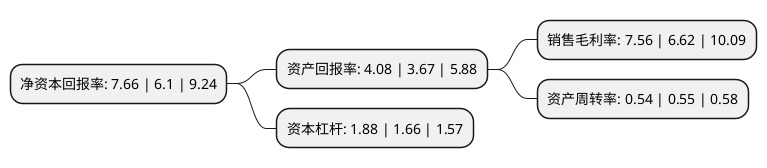

> 本页面由自动化程序生成于 2022年5月20日 01:31
> 内容可能存在错误，如有bug请提交issue至：https://github.com/Eroleice/doc-pi/issues
{.is-warning}

# 上市公司基本情况

## 基本资料

长飞光纤光缆股份有限公司（以下简称“长飞光纤”）成立于1988年05月31日，武汉市。于2018年07月20日在上交所主板上市。

长飞光纤注册资本75,790.511万元，长飞光纤一直专注于光纤光缆行业，致力于光纤预制棒，光纤和光缆等相关产品的研发创新与生产制造，是全球最大的光纤预制棒，光纤和光缆的供应商。公司主要从事研究，开发，生产和销售光纤预制棒，光纤，光缆，通信线缆，特种线缆及器件，附件，组件和材料，专用设备以及通信产品的制造，以及提供上述产品的工程及技术服务业务。以下是详细信息：

- 公司名称: 长飞光纤光缆股份有限公司
- 股票代码: 601869.SH
- 所在地: 湖北 - 武汉市
- 成立日期: 1988年05月31日
- 注册资本: 75,790.511万元
- 法定代表人: 马杰
- 主营业务: 长飞光纤一直专注于光纤光缆行业，致力于光纤预制棒，光纤和光缆等相关产品的研发创新与生产制造，是全球最大的光纤预制棒，光纤和光缆的供应商公司主要从事研究，开发，生产和销售光纤预制棒，光纤，光缆，通信线缆，特种线缆及器件，附件，组件和材料，专用设备以及通信产品的制造，以及提供上述产品的工程及技术服务业务
- 公司官网: www.yofc.com
- 公司介绍: 公司是世界领先的光纤预制棒、光纤及光缆供货商之一，主要生产和销售通信行业广泛采用的各种标准规格的光纤预制棒、光纤、光缆，基于客户需求的各类特种光纤、光缆，以及射频同轴电缆、配件等产品，公司拥有完备的集成系统、工程设计服务与解决方案，能为世界通信行业及其他行业(包括公用事业、运输、石油化工及医疗)提供各种光纤光缆产品及相关解决方案，在全球60多个国家和地区提供优质的产品与服务。长飞公司已获得多项国家授权专利和多项欧洲、美国、日本等国外发明专利及PCT授权，是国家级企业技术中心、创新型企业、全国首批智能制造试点示范企业、全国制造业单项冠军示范企业等，荣获国家科技进步二等奖、全国质量奖等权威奖项，并成为光纤光缆制备技术国家重点实验室的依托单位以及国际电联ITU-T和国际电工IEC标准制定的重要成员之一。

## 股东及高管情况

上市公司第一大股东为荷兰德拉克通信科技有限公司，持股179,827,794股，占比23.73%，**疑似为**上市公司实际控制人。

截至2022年03月31日，上市公司的前十大股东中，共有8名机构股东，2个海外主体，其中5%以上大股东共有4名。上市公司前十大股东明细如下：

> 未能通过持股比例判定出上市公司实际控制人（持股30%以上）
> 可能存在通过间接持股、联合持股、协议控制等方式拥有实际控制权的主体，具体请参考上市公司定期公告！
{.is-warning}

> 截至2022年03月31日，上市公司前十大股东信息如下：

| 股东名称 | 持股数量（股） | 持股比例 |
| --- | --- | --- |
| 荷兰德拉克通信科技有限公司 | 179,827,794 | 23.73% |
| 中国华信邮电科技有限公司 | 179,827,794 | 23.73% |
| 香港中央结算(代理人)有限公司 | 171,603,349 | 22.64% |
| 武汉长江通信产业集团股份有限公司 | 119,937,010 | 15.82% |
| 宁波睿图企业管理咨询合伙企业(有限合伙) | 10,553,390 | 1.39% |
| 宁波睿盈企业管理咨询合伙企业(有限合伙) | 6,153,500 | 0.81% |
| 华润深国投信托有限公司-华润信托·晟利5号单一资金信托 | 4,570,227 | 0.6% |
| 香港中央结算有限公司(陆股通) | 3,925,400 | 0.52% |
| 陕西省国际信托股份有限公司-陕国投·财富59号单一资金信托 | 3,864,400 | 0.51% |
| 宁波睿麒企业管理咨询合伙企业(有限合伙) | 2,430,345 | 0.32% |

## 利润表分析

上市公司2021年总收入为95.36亿元，净利润为7.2亿元，实现盈利。

## 杜邦分析

> 数据列示周期：2021年 | 2020年 | 2019年
{.is-info}

上市公司的净资产收益率在近一年有所上升，上升幅度为25.57%，其变化情况分解如下：
- 上市公司的销售毛利率在近一年上升了14.2%，可能是生产效率的提升、商品原材料价格下跌或商品价格的上涨所致。
- 上市公司的资产周转率在近一年下降了-1.82%，可能是源自于更慢的销售回款或库存管理效果下降。
- 上市公司的财务杠杆比率在近一年上升了13.25%，可能是增加负债扩大生产规模。

