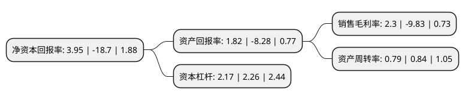

> 本页面由自动化程序生成于 2022年5月20日 01:32
> 内容可能存在错误，如有bug请提交issue至：https://github.com/Eroleice/doc-pi/issues
{.is-warning}

# 上市公司基本情况

## 基本资料

上海剑桥科技股份有限公司（以下简称“剑桥科技”）成立于2006年03月14日，上海市。于2017年11月10日在上交所主板上市。

剑桥科技注册资本25,558.157万元，主营业务为基于合作模式(主要为JDM和ODM模式)进行家庭，企业及工业应用类ICT终端领域产品的研发，生产和销售，目前主要产品包括电信宽带终端，无线网络设备，智能家庭网关，工业物联网产品与解决方案四大类。以下是详细信息：

- 公司名称: 上海剑桥科技股份有限公司
- 股票代码: 603083.SH
- 所在地: 上海 - 上海市
- 成立日期: 2006年03月14日
- 注册资本: 25,558.157万元
- 法定代表人: Gerald G Wong
- 主营业务: 主营业务为基于合作模式(主要为JDM和ODM模式)进行家庭，企业及工业应用类ICT终端领域产品的研发，生产和销售，目前主要产品包括电信宽带终端，无线网络设备，智能家庭网关，工业物联网产品与解决方案四大类
- 公司官网: www.cigtech.com
- 公司介绍: 公司是电子信息领域的一家高新技术企业，公司致力于成为国际ICT行业合作研发和智能生产平台，坚持先进研发和智能制造双引擎驱动成长，坚持在工程技术、效率驱动两个层面的创新。自成立以来，公司以先进研发和智能制造平台为基础，不断把握市场变化和新机遇，开发掌握新技术、拓展新领域，从而促使产品线不断丰富升级。公司顺应行业发展趋势，以工业4.0为目标，对生产流程不断精益优化，自主研发生产信息化系统，加快生产自动化的研究和导入，加大基于工业4.0理念的相关智能制造技术的投入，努力建设工业4.0理念的智能工厂。目前，公司已基本形成具有竞争优势的智能制造平台。公司产品已广泛应用到世界各国主流通信运营商的网络。

## 股东及高管情况

上市公司第一大股东为Cambridge Industries Company Limited，持股43,882,647股，占比17.1697%，**疑似为**上市公司实际控制人。

截至2022年04月15日，上市公司的前十大股东中，共有5名自然人股东，3名机构股东，2个海外主体，其中5%以上大股东共有3名。上市公司前十大股东明细如下：

> 未能通过持股比例判定出上市公司实际控制人（持股30%以上）
> 可能存在通过间接持股、联合持股、协议控制等方式拥有实际控制权的主体，具体请参考上市公司定期公告！
{.is-warning}

> 截至2022年04月15日，上市公司前十大股东信息如下：

| 股东名称 | 持股数量（股） | 持股比例 |
| --- | --- | --- |
| Cambridge Industries Company Limited | 43,882,647 | 17.1697% |
| 上海康宜桥投资咨询合伙企业(有限合伙) | 17,283,321 | 6.76% |
| 上海康宜桥投资咨询合伙企业(有限合伙) | 17,004,321 | 6.6532% |
| 北京康令科技发展中心(普通合伙) | 11,803,434 | 4.62% |
| Hong Kong CIG Holding Company, Limited | 6,207,275 | 2.43% |
| 贺军 | 3,056,000 | 1.2% |
| 洪津 | 2,101,675 | 0.82% |
| 陈达驱 | 1,396,330 | 0.55% |
| 陈达盛 | 1,180,000 | 0.46% |
| 金峰顺 | 1,102,500 | 0.43% |

## 利润表分析

上市公司2021年总收入为29.19亿元，净利润为0.67亿元，实现盈利。

## 杜邦分析

> 数据列示周期：2021年 | 2020年 | 2019年
{.is-info}

上市公司的净资产收益率在近一年有所下降，下降幅度为-121.12%，其变化情况分解如下：
- 上市公司的销售毛利率在近一年下降了-123.4%，可能是生产效率的下降、商品原材料价格上涨或商品价格的下跌所致。
- 上市公司的资产周转率在近一年下降了-5.95%，可能是源自于更慢的销售回款或库存管理效果下降。
- 上市公司的财务杠杆比率在近一年下降了-3.98%，可能是减少负债降低财务费用。

