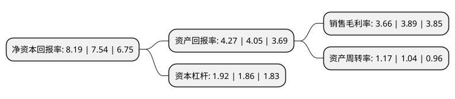

> 本页面由自动化程序生成于 2022年5月20日 01:32
> 内容可能存在错误，如有bug请提交issue至：https://github.com/Eroleice/doc-pi/issues
{.is-warning}

# 上市公司基本情况

## 基本资料

深圳市共进电子股份有限公司（以下简称“共进股份”）成立于1998年11月24日，深圳市。于2015年02月25日在上交所主板上市。

共进股份注册资本79,213.333万元，公司主营业务为宽带通讯终端的研发，生产及销售。主要产品包括DSL(ADSL，VDSL)终端系列，光接入(EPON，GPON)终端系列，无线(WiFi)及移动(3G，LTE)终端系列和其它宽带通讯终端系列(PLC终端和EoC终端等)以下是详细信息：

- 公司名称: 深圳市共进电子股份有限公司
- 股票代码: 603118.SH
- 所在地: 广东 - 深圳市
- 成立日期: 1998年11月24日
- 注册资本: 79,213.333万元
- 法定代表人: 汪大维
- 主营业务: 公司主营业务为宽带通讯终端的研发，生产及销售主要产品包括DSL(ADSL，VDSL)终端系列，光接入(EPON，GPON)终端系列，无线(WiFi)及移动(3G，LTE)终端系列和其它宽带通讯终端系列(PLC终端和EoC终端等)
- 公司官网: www.twsz.com
- 公司介绍: 公司自1998年创始，以“发展企业，培养人才，回馈社会”为宗旨，拥有“T&W”商标。公司积多年发展厚势，追求卓越，永不止步。作为全球领先的宽带通信终端产品制造商，共进股份二次创业，再扬风帆，专业从事通信终端、通信网络和智慧医疗业务。公司以产品创新为核心竞争力，定位为网络通信产品和系统方案提供商(有线、无线和移动)、无线智能应用产品提供商、互联网健康设备和服务提供商。产品涵盖各类宽带通信终端设备、互联网医疗、智慧家庭等；目前拥有深圳、上海、太仓、大连、成都、中国香港和欧美各地多个研发中心、生产基地或销售中心。公司先后通过一系列国际认证，导入了质量、环安、社会责任等管理体系，相继获得国家级高新技术企业、中国电子信息百强企业、国家企业技术中心、中国民营制造业500强、深圳市工业百强企业、深圳市企业技术中心、深圳市民营领军骨干企业、广东省科学技术奖、广东省制造业500强、深圳质量百强企业等各项荣誉。

## 股东及高管情况

上市公司第一大股东为汪大维，持股172,013,303股，占比21.72%，**疑似为**上市公司实际控制人。

截至2022年03月31日，上市公司的前十大股东中，共有6名自然人股东，1名机构股东，2个产品账户，1个海外主体，其中5%以上大股东共有2名。上市公司前十大股东明细如下：

> 未能通过持股比例判定出上市公司实际控制人（持股30%以上）
> 可能存在通过间接持股、联合持股、协议控制等方式拥有实际控制权的主体，具体请参考上市公司定期公告！
{.is-warning}

> 截至2022年03月31日，上市公司前十大股东信息如下：

| 股东名称 | 持股数量（股） | 持股比例 |
| --- | --- | --- |
| 汪大维 | 172,013,303 | 21.72% |
| 唐佛南 | 172,013,224 | 21.72% |
| 中信证券-深圳市共进电子股份有限公司第一期员工持股计划-中信证券共进股份第一期员工持股单一资产管理计划 | 15,500,000 | 1.96% |
| 吴靖宇 | 10,266,665 | 1.3% |
| 青岛城投金融控股集团有限公司 | 10,202,898 | 1.29% |
| 中国建设银行股份有限公司-信达澳银新能源产业股票型证券投资基金 | 5,673,745 | 0.72% |
| 香港中央结算有限公司(陆股通) | 5,494,034 | 0.69% |
| 黄永军 | 4,048,900 | 0.51% |
| 王丹华 | 3,949,002 | 0.5% |
| 崔正南 | 3,949,002 | 0.5% |

## 利润表分析

上市公司2021年总收入为108.08亿元，净利润为3.95亿元，实现盈利。

## 杜邦分析

> 数据列示周期：2021年 | 2020年 | 2019年
{.is-info}

上市公司的净资产收益率在近一年有所上升，上升幅度为8.62%，其变化情况分解如下：
- 上市公司的销售毛利率在近一年下降了-5.91%，可能是生产效率的下降、商品原材料价格上涨或商品价格的下跌所致。
- 上市公司的资产周转率在近一年上升了12.5%，可能是源自于更快的销售回款或库存管理效果提升。
- 上市公司的财务杠杆比率在近一年上升了3.23%，可能是增加负债扩大生产规模。

