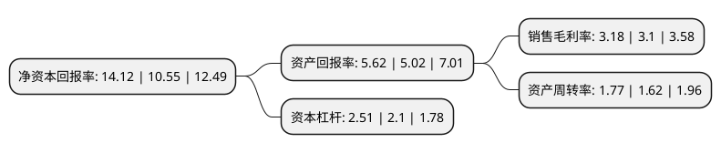

> 本页面由自动化程序生成于 2022年5月20日 01:33
> 内容可能存在错误，如有bug请提交issue至：https://github.com/Eroleice/doc-pi/issues
{.is-warning}

# 上市公司基本情况

## 基本资料

上海移远通信技术股份有限公司（以下简称“移远通信”）成立于2010年10月25日，上海市。于2019年07月16日在上交所主板上市。

移远通信注册资本14,537.083万元，从事物联网领域蜂窝通信模块及其解决方案的设计，研发与销售服务。主要产品包括GSM/GPRS(2G类别)系列，WCDMA/HSPA(3G类别)系列，LTE(4G类别)系列，NB-IoT系列等蜂窝通信模块，以及GNSS系列定位模块系列，EVB工具系列，目前公司产品主要应用于无线支付，车载运输，智慧能源，智慧城市，智能安防，无线网关，工业应用，医疗健康和农业环境等领域。以下是详细信息：

- 公司名称: 上海移远通信技术股份有限公司
- 股票代码: 603236.SH
- 所在地: 上海 - 上海市
- 成立日期: 2010年10月25日
- 注册资本: 14,537.083万元
- 法定代表人: 钱鹏鹤
- 主营业务: 从事物联网领域蜂窝通信模块及其解决方案的设计，研发与销售服务主要产品包括GSM/GPRS(2G类别)系列，WCDMA/HSPA(3G类别)系列，LTE(4G类别)系列，NB-IoT系列等蜂窝通信模块，以及GNSS系列定位模块系列，EVB工具系列，目前公司产品主要应用于无线支付，车载运输，智慧能源，智慧城市，智能安防，无线网关，工业应用，医疗健康和农业环境等领域
- 公司官网: www.quectel.com
- 公司介绍: 公司主要从事物联网领域蜂窝通信模块及其解决方案的设计,研发与销售服务.主要产品包括GSM/GPRS(2G类别)系列,WCDMA/HSPA(3G类别)系列,LTE(4G类别)系列,NB-IoT系列等蜂窝通信模块,以及GNSS系列定位模块系列,EVB工具系列,目前公司产品主要应用于无线支付,车载运输,智慧能源,智慧城市,智能安防,无线网关,工业应用,医疗健康和农业环境等领域.公司是专业的物联网(M2M)技术的研发者和无线模块的供应商，提供物联网无线通信模块解决方案的一站式服务。

## 股东及高管情况

上市公司第一大股东为钱鹏鹤，持股33,079,878股，占比22.76%，**疑似为**上市公司实际控制人。

截至2022年03月31日，上市公司的前十大股东中，共有3名自然人股东，2名机构股东，4个产品账户，1个海外主体，其中5%以上大股东共有2名。上市公司前十大股东明细如下：

> 未能通过持股比例判定出上市公司实际控制人（持股30%以上）
> 可能存在通过间接持股、联合持股、协议控制等方式拥有实际控制权的主体，具体请参考上市公司定期公告！
{.is-warning}

> 截至2022年03月31日，上市公司前十大股东信息如下：

| 股东名称 | 持股数量（股） | 持股比例 |
| --- | --- | --- |
| 钱鹏鹤 | 33,079,878 | 22.76% |
| 宁波移远投资合伙企业(有限合伙) | 10,920,000 | 7.51% |
| 香港中央结算有限公司(陆股通) | 3,134,555 | 2.16% |
| 上海行知创业投资有限公司 | 2,901,569 | 2% |
| 任晗熙 | 2,404,300 | 1.65% |
| 上海重阳战略投资有限公司-重阳战略聚智基金 | 2,376,869 | 1.64% |
| 上海浦东发展银行股份有限公司-易方达裕祥回报债券型证券投资基金 | 2,363,588 | 1.63% |
| 重庆信展股权投资基金管理有限公司-重庆信展保达投资中心(有限合伙) | 2,088,049 | 1.44% |
| 中国工商银行股份有限公司-富国天惠精选成长混合型证券投资基金(LOF) | 2,000,000 | 1.38% |
| 葛卫东 | 2,000,000 | 1.38% |

## 利润表分析

上市公司2021年总收入为112.61亿元，净利润为3.58亿元，实现盈利。

## 杜邦分析

> 数据列示周期：2021年 | 2020年 | 2019年
{.is-info}

上市公司的净资产收益率在近一年有所上升，上升幅度为33.84%，其变化情况分解如下：
- 上市公司的销售毛利率在近一年上升了2.58%，可能是生产效率的提升、商品原材料价格下跌或商品价格的上涨所致。
- 上市公司的资产周转率在近一年上升了9.26%，可能是源自于更快的销售回款或库存管理效果提升。
- 上市公司的财务杠杆比率在近一年上升了19.52%，可能是增加负债扩大生产规模。

