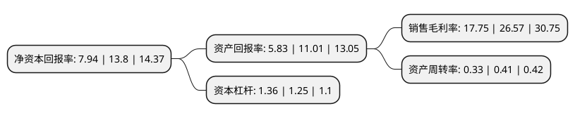

> 本页面由自动化程序生成于 2022年5月20日 01:34
> 内容可能存在错误，如有bug请提交issue至：https://github.com/Eroleice/doc-pi/issues
{.is-warning}

# 上市公司基本情况

## 基本资料

北京淳中科技股份有限公司（以下简称“淳中科技”）成立于2011年05月16日，北京市。于2018年02月02日在上交所主板上市。

淳中科技注册资本18,635.57万元，国内领先的显控系统设备及解决方案提供商，主要产品分为设备类和平台类两大类，具体包括图像处理设备，矩阵切换设备，信号传输设备及数字视频综合平台，显控协作平台等。以下是详细信息：

- 公司名称: 北京淳中科技股份有限公司
- 股票代码: 603516.SH
- 所在地: 北京 - 北京市
- 成立日期: 2011年05月16日
- 注册资本: 18,635.57万元
- 法定代表人: 何仕达
- 主营业务: 国内领先的显控系统设备及解决方案提供商，主要产品分为设备类和平台类两大类，具体包括图像处理设备，矩阵切换设备，信号传输设备及数字视频综合平台，显控协作平台等
- 公司官网: www.chinargb.com.cn
- 公司介绍: 公司是全球领先的专业视音频显控产品及解决方案的供应商，秉承深厚的图像处理、音视频编解码、传输技术、系统集成的专业能力，致力于面向全球各行业客户提供领先的显控产品与解决方案及专业优质的服务。自2011年成立以来，一直为政府、军队、公安、交通、金融、能源、大型企业等社会各类客户提供优秀的音视频解决方案，产品涵盖图像处理、矩阵切换、数字视频综合平台、显控协作、信号传输等系列产品。主要产品通过CCC、CE、FCC、RoHS等产品认证，为客户提供绿色解决方案，减少全球温室气体排放。秉承“淳德忠信”的经营理念，以成为世界一流企业为使命，立志成为受人尊敬的、全球领先的音视频行业的领航者，并为社会带来价值。

## 股东及高管情况

上市公司第一大股东为何仕达，持股53,217,920股，占比28.56%，**疑似为**上市公司实际控制人。

截至2022年05月09日，上市公司的前十大股东中，共有6名自然人股东，1名机构股东，3个产品账户，其中5%以上大股东共有3名。上市公司前十大股东明细如下：

> 未能通过持股比例判定出上市公司实际控制人（持股30%以上）
> 可能存在通过间接持股、联合持股、协议控制等方式拥有实际控制权的主体，具体请参考上市公司定期公告！
{.is-warning}

> 截至2022年05月09日，上市公司前十大股东信息如下：

| 股东名称 | 持股数量（股） | 持股比例 |
| --- | --- | --- |
| 何仕达 | 53,217,920 | 28.56% |
| 张峻峰 | 20,653,920 | 11.08% |
| 黄秀瑜 | 9,918,800 | 5.32% |
| 余绵梓 | 4,890,900 | 2.62% |
| 青骓投资管理有限公司-青骓旭照九期私募证券投资基金 | 3,852,545 | 2.07% |
| 天津斯豪企业管理咨询中心(有限合伙) | 3,806,495 | 2.04% |
| 上海牧鑫资产管理有限公司-牧鑫佳利和1号私募证券投资基金 | 2,650,000 | 1.42% |
| 冯小红 | 1,918,000 | 1.03% |
| 国寿养老策略4号股票型养老金产品-中国工商银行股份有限公司 | 1,335,184 | 0.72% |
| 邬勤波 | 1,322,760 | 0.71% |

## 利润表分析

上市公司2021年总收入为4.68亿元，净利润为0.83亿元，实现盈利。

## 杜邦分析

> 数据列示周期：2021年 | 2020年 | 2019年
{.is-info}

上市公司的净资产收益率在近一年有所下降，下降幅度为-42.46%，其变化情况分解如下：
- 上市公司的销售毛利率在近一年下降了-33.2%，可能是生产效率的下降、商品原材料价格上涨或商品价格的下跌所致。
- 上市公司的资产周转率在近一年下降了-19.51%，可能是源自于更慢的销售回款或库存管理效果下降。
- 上市公司的财务杠杆比率在近一年上升了8.8%，可能是增加负债扩大生产规模。

