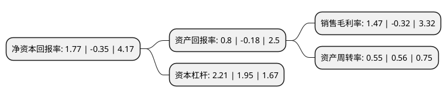

> 本页面由自动化程序生成于 2022年5月20日 01:34
> 内容可能存在错误，如有bug请提交issue至：https://github.com/Eroleice/doc-pi/issues
{.is-warning}

# 上市公司基本情况

## 基本资料

杭州纵横通信股份有限公司（以下简称“纵横通信”）成立于2006年12月28日，杭州市。于2017年08月10日在上交所主板上市。

纵横通信注册资本20,384.887万元，主营业务:为中国移动，中国电信，中国联通，铁塔公司等业内主要客户服务，针对大型公共设施，通信基站，住宅和商业建筑，交通网络等多种物理建筑及通信设施，提供移动通信技术和无线互联技术的系统解决方案和组网应用服务。主要产品:通信网络建设服务，通信网络代维服务，系统解决方案及质量控制系统，业务的地区分布与客户资源，以下是详细信息：

- 公司名称: 杭州纵横通信股份有限公司
- 股票代码: 603602.SH
- 所在地: 浙江 - 杭州市
- 成立日期: 2006年12月28日
- 注册资本: 20,384.887万元
- 法定代表人: 苏维锋
- 主营业务: 主营业务:为中国移动，中国电信，中国联通，铁塔公司等业内主要客户服务，针对大型公共设施，通信基站，住宅和商业建筑，交通网络等多种物理建筑及通信设施，提供移动通信技术和无线互联技术的系统解决方案和组网应用服务主要产品:通信网络建设服务，通信网络代维服务，系统解决方案及质量控制系统，业务的地区分布与客户资源，
- 公司官网: www.freelynet.com
- 公司介绍: 公司是一家通信网络技术服务提供商，为中国移动、中国电信、中国联通、铁塔公司等业内主要客户服务，针对大型通信基站、公共设施、住宅和商业建筑、交通网络等多种物理建筑及通信设施，提供移动通信技术和无线互联技术的系统解决方案和组网应用服务。经过多年的积累，公司形成了完善的技术及管理支持平台，具备包括基站安装工程服务、室内分布系统技术服务、综合接入技术服务和网络代维服务的全业务服务体系，通过勘测、设计、项目实施、调试、开通验收、维护抢修及升级改造等系统化、模块化、产品化的服务，涵盖通信网络建设、维护、升级的三大环节，深入参与我国网络建设进程。公司是高新技术企业，浙江省创新试点单位，具备通信信息网络系统集成企业甲级资质、通信网络代维企业甲级资质(线路专业和基站专业)、通信工程施工总承包壹级资质和通信建设工程企业安全生产合格证等专业资质，公司在掌握电信运营商各种网络制式，熟悉各类通信设备，深刻理解无线、传输、动力、网管等专业知识基础上提供通信专业技术应用服务，提高通信网络建设、维护及运营效率。

## 股东及高管情况

上市公司第一大股东为苏维锋，持股62,284,331股，占比30.55%，为上市公司实际控制人。

截至2022年03月31日，上市公司的前十大股东中，共有9名自然人股东，1个海外主体，其中5%以上大股东共有1名。上市公司前十大股东明细如下：

> 截至2022年03月31日，上市公司前十大股东信息如下：

| 股东名称 | 持股数量（股） | 持股比例 |
| --- | --- | --- |
| 苏维锋 | 62,284,331 | 30.55% |
| 林爱华 | 8,210,800 | 4.03% |
| 吴海涛 | 6,964,725 | 3.42% |
| 濮澍 | 5,517,849 | 2.71% |
| 方志平 | 4,831,500 | 2.37% |
| 林元职 | 2,691,410 | 1.32% |
| JPMORGAN CHASE  BANK,NATIONAL ASSOCIATION | 2,141,443 | 1.05% |
| 汤宝辉 | 1,904,442 | 0.93% |
| 林炜 | 1,810,000 | 0.89% |
| 项新波 | 1,676,974 | 0.82% |

## 利润表分析

上市公司2021年总收入为8.83亿元，净利润为0.13亿元，实现盈利。

## 杜邦分析

> 数据列示周期：2021年 | 2020年 | 2019年
{.is-info}

上市公司的净资产收益率在近一年有所下降，下降幅度为-605.71%，其变化情况分解如下：
- 上市公司的销售毛利率在近一年下降了-559.37%，可能是生产效率的下降、商品原材料价格上涨或商品价格的下跌所致。
- 上市公司的资产周转率在近一年下降了-1.79%，可能是源自于更慢的销售回款或库存管理效果下降。
- 上市公司的财务杠杆比率在近一年上升了13.33%，可能是增加负债扩大生产规模。

