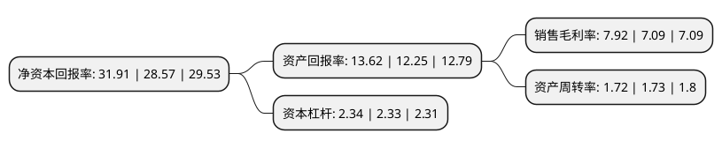

> 本页面由自动化程序生成于 2022年5月20日 01:37
> 内容可能存在错误，如有bug请提交issue至：https://github.com/Eroleice/doc-pi/issues
{.is-warning}

# 上市公司基本情况

## 基本资料

深圳传音控股股份有限公司（以下简称“传音控股”）成立于2013年08月21日，深圳市。于2019年09月30日在上交所科创板上市。

传音控股注册资本80,169.095万元，发行人的主营业务是从事以手机为核心的智能终端的设计，研发，生产，销售和品牌运营，主要产品为TECNO，itel和Infinix三大品牌手机，销售区域主要集中在非洲，南亚，东南亚，中东和南美等全球新兴市场国家。基于在新兴市场积累的领先优势，公司围绕主营业务积极实施多元化战略布局，创立了数码配件品牌Oraimo，家用电器品牌Syinix以及售后服务品牌Carlcare等。公司自主研发HiOS，itelOS和XOS等智能终端操作系统，围绕OS操作系统开发应用商店，游戏平台，广告分发平台以及手机管家等工具类软件。同时公司与网易等多家国内领先的互联网公司，积极开发和孵化移动互联网产品，在音乐，游戏，短视频，内容聚合及其他应用领域进行出海战略合作。基于用户流量和数据资源开展的移动互联网业务是公司经营业绩增长的新动力。以下是详细信息：

- 公司名称: 深圳传音控股股份有限公司
- 股票代码: 688036.SH
- 所在地: 广东 - 深圳市
- 成立日期: 2013年08月21日
- 注册资本: 80,169.095万元
- 法定代表人: 竺兆江
- 主营业务: 发行人的主营业务是从事以手机为核心的智能终端的设计，研发，生产，销售和品牌运营，主要产品为TECNO，itel和Infinix三大品牌手机，销售区域主要集中在非洲，南亚，东南亚，中东和南美等全球新兴市场国家基于在新兴市场积累的领先优势，公司围绕主营业务积极实施多元化战略布局，创立了数码配件品牌Oraimo，家用电器品牌Syinix以及售后服务品牌Carlcare等公司自主研发HiOS，itelOS和XOS等智能终端操作系统，围绕OS操作系统开发应用商店，游戏平台，广告分发平台以及手机管家等工具类软件同时公司与网易等多家国内领先的互联网公司，积极开发和孵化移动互联网产品，在音乐，游戏，短视频，内容聚合及其他应用领域进行出海战略合作基于用户流量和数据资源开展的移动互联网业务是公司经营业绩增长的新动力
- 公司官网: www.transsion.com
- 公司介绍: 公司是一家以手机为核心的智能终端的设计、研发、生产及品牌运营的高新技术企业，业务集中在非洲、南亚、东南亚等新兴市场国家。同时实施多元化战略，开发了数码配件、家用电器以及移动互联网服务。主要产品为TECNO、itel和Infinix三大品牌手机，另创立数码配件品牌Oraimo，家用电器品牌Syinix及售后服务品牌Carlcare，自主研发HIOS、itelOS、和XOS等智能终端操作系统。针对特定市场需求，完成了切合当地市场的研发成果，包括黑人肤色摄像技术、防汗液USB端口等。2018年手机出货量全球市场占有率7.04%，排名第四；非洲市占率48.71%，排名第一；印度市占率6.72%，排名第四。

## 股东及高管情况

上市公司第一大股东为深圳市传音投资有限公司，持股408,425,276股，占比50.95%，为上市公司实际控制人。

截至2022年03月31日，上市公司的前十大股东中，共有5名机构股东，3个产品账户，1个海外主体，1名其他股东，其中5%以上大股东共有3名。上市公司前十大股东明细如下：

> 截至2022年03月31日，上市公司前十大股东信息如下：

| 股东名称 | 持股数量（股） | 持股比例 |
| --- | --- | --- |
| 深圳市传音投资有限公司 | 408,425,276 | 50.95% |
| 源科(平潭)股权投资管理合伙企业(有限合伙)-源科(平潭)股权投资基金合伙企业(有限合伙) | 67,202,649 | 8.38% |
| 云南传力企业管理有限公司 | 44,289,526 | 5.52% |
| 云南传力企业管理中心(有限合伙) | 22,162,178 | 2.76% |
| 香港中央结算有限公司(陆股通) | 22,084,206 | 2.75% |
| 云南传音企业管理中心(有限合伙) | 20,986,070 | 2.62% |
| 云南传承企业管理中心(有限合伙) | 17,148,778 | 2.14% |
| 全国社保基金一零一组合 | 10,268,393 | 1.28% |
| 招商银行股份有限公司-华夏上证科创板50成份交易型开放式指数证券投资基金 | 6,638,906 | 0.83% |
| 挪威中央银行-自有资金 | 5,855,749 | 0.73% |

## 利润表分析

上市公司2021年总收入为494.11亿元，净利润为39.11亿元，实现盈利。

## 杜邦分析

> 数据列示周期：2021年 | 2020年 | 2019年
{.is-info}

上市公司的净资产收益率在近一年有所上升，上升幅度为11.69%，其变化情况分解如下：
- 上市公司的销售毛利率在近一年上升了11.71%，可能是生产效率的提升、商品原材料价格下跌或商品价格的上涨所致。
- 上市公司的资产周转率在近一年下降了-0.58%，可能是源自于更慢的销售回款或库存管理效果下降。
- 上市公司的财务杠杆比率在近一年上升了0.43%，可能是增加负债扩大生产规模。

