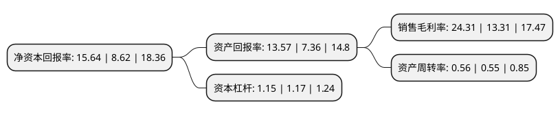

> 本页面由自动化程序生成于 2022年5月20日 01:37
> 内容可能存在错误，如有bug请提交issue至：https://github.com/Eroleice/doc-pi/issues
{.is-warning}

# 上市公司基本情况

## 基本资料

北京映翰通网络技术股份有限公司（以下简称“映翰通”）成立于2001年05月29日，北京市。于2020年02月12日在上交所科创板上市。

映翰通注册资本5,242.879万元，主营业务为工业物联网技术的研发和应用，为客户提供工业物联网通信(M2M)产品以及物联网(IoT)领域“云+端”整体解决方案。主营产品包括工业无线路由器，无线数据终端，边缘计算网关，工业以太网交换机等工业物联网通信产品，以及智能配电网状态监测系统，智能售货控制系统等物联网创新解决方案。以下是详细信息：

- 公司名称: 北京映翰通网络技术股份有限公司
- 股票代码: 688080.SH
- 所在地: 北京 - 北京市
- 成立日期: 2001年05月29日
- 注册资本: 5,242.879万元
- 法定代表人: 李明
- 主营业务: 主营业务为工业物联网技术的研发和应用，为客户提供工业物联网通信(M2M)产品以及物联网(IoT)领域“云+端”整体解决方案主营产品包括工业无线路由器，无线数据终端，边缘计算网关，工业以太网交换机等工业物联网通信产品，以及智能配电网状态监测系统，智能售货控制系统等物联网创新解决方案
- 公司官网: www.inhand.com.cn
- 公司介绍: 公司是知名的工业物联网通信产品以及物联网领域“云+端”整体解决方案的提供商，主营产品包括工业无线路由器、无线数据终端、边缘计算网关、工业以太网交换机等工业物联网通信产品，以及智能配电网状态监测系统、智能售货控制系统等物联网创新解决方案。公司主营业务为工业物联网技术的研发和应用，为客户提供工业物联网通信(M2M)产品以及物联网(IoT)领域“云+端”整体解决方案。公司为定位于新一代信息技术领域，推动互联网、大数据、云计算、人工智能和制造业深度融合的科技创新型企业。公司致力于成为工业物联网行业的引领者，利用物联网前沿科技打造领先的工业大数据汇聚与云管理服务，帮助行业用户有效收集和利用生产运营过程中产生的海量数据，并通过掘取数据价值提高生产效率和决策能力，推动行业的智能化升级。

## 股东及高管情况

上市公司第一大股东为李明，持股10,469,870股，占比19.97%，**疑似为**上市公司实际控制人。

截至2022年03月31日，上市公司的前十大股东中，共有5名自然人股东，3名机构股东，2个产品账户，其中5%以上大股东共有3名。上市公司前十大股东明细如下：

> 未能通过持股比例判定出上市公司实际控制人（持股30%以上）
> 可能存在通过间接持股、联合持股、协议控制等方式拥有实际控制权的主体，具体请参考上市公司定期公告！
{.is-warning}

> 截至2022年03月31日，上市公司前十大股东信息如下：

| 股东名称 | 持股数量（股） | 持股比例 |
| --- | --- | --- |
| 李明 | 10,469,870 | 19.97% |
| 李红雨 | 4,139,130 | 7.89% |
| 常州德丰杰清洁技术创业投资中心(有限合伙) | 3,263,646 | 6.22% |
| 韩传俊 | 2,460,710 | 4.69% |
| 姚立生 | 2,101,870 | 4.01% |
| 深圳市优尼科投资管理合伙企业(有限合伙)-深圳南山阿斯特创新股权投资基金合伙企业(有限合伙) | 1,986,017 | 3.79% |
| 张建良 | 1,233,373 | 2.35% |
| 宁波梅山保税港区天鹰合鼎投资管理合伙企业(有限合伙) | 1,057,000 | 2.02% |
| 中国建设银行股份有限公司-中欧电子信息产业沪港深股票型证券投资基金 | 823,731 | 1.57% |
| 北京飞图开元创业投资中心(有限合伙) | 786,000 | 1.5% |

## 利润表分析

上市公司2021年总收入为4.49亿元，净利润为1.09亿元，实现盈利。

## 杜邦分析

> 数据列示周期：2021年 | 2020年 | 2019年
{.is-info}

上市公司的净资产收益率在近一年有所上升，上升幅度为81.44%，其变化情况分解如下：
- 上市公司的销售毛利率在近一年上升了82.64%，可能是生产效率的提升、商品原材料价格下跌或商品价格的上涨所致。
- 上市公司的资产周转率在近一年上升了1.82%，可能是源自于更快的销售回款或库存管理效果提升。
- 上市公司的财务杠杆比率在近一年下降了-1.71%，可能是减少负债降低财务费用。

