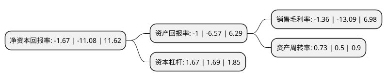

> 本页面由自动化程序生成于 2022年5月20日 01:38
> 内容可能存在错误，如有bug请提交issue至：https://github.com/Eroleice/doc-pi/issues
{.is-warning}

# 上市公司基本情况

## 基本资料

深圳市有方科技股份有限公司（以下简称“有方科技”）成立于2006年10月18日，深圳市。于2020年01月23日在上交所科创板上市。

有方科技注册资本9,167.95万元，主营业务:物联网无线通信模块，物联网无线通信解决方案，物联网无线通信终端。以下是详细信息：

- 公司名称: 深圳市有方科技股份有限公司
- 股票代码: 688159.SH
- 所在地: 广东 - 深圳市
- 成立日期: 2006年10月18日
- 注册资本: 9,167.95万元
- 法定代表人: 王慷
- 主营业务: 主营业务:物联网无线通信模块，物联网无线通信解决方案，物联网无线通信终端
- 公司官网: www.neoway.com
- 公司介绍: 公司是一家专注于M2M物联网无线通信产品和服务的国家级高新技术企业。有方科技专注于无线应用需求的挖掘和实现，提供专业的LTE、WCDMA、EVDO、GPRS、CDMA1X、短距无线等多种通讯制式的工业模块产品以及工业物联网解决方案，拥有产品规划、工业设计、结构、硬件、软件、测试、ID、物流等完整的研发及设计体系。有方科技是全球第一家推出GPRS单芯片工业模块的提供商。其中，M580是全球第一款单芯片GPRS工业模块，M590是全球第一款纯数据单芯片GPRS工业模块，AM812为全球第一款Android智能模块，2015年推出全球首款Windows10和Android双系统的LTE智能模块AM809，多个产品技术全球领先。

## 股东及高管情况

上市公司第一大股东为深圳市基思瑞投资发展有限公司，持股21,641,000股，占比23.61%，**疑似为**上市公司实际控制人。

截至2022年03月31日，上市公司的前十大股东中，共有3名自然人股东，5名机构股东，2个产品账户，其中5%以上大股东共有3名。上市公司前十大股东明细如下：

> 未能通过持股比例判定出上市公司实际控制人（持股30%以上）
> 可能存在通过间接持股、联合持股、协议控制等方式拥有实际控制权的主体，具体请参考上市公司定期公告！
{.is-warning}

> 截至2022年03月31日，上市公司前十大股东信息如下：

| 股东名称 | 持股数量（股） | 持股比例 |
| --- | --- | --- |
| 深圳市基思瑞投资发展有限公司 | 21,641,000 | 23.61% |
| 厦门市方星汇投资合伙企业(有限合伙) | 5,741,325 | 6.26% |
| 王慷 | 4,666,454 | 5.09% |
| 深圳市万物成长创业投资有限责任公司-深圳市万物成长股权投资合伙企业(有限合伙) | 3,164,557 | 3.45% |
| 广东美的智能科技产业投资基金管理中心(有限合伙) | 2,000,000 | 2.18% |
| 谭延凌 | 1,773,655 | 1.93% |
| 北京昆石天利投资有限公司-宁波昆石天利股权投资合伙企业(有限合伙) | 1,599,700 | 1.74% |
| 深圳市创新投资集团有限公司 | 1,574,058 | 1.72% |
| 中国工商银行股份有限公司-宝盈优势产业灵活配置混合型证券投资基金 | 1,429,398 | 1.56% |
| 魏琼 | 1,302,737 | 1.42% |

## 利润表分析

上市公司2021年总收入为10.24亿元，净利润为-0.14亿元，**未实现盈利**。

## 杜邦分析

> 数据列示周期：2021年 | 2020年 | 2019年
{.is-info}

上市公司的净资产收益率在近一年有所下降，下降幅度为-84.93%，其变化情况分解如下：
- 上市公司的销售毛利率在近一年下降了-89.61%，可能是生产效率的下降、商品原材料价格上涨或商品价格的下跌所致。
- 上市公司的资产周转率在近一年上升了46%，可能是源自于更快的销售回款或库存管理效果提升。
- 上市公司的财务杠杆比率在近一年下降了-1.18%，可能是减少负债降低财务费用。

