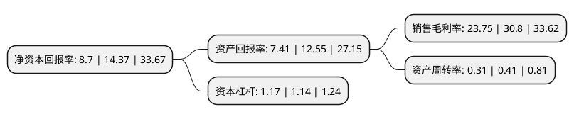

> 本页面由自动化程序生成于 2022年5月20日 01:40
> 内容可能存在错误，如有bug请提交issue至：https://github.com/Eroleice/doc-pi/issues
{.is-warning}

# 上市公司基本情况

## 基本资料

深圳市三旺通信股份有限公司（以下简称“三旺通信”）成立于2001年09月06日，深圳市。于2020年12月30日在上交所科创板上市。

三旺通信注册资本5,052.75万元，致力于工业互联网通信产品的研发，生产和销售。以下是详细信息：

- 公司名称: 深圳市三旺通信股份有限公司
- 股票代码: 688618.SH
- 所在地: 广东 - 深圳市
- 成立日期: 2001年09月06日
- 注册资本: 5,052.75万元
- 法定代表人: 熊伟
- 主营业务: 致力于工业互联网通信产品的研发，生产和销售
- 公司官网: www.3onedata.com.cn
- 公司介绍: 公司是专注于工业互联网的高新技术企业，面向工业经济数字化、网络化、智能化的基础设施需求，致力于工业互联网通信产品的研发、生产和销售,公司是国内较早从事工业互联网通信产品的公司之一，拥有较为齐全的产品体系，主要产品为工业以太网交换机、嵌入式工业以太网模块、设备联网产品、工业无线产品等。公司聚焦工业级产品的可靠性、实时性、安全性及下游行业应用需求，自主研发了电磁兼容、环境适应、环网冗余、精密时钟同步等一批核心技术，较好地解决了高低温、高粉尘、高电压、潮湿、腐蚀、无人值守、剧烈振动冲击、极强电磁干扰等严酷工业环境中的通信应用问题，产品应用已覆盖智慧城市、智慧矿山、轨道交通、电力及新能源、智能制造等领域,公司通过了高新技术企业认证、软件企业认证、国家规划布局内重点软件企业认证。公司获广东省科技厅评为“广东省工业网络传输设备工程技术研究中心”，入选了广东省工业和信息化厅“广东省工业互联网产业生态供给资源池企业”名录，先后被深圳市工业总会评为“第十五届深圳企业创新纪录自主创新新锐企业”、“第十八届深圳企业创新纪录自主创新标杆企业”。

## 股东及高管情况

上市公司第一大股东为深圳市七零年代控股有限公司，持股20,000,000股，占比39.58%，为上市公司实际控制人。

截至2022年03月31日，上市公司的前十大股东中，共有4名自然人股东，5名机构股东，1个产品账户，其中5%以上大股东共有3名。上市公司前十大股东明细如下：

> 截至2022年03月31日，上市公司前十大股东信息如下：

| 股东名称 | 持股数量（股） | 持股比例 |
| --- | --- | --- |
| 深圳市七零年代控股有限公司 | 20,000,000 | 39.58% |
| 熊伟 | 6,500,000 | 12.86% |
| 上海钜有管理咨询合伙企业(有限合伙) | 5,000,000 | 9.9% |
| 吴健 | 2,500,000 | 4.95% |
| 宁波梅山保税港区领慧达行投资管理合伙企业(有限合伙)-宁波梅山保税港区领慧投资合伙企业(有限合伙) | 1,393,996 | 2.76% |
| 袁自军 | 1,000,000 | 1.98% |
| 上海名鑫管理咨询合伙企业(有限合伙) | 972,222 | 1.92% |
| 中信建投证券-杭州银行-中信建投三旺通信科创板战略配售集合资产管理计划 | 759,115 | 1.5% |
| 中信建投投资有限公司 | 605,700 | 1.2% |
| 庄连美 | 436,151 | 0.86% |

## 利润表分析

上市公司2021年总收入为2.53亿元，净利润为0.6亿元，实现盈利。

## 杜邦分析

> 数据列示周期：2021年 | 2020年 | 2019年
{.is-info}

上市公司的净资产收益率在近一年有所下降，下降幅度为-39.46%，其变化情况分解如下：
- 上市公司的销售毛利率在近一年下降了-22.89%，可能是生产效率的下降、商品原材料价格上涨或商品价格的下跌所致。
- 上市公司的资产周转率在近一年下降了-24.39%，可能是源自于更慢的销售回款或库存管理效果下降。
- 上市公司的财务杠杆比率在近一年上升了2.63%，可能是增加负债扩大生产规模。

