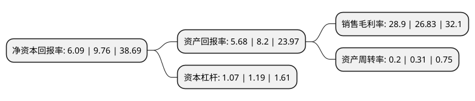

> 本页面由自动化程序生成于 2022年5月20日 01:40
> 内容可能存在错误，如有bug请提交issue至：https://github.com/Eroleice/doc-pi/issues
{.is-warning}

# 上市公司基本情况

## 基本资料

深圳市科思科技股份有限公司（以下简称“科思科技”）成立于2004年02月27日，深圳市。于2020年10月22日在上交所科创板上市。

科思科技注册资本7,553.423万元，主要从事军用电子信息装备及相关模块的研发，生产和销售。以下是详细信息：

- 公司名称: 深圳市科思科技股份有限公司
- 股票代码: 688788.SH
- 所在地: 广东 - 深圳市
- 成立日期: 2004年02月27日
- 注册资本: 7,553.423万元
- 法定代表人: 刘建德
- 主营业务: 主要从事军用电子信息装备及相关模块的研发，生产和销售
- 公司官网: www.consys.com.cn
- 公司介绍: 公司主要从事军用电子信息装备及相关模块的研发、生产和销售。在国防信息化建设中，公司参与了指挥控制信息处理系统、军用雷达信息处理系统、军用模拟训练系统、火力控制系统、反坦克导弹武器系统、侦察系统等军用装备系统的研制，主要产品为指挥控制信息处理设备、软件雷达信息处理设备、便携式无线指挥终端、其他信息处理终端及专用模块等一系列信息化装备，应用领域涉及指挥控制、通信、侦察、情报、防化、测绘、电子对抗、气象等，广泛覆盖陆军各兵种，并已进入空军、火箭军等几大军种,公司坚持围绕新形势下部队装备需求持续进行研发创新，不断提升产品的国产化水平，已逐渐成长为领先的军用电子信息装备供应商,公司多款指挥控制信息处理设备、软件雷达信息处理设备随军用指挥车、无人机地面站、侦察车、雷达车等军用装备参与了各军兵种组织的重要演习演练任务，包括“中国人民解放军建军90周年朱日和阅兵”、“庆祝中华人民共和国成立70周年阅兵”等，并应用于作战训练等领域。

## 股东及高管情况

上市公司第一大股东为刘建德，持股28,652,672股，占比37.93%，为上市公司实际控制人。

截至2022年03月31日，上市公司的前十大股东中，共有4名自然人股东，4名机构股东，2个产品账户，其中5%以上大股东共有2名。上市公司前十大股东明细如下：

> 截至2022年03月31日，上市公司前十大股东信息如下：

| 股东名称 | 持股数量（股） | 持股比例 |
| --- | --- | --- |
| 刘建德 | 28,652,672 | 37.93% |
| 梁宏建 | 17,493,677 | 23.16% |
| 昌舜尧 | 794,015 | 1.05% |
| 贵阳中天佳创投资有限公司 | 566,506 | 0.75% |
| 上海源星胤石股权投资合伙企业(有限合伙) | 547,138 | 0.72% |
| 佛山金茂投资顾问管理有限公司-佛山新动力创新创业股权投资合伙企业(有限合伙) | 410,353 | 0.54% |
| 佛山今茂私募股权投资基金管理有限公司-佛山新动力创新创业股权投资合伙企业(有限合伙) | 410,353 | 0.54% |
| 葛海莲 | 377,119 | 0.5% |
| 北京华控投资顾问有限公司-北京华控产业投资基金(有限合伙) | 374,243 | 0.5% |
| 深圳欢盈投资合伙企业(有限合伙) | 337,435 | 0.45% |

## 利润表分析

上市公司2021年总收入为6.1亿元，净利润为1.76亿元，实现盈利。

## 杜邦分析

> 数据列示周期：2021年 | 2020年 | 2019年
{.is-info}

上市公司的净资产收益率在近一年有所下降，下降幅度为-37.6%，其变化情况分解如下：
- 上市公司的销售毛利率在近一年上升了7.72%，可能是生产效率的提升、商品原材料价格下跌或商品价格的上涨所致。
- 上市公司的资产周转率在近一年下降了-35.48%，可能是源自于更慢的销售回款或库存管理效果下降。
- 上市公司的财务杠杆比率在近一年下降了-10.08%，可能是减少负债降低财务费用。

