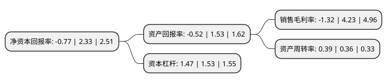

> 本页面由自动化程序生成于 2022年5月20日 01:03
> 内容可能存在错误，如有bug请提交issue至：https://github.com/Eroleice/doc-pi/issues
{.is-warning}

# 上市公司基本情况

## 基本资料

中冶美利云产业投资股份有限公司（以下简称“美利云”）成立于1998年05月28日，中卫市。于1998年06月09日在深交所主板上市。

美利云注册资本69,526.304万元，主要产品:中，高档文化用纸，板纸。以下是详细信息：

- 公司名称: 中冶美利云产业投资股份有限公司
- 股票代码: 000815.SZ
- 所在地: 宁夏 - 中卫市
- 成立日期: 1998年05月28日
- 注册资本: 69,526.304万元
- 法定代表人: 张春华
- 主营业务: 主要产品:中，高档文化用纸，板纸
- 公司官网: www.China-meili.com
- 公司介绍: 公司是我国西部地区重要的造纸企业，中国冶金科工集团公司的全资子公司，为一家以造纸为主体，造纸机械设备的加工制造、建筑等多位一体的国家大型企业。公司产品以书写纸、胶版纸等中高档文化纸为主。公司技术力量雄厚，设有专家委员会和技术开发中心，与国内一些知名的制浆造纸研究机构和大专院校建立了长期合作关系。公司生产工艺装备齐全、技术工艺专长碱法草类原料蒸煮漂白制浆和高中档文化用纸抄造，已建成的国内规模较大的碱回收及环保节能工程和废纸脱墨生产线。2016年通过非公开发行，增资云创公司，增加互联网数据中心业务(IDC)，提供机柜出租并同时提供宽带接入服务，具体为投建IDC机房并购置存放服务器的机柜后从事机柜出租、网络接入及柜机运行维护等业务，建成双主营业务格局，并且数据中心业务成为公司重要业务。

## 股东及高管情况

上市公司第一大股东为北京兴诚旺实业有限公司，持股145,000,000股，占比20.86%，**疑似为**上市公司实际控制人。

截至2022年03月31日，上市公司的前十大股东中，共有3名自然人股东，6名机构股东，1个产品账户，其中5%以上大股东共有3名。上市公司前十大股东明细如下：

> 未能通过持股比例判定出上市公司实际控制人（持股30%以上）
> 可能存在通过间接持股、联合持股、协议控制等方式拥有实际控制权的主体，具体请参考上市公司定期公告！
{.is-warning}

> 截至2022年03月31日，上市公司前十大股东信息如下：

| 股东名称 | 持股数量（股） | 持股比例 |
| --- | --- | --- |
| 北京兴诚旺实业有限公司 | 145,000,000 | 20.86% |
| 中冶纸业集团有限公司 | 79,131,048 | 11.38% |
| 赛伯乐投资集团有限公司 | 68,093,385 | 9.79% |
| 高雅萍 | 11,472,863 | 1.65% |
| 吉林省卓创众银股权投资基金合伙企业(有限合伙) | 10,125,479 | 1.46% |
| 蒋仕波 | 7,157,502 | 1.03% |
| 季爱琴 | 7,057,678 | 1.02% |
| 中国新元资产管理公司 | 6,500,000 | 0.93% |
| 华融国际信托有限责任公司-华融·汇盈32号证券投资单一资金信托 | 4,510,000 | 0.65% |
| 北京云诺投资中心(有限合伙) | 3,648,530 | 0.52% |

## 利润表分析

上市公司2021年总收入为12.32亿元，净利润为-0.17亿元，**未实现盈利**。

## 杜邦分析

> 数据列示周期：2021年 | 2020年 | 2019年
{.is-info}

上市公司的净资产收益率在近一年有所下降，下降幅度为-133.05%，其变化情况分解如下：
- 上市公司的销售毛利率在近一年下降了-131.21%，可能是生产效率的下降、商品原材料价格上涨或商品价格的下跌所致。
- 上市公司的资产周转率在近一年上升了8.33%，可能是源自于更快的销售回款或库存管理效果提升。
- 上市公司的财务杠杆比率在近一年下降了-3.92%，可能是减少负债降低财务费用。

