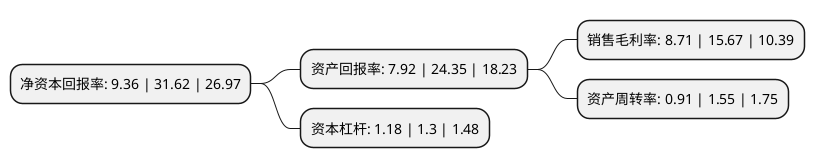

> 本页面由自动化程序生成于 2022年5月20日 01:05
> 内容可能存在错误，如有bug请提交issue至：https://github.com/Eroleice/doc-pi/issues
{.is-warning}

# 上市公司基本情况

## 基本资料

天津市依依卫生用品股份有限公司（以下简称“依依股份”）成立于1990年05月10日，天津市。于2021年05月18日在深交所主板上市。

依依股份注册资本9,433.358万元，主营业务为一次性卫生护理用品及无纺布的研发，生产和销售，公司主要产品为宠物一次性卫生护理用品，个人一次性卫生护理用品和无纺布。以下是详细信息：

- 公司名称: 天津市依依卫生用品股份有限公司
- 股票代码: 001206.SZ
- 所在地: 天津 - 天津市
- 成立日期: 1990年05月10日
- 注册资本: 9,433.358万元
- 法定代表人: 高福忠
- 主营业务: 主营业务为一次性卫生护理用品及无纺布的研发，生产和销售，公司主要产品为宠物一次性卫生护理用品，个人一次性卫生护理用品和无纺布
- 公司官网: www.tjyiyi.com
- 公司介绍: 公司作为国内卓越的卫生护理用品生产企业，历经二十余年的行业深耕，在宠物卫生护理用品及个人卫生护理用品的生产、销售方面积累了丰富的经验。目前公司的主营业务为一次性卫生护理用品及无纺布的研发、生产和销售，其中，一次性卫生护理用品包括宠物卫生护理用品和个人卫生护理用品。宠物卫生护理用品包括宠物垫、宠物尿裤、宠物清洁袋、宠物湿巾、宠物垃圾袋等，个人卫生护理用品包括卫生巾、护理垫、纸尿裤等。公司经营过程中取得多项企业荣誉。2016至2018年度连续三年获得“西青区出口十强内资企业”和“西青区出口十强内资企业第一名”，2018年获得天津市民营企业“健康成长工程”之“2018年销售收入100强企业”、“2018年制造业100强企业”两项荣誉。

## 股东及高管情况

上市公司第一大股东为高福忠，持股29,240,175股，占比31%，为上市公司实际控制人。

截至2022年03月31日，上市公司的前十大股东中，共有6名自然人股东，2名机构股东，2个产品账户，其中5%以上大股东共有3名。上市公司前十大股东明细如下：

> 截至2022年03月31日，上市公司前十大股东信息如下：

| 股东名称 | 持股数量（股） | 持股比例 |
| --- | --- | --- |
| 高福忠 | 29,240,175 | 31% |
| 卢俊美 | 11,377,500 | 12.06% |
| 高健 | 5,688,749 | 6.03% |
| 高斌 | 2,844,375 | 3.02% |
| 上海乔贝投资管理合伙企业(有限合伙)-诸暨乔贝昭益创业投资合伙企业(有限合伙) | 2,577,669 | 2.73% |
| 杭州乔贝盛泰投资管理合伙企业(有限合伙) | 2,497,500 | 2.65% |
| 深圳市架桥富凯投资有限公司-横琴架桥创新三号股权投资基金(有限合伙) | 2,374,169 | 2.52% |
| 深圳光点资本股权投资管理合伙企业(有限合伙)-深圳印纪光大文化产业股权投资基金合伙企业(有限合伙) | 2,035,002 | 2.16% |
| 卢俊江 | 1,706,625 | 1.81% |
| 杨丙发 | 1,706,625 | 1.81% |

## 利润表分析

上市公司2021年总收入为13.1亿元，净利润为1.14亿元，实现盈利。

## 杜邦分析

> 数据列示周期：2021年 | 2020年 | 2019年
{.is-info}

上市公司的净资产收益率在近一年有所下降，下降幅度为-70.4%，其变化情况分解如下：
- 上市公司的销售毛利率在近一年下降了-44.42%，可能是生产效率的下降、商品原材料价格上涨或商品价格的下跌所致。
- 上市公司的资产周转率在近一年下降了-41.29%，可能是源自于更慢的销售回款或库存管理效果下降。
- 上市公司的财务杠杆比率在近一年下降了-9.23%，可能是减少负债降低财务费用。

