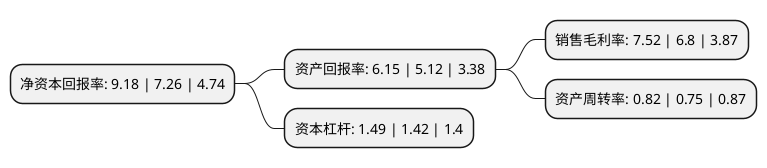

> 本页面由自动化程序生成于 2022年5月20日 01:05
> 内容可能存在错误，如有bug请提交issue至：https://github.com/Eroleice/doc-pi/issues
{.is-warning}

# 上市公司基本情况

## 基本资料

浙江景兴纸业股份有限公司（以下简称“景兴纸业”）成立于1996年11月01日，嘉兴市。于2006年09月15日在深交所中小板上市。

景兴纸业注册资本119,392.884万元，主营业务:本公司主要从事牛皮箱纸板，白面牛皮卡纸，高强度瓦楞原纸和瓦楞纸箱的生产制造，销售业务。以下是详细信息：

- 公司名称: 浙江景兴纸业股份有限公司
- 股票代码: 002067.SZ
- 所在地: 浙江 - 嘉兴市
- 成立日期: 1996年11月01日
- 注册资本: 119,392.884万元
- 法定代表人: 朱在龙
- 主营业务: 主营业务:本公司主要从事牛皮箱纸板，白面牛皮卡纸，高强度瓦楞原纸和瓦楞纸箱的生产制造，销售业务
- 公司官网: www.zjjxjt.com
- 公司介绍: 公司是拥有多家子公司并在造纸和包装行业拥有一定知名度的大型企业，是全国规模最大的以专业生产A级牛皮箱板纸为主的造纸企业之一，公司的主导产品为牛皮箱板纸、白面牛卡纸、高强度瓦楞原纸、纱管纸、纸箱等系列产品。专业化的发展，规模化的进程，使公司成为中国包装纸板开发生产基地和浙江省先进制造业基地之一。公司拥有具有21世纪国际先进水平的造纸流水线，为生产出高品质的产品奠定了坚实的基础。公司先后获得了浙江省“高新技术企业”、国家首批“资源节约型、环境友好型”试点企业、工业循环经济示范企业、中国500强规模民营企业等荣誉称号，并在同行中率先通过了ISO9001质量管理体系认证、ISO14001环境管理体系认证、职业健康安全管理体系认证、能源管理体系认证及FSC认证。公司产品先后获得国家级新产品、中国包装名牌产品、浙江省名牌产品等称号，“景兴”牌商标被认定为中国驰名品牌、浙江省著名商标等。

## 股东及高管情况

上市公司第一大股东为朱在龙，持股178,200,000股，占比14.93%，**疑似为**上市公司实际控制人。

截至2022年03月31日，上市公司的前十大股东中，共有5名自然人股东，5个产品账户，其中5%以上大股东共有1名。上市公司前十大股东明细如下：

> 未能通过持股比例判定出上市公司实际控制人（持股30%以上）
> 可能存在通过间接持股、联合持股、协议控制等方式拥有实际控制权的主体，具体请参考上市公司定期公告！
{.is-warning}

> 截至2022年03月31日，上市公司前十大股东信息如下：

| 股东名称 | 持股数量（股） | 持股比例 |
| --- | --- | --- |
| 朱在龙 | 178,200,000 | 14.93% |
| 广东德汇投资管理有限公司-德汇优选私募证券投资基金 | 13,310,482 | 1.11% |
| 广东德汇投资管理有限公司-德汇尊享私募证券投资基金 | 11,569,000 | 0.97% |
| 广东德汇投资管理有限公司-德汇尊享九号私募证券投资基金 | 6,487,700 | 0.54% |
| 广东德汇投资管理有限公司-德汇尊享六号私募证券投资基金 | 6,432,000 | 0.54% |
| 孙宇实 | 5,792,614 | 0.49% |
| 广东德汇投资管理有限公司-德汇全球优选私募证券投资基金 | 5,280,000 | 0.44% |
| 罗伟健 | 4,876,291 | 0.41% |
| 刘金媛 | 4,002,500 | 0.34% |
| 于卫国 | 3,839,359 | 0.32% |

## 利润表分析

上市公司2021年总收入为62.24亿元，净利润为4.68亿元，实现盈利。

## 杜邦分析

> 数据列示周期：2021年 | 2020年 | 2019年
{.is-info}

上市公司的净资产收益率在近一年有所上升，上升幅度为26.45%，其变化情况分解如下：
- 上市公司的销售毛利率在近一年上升了10.59%，可能是生产效率的提升、商品原材料价格下跌或商品价格的上涨所致。
- 上市公司的资产周转率在近一年上升了9.33%，可能是源自于更快的销售回款或库存管理效果提升。
- 上市公司的财务杠杆比率在近一年上升了4.93%，可能是增加负债扩大生产规模。

