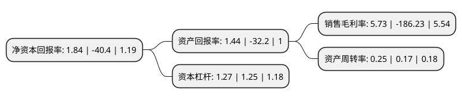

> 本页面由自动化程序生成于 2022年5月20日 01:07
> 内容可能存在错误，如有bug请提交issue至：https://github.com/Eroleice/doc-pi/issues
{.is-warning}

# 上市公司基本情况

## 基本资料

厦门安妮股份有限公司（以下简称“安妮股份”）成立于1998年09月14日，厦门市。于2008年05月16日在深交所中小板上市。

安妮股份注册资本57,957.228万元，主营业务:版权服务，互联网营销服务，商务信息用纸业务。以下是详细信息：

- 公司名称: 厦门安妮股份有限公司
- 股票代码: 002235.SZ
- 所在地: 福建 - 厦门市
- 成立日期: 1998年09月14日
- 注册资本: 57,957.228万元
- 法定代表人: 张杰
- 主营业务: 主营业务:版权服务，互联网营销服务，商务信息用纸业务
- 公司官网: www.anne.com.cn
- 公司介绍: 公司是一家以互联网应用与服务业务为主要领域和方向的综合企业集团，是国家火炬计划重点高新技术企业。公司当前拥有四个主要业务，包括数字版权服务、数字营销服务、商务信息纸品营销服务、彩票营销服务。公司专业提供在线数字版权申请服务，已推出“申请数字版权，只要3分钟”极速数字版权服务平台。产品使用创新的智能AI和区块链加固技术，还可提供基于DCI数字版权保护体系的数字版权服务。公司专业从事数字媒体的内容服务，亟社会化媒体运营、营销及内容IP的增值服务。公司的商务信息纸品营销服务业务拥有以热敏纸、无碳纸、彩色打印纸、双胶纸等为主的品类系列。彩票营销服务业务专业从事为国家彩票的产品制造供应与服务和无纸化彩票销售的整体解决方案提供与服务。

## 股东及高管情况

上市公司第一大股东为林旭曦，持股86,669,683股，占比14.95%，**疑似为**上市公司实际控制人。

截至2022年03月31日，上市公司的前十大股东中，共有9名自然人股东，1个产品账户，其中5%以上大股东共有2名。上市公司前十大股东明细如下：

> 未能通过持股比例判定出上市公司实际控制人（持股30%以上）
> 可能存在通过间接持股、联合持股、协议控制等方式拥有实际控制权的主体，具体请参考上市公司定期公告！
{.is-warning}

> 截至2022年03月31日，上市公司前十大股东信息如下：

| 股东名称 | 持股数量（股） | 持股比例 |
| --- | --- | --- |
| 林旭曦 | 86,669,683 | 14.95% |
| 张杰 | 34,493,494 | 5.95% |
| 杨超 | 7,114,279 | 1.23% |
| 唐维一 | 4,519,200 | 0.78% |
| 唐龙福 | 2,628,500 | 0.45% |
| 上海阿杏投资管理有限公司-阿杏世纪私募证券投资基金 | 2,482,700 | 0.43% |
| 张玉萍 | 2,070,000 | 0.36% |
| 王鸿增 | 1,845,700 | 0.32% |
| 王建明 | 1,700,622 | 0.29% |
| 张玉芬 | 1,684,900 | 0.29% |

## 利润表分析

上市公司2021年总收入为3.93亿元，净利润为0.22亿元，实现盈利。

## 杜邦分析

> 数据列示周期：2021年 | 2020年 | 2019年
{.is-info}

上市公司的净资产收益率在近一年有所下降，下降幅度为-104.55%，其变化情况分解如下：
- 上市公司的销售毛利率在近一年下降了-103.08%，可能是生产效率的下降、商品原材料价格上涨或商品价格的下跌所致。
- 上市公司的资产周转率在近一年上升了47.06%，可能是源自于更快的销售回款或库存管理效果提升。
- 上市公司的财务杠杆比率在近一年上升了1.6%，可能是增加负债扩大生产规模。

