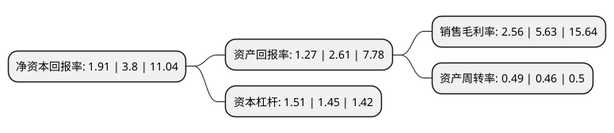

> 本页面由自动化程序生成于 2022年5月20日 01:07
> 内容可能存在错误，如有bug请提交issue至：https://github.com/Eroleice/doc-pi/issues
{.is-warning}

# 上市公司基本情况

## 基本资料

美盈森集团股份有限公司（以下简称“美盈森”）成立于2000年05月17日，深圳市。于2009年11月03日在深交所中小板上市。

美盈森注册资本153,132.369万元，从事轻型包装产品与重型包装产品的生产与销售，并为客户提供包装产品设计，包装方案优化，第三方采购与包装产品物流配送，供应商库存管理以及辅助包装作业等包装一体化服务。以下是详细信息：

- 公司名称: 美盈森集团股份有限公司
- 股票代码: 002303.SZ
- 所在地: 广东 - 深圳市
- 成立日期: 2000年05月17日
- 注册资本: 153,132.369万元
- 法定代表人: 王海鹏
- 主营业务: 从事轻型包装产品与重型包装产品的生产与销售，并为客户提供包装产品设计，包装方案优化，第三方采购与包装产品物流配送，供应商库存管理以及辅助包装作业等包装一体化服务
- 公司官网: www.szmys.com
- 公司介绍: 公司是一家国内领先的高端环保包装一体化综合服务商。公司主要从事轻重型环保包装、电子标签及RFID产品的研发、生产与销售，并为客户提供包装产品设计、包装方案优化、第三方采购与包装产品物流配送、供应商库存管理、辅助包装作业、电子标签及RFID解决方案。公司主要客户覆盖电子通讯、智能终端、食品饮料、保健品、家具家居、快递速运、新能源汽车产业链、家用电器、机械制造等多个行业。公司及下属公司共计拥有专利多项，同时也是多项国家包装标准的主要起草和参与起草单位，拥有的专利及参与制定和修订行业标准数量均在业内排名前列。公司已逐步实现在珠三角经济圈、长三角经济圈、成渝经济区、环渤海经济圈、长株潭经济圈、一带一路-越南的布局，赢得了众多世界知名企业和国内外细分行业领先企业的青睐。公司秉承“为顾客创造价值，为员工创造机会，为社会创造效益”的核心价值观，依托对包装美学、环保、节能、安全等理念的深入研究和深刻理解，在技术研发、服务模式、制造平台、客户资源、管理体系、产品及品牌等方面具有突出优势的国内领先的高端环保包装一体化综合服务商。

## 股东及高管情况

上市公司第一大股东为王海鹏，持股634,495,296股，占比41.43%，为上市公司实际控制人。

截至2022年03月31日，上市公司的前十大股东中，共有7名自然人股东，1名机构股东，2个产品账户，其中5%以上大股东共有2名。上市公司前十大股东明细如下：

> 截至2022年03月31日，上市公司前十大股东信息如下：

| 股东名称 | 持股数量（股） | 持股比例 |
| --- | --- | --- |
| 王海鹏 | 634,495,296 | 41.43% |
| 王治军 | 137,026,811 | 8.95% |
| 鞠成立 | 23,976,960 | 1.57% |
| 中国国际金融股份有限公司 | 17,191,600 | 1.12% |
| 毛顺华 | 10,000,600 | 0.65% |
| 中国建设银行股份有限公司-大成中证红利指数证券投资基金 | 8,199,100 | 0.54% |
| 陈良 | 8,100,000 | 0.53% |
| 池小贵 | 7,887,800 | 0.52% |
| 中国工商银行股份有限公司-富国中证红利指数增强型证券投资基金 | 7,252,800 | 0.47% |
| 王建荣 | 7,137,700 | 0.47% |

## 利润表分析

上市公司2021年总收入为36.05亿元，净利润为0.92亿元，实现盈利。

## 杜邦分析

> 数据列示周期：2021年 | 2020年 | 2019年
{.is-info}

上市公司的净资产收益率在近一年有所下降，下降幅度为-49.74%，其变化情况分解如下：
- 上市公司的销售毛利率在近一年下降了-54.53%，可能是生产效率的下降、商品原材料价格上涨或商品价格的下跌所致。
- 上市公司的资产周转率在近一年上升了6.52%，可能是源自于更快的销售回款或库存管理效果提升。
- 上市公司的财务杠杆比率在近一年上升了4.14%，可能是增加负债扩大生产规模。

