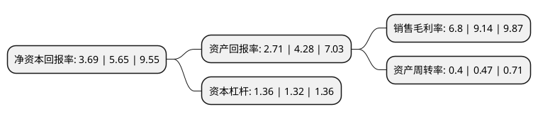

> 本页面由自动化程序生成于 2022年5月20日 01:21
> 内容可能存在错误，如有bug请提交issue至：https://github.com/Eroleice/doc-pi/issues
{.is-warning}

# 上市公司基本情况

## 基本资料

龙利得智能科技股份有限公司（以下简称“龙利得”）成立于2010年04月02日，滁州市。于2020年09月10日在深交所创业板上市。

龙利得注册资本34,600万元，专业从事瓦楞纸箱，纸板的研发，设计，生产和销售，主要为食品饮料，日化家化，粮油，家居办公，电子器械，医药医疗等行业的客户提供包装产品和服务，可根据客户的需求量身定制，设计综合包装方案，提供精细化服务。以下是详细信息：

- 公司名称: 龙利得智能科技股份有限公司
- 股票代码: 300883.SZ
- 所在地: 安徽 - 滁州市
- 成立日期: 2010年04月02日
- 注册资本: 34,600万元
- 法定代表人: 徐龙平
- 主营业务: 专业从事瓦楞纸箱，纸板的研发，设计，生产和销售，主要为食品饮料，日化家化，粮油，家居办公，电子器械，医药医疗等行业的客户提供包装产品和服务，可根据客户的需求量身定制，设计综合包装方案，提供精细化服务
- 公司官网: www.llddl.com
- 公司介绍: 公司是一家从事瓦楞纸箱、纸板的研发、设计、生产和销售的国内包装行业知名企业,通过自行设计和自主研发的软件，将产自多个国家领先的自动化流水线、码垛机器人、智能物流系统、印刷机等设备联接，达到了生产过程的自动化、智能化，实现了运营物流智能、操作流程智能、产品转换智能、仓储智能及生产流程信息化智能，提高了公司精细化和快速服务能力，降本增效,公司拥有191项专利，是国家级高新技术企业，在瓦楞结构、成型结构、水性高清印刷等方面拥有多项核心技术和自主知识产权，产品可实现防潮、防水、耐酸、防油、防锈、抗静电、耐磨、耐低温、抗高温等特殊功能，具有轻量化、高强度、环保的特征，产品附加值较高,先后获得“国家印刷示范企业”、“中国印刷包装企业100强”、“中国印刷行业100强”、“中国包装行业100强”、“安徽省名牌产品”、“安徽省企业技术中心”、“安徽省专精特新企业”等荣誉。

## 股东及高管情况

上市公司第一大股东为张云学，持股42,875,000股，占比12.39%，**疑似为**上市公司实际控制人。

截至2022年03月31日，上市公司的前十大股东中，共有4名自然人股东，5名机构股东，1个产品账户，其中5%以上大股东共有4名。上市公司前十大股东明细如下：

> 未能通过持股比例判定出上市公司实际控制人（持股30%以上）
> 可能存在通过间接持股、联合持股、协议控制等方式拥有实际控制权的主体，具体请参考上市公司定期公告！
{.is-warning}

> 截至2022年03月31日，上市公司前十大股东信息如下：

| 股东名称 | 持股数量（股） | 持股比例 |
| --- | --- | --- |
| 张云学 | 42,875,000 | 12.39% |
| 上海龙尔利投资发展有限公司 | 42,000,000 | 12.14% |
| 滁州浚源创业投资中心(有限合伙) | 35,222,100 | 10.18% |
| 徐龙平 | 20,433,900 | 5.91% |
| 上海金浦创新股权投资管理有限公司-上海金浦国调并购股权投资基金合伙企业(有限合伙) | 14,443,000 | 4.17% |
| 诸暨东证致臻投资中心(有限合伙) | 6,080,000 | 1.76% |
| 王皎 | 6,000,000 | 1.73% |
| 西藏金葵花资本管理有限公司 | 5,694,200 | 1.65% |
| 万里平 | 5,087,600 | 1.47% |
| 潍坊浚源股权投资中心合伙企业(有限合伙) | 3,363,000 | 0.97% |

## 利润表分析

上市公司2021年总收入为7.55亿元，净利润为0.51亿元，实现盈利。

## 杜邦分析

> 数据列示周期：2021年 | 2020年 | 2019年
{.is-info}

上市公司的净资产收益率在近一年有所下降，下降幅度为-34.69%，其变化情况分解如下：
- 上市公司的销售毛利率在近一年下降了-25.6%，可能是生产效率的下降、商品原材料价格上涨或商品价格的下跌所致。
- 上市公司的资产周转率在近一年下降了-14.89%，可能是源自于更慢的销售回款或库存管理效果下降。
- 上市公司的财务杠杆比率在近一年上升了3.03%，可能是增加负债扩大生产规模。

