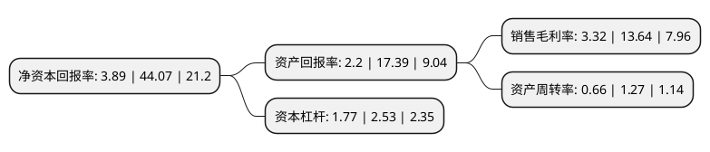

> 本页面由自动化程序生成于 2022年5月20日 01:22
> 内容可能存在错误，如有bug请提交issue至：https://github.com/Eroleice/doc-pi/issues
{.is-warning}

# 上市公司基本情况

## 基本资料

杭州可靠护理用品股份有限公司（以下简称“可靠股份”）成立于2001年08月07日，杭州市。于2021年06月17日在深交所创业板上市。

可靠股份注册资本27,186万元，公司专注于一次性卫生用品的设计，研发，生产和销售，公司的主要产品包括婴儿护理用品，成人失禁用品和宠物卫生用品和口罩。以下是详细信息：

- 公司名称: 杭州可靠护理用品股份有限公司
- 股票代码: 301009.SZ
- 所在地: 浙江 - 杭州市
- 成立日期: 2001年08月07日
- 注册资本: 27,186万元
- 法定代表人: 金利伟
- 主营业务: 公司专注于一次性卫生用品的设计，研发，生产和销售，公司的主要产品包括婴儿护理用品，成人失禁用品和宠物卫生用品和口罩
- 公司官网: www.cocohealthcare.com
- 公司介绍: 公司创办于2001年，是一家集科研、制造、贸易于一体的高新科技型企业，是国内著名的专业生产成人、婴儿、宠物卫生护理用品的基地。公司自创办之初开始生产纸尿裤产品，经过10年的努力，截止2013年已形成了四大系列多个品种，生产能力居国内领先水平。目前拥有“可靠”成人护理系列、“吸收宝”成人护理系列、“Quties酷特适、可可的童话”婴儿护理系列、“派特酷”宠物护理系列等自主品牌的纸尿裤产品；此外，公司产品出口亚洲、非洲、欧洲、美洲、澳洲等各大洲，已成为国内纸尿裤产品的重点骨干生产企业。公司产品作为国内成人纸尿裤市场的一线品牌，具备明显的市场竞争优势，自成立以来产销量一直保持持续快速增长，是国内最大的成人纸尿裤生产商家，中国成人护理领域最具价值品牌企业。同时公司还是国内成人纸尿裤、尿片国家标准的起草单位之一。

## 股东及高管情况

上市公司第一大股东为金利伟，持股161,099,964股，占比59.26%，为上市公司实际控制人。

截至2022年03月31日，上市公司的前十大股东中，共有2名自然人股东，4名机构股东，1个产品账户，3个海外主体，其中5%以上大股东共有1名。上市公司前十大股东明细如下：

> 截至2022年03月31日，上市公司前十大股东信息如下：

| 股东名称 | 持股数量（股） | 持股比例 |
| --- | --- | --- |
| 金利伟 | 161,099,964 | 59.26% |
| PACKWOODENTERPRISESLIMITED | 7,500,000 | 2.76% |
| 杭州唯艾诺投资合伙企业(有限合伙) | 7,200,000 | 2.65% |
| 北京海林致理投资管理有限公司-北京海林秉理投资中心(有限合伙) | 6,796,333 | 2.5% |
| Gracious Star (HK) Limited | 6,473,507 | 2.38% |
| Cherish Star (HK) Limited | 4,302,456 | 1.58% |
| 国泰君安证券资管-兴业银行-国泰君安君享创业板可靠护理1号战略配售集合资产管理计划 | 3,662,800 | 1.35% |
| 吴志伟 | 3,177,273 | 1.17% |
| 杭州唯艾诺贰号企业管理合伙企业(有限合伙) | 2,000,000 | 0.74% |
| 杭州唯艾诺叁号企业管理合伙企业(有限合伙) | 1,993,271 | 0.73% |

## 利润表分析

上市公司2021年总收入为11.86亿元，净利润为0.39亿元，实现盈利。

## 杜邦分析

> 数据列示周期：2021年 | 2020年 | 2019年
{.is-info}

上市公司的净资产收益率在近一年有所下降，下降幅度为-91.17%，其变化情况分解如下：
- 上市公司的销售毛利率在近一年下降了-75.66%，可能是生产效率的下降、商品原材料价格上涨或商品价格的下跌所致。
- 上市公司的资产周转率在近一年下降了-48.03%，可能是源自于更慢的销售回款或库存管理效果下降。
- 上市公司的财务杠杆比率在近一年下降了-30.04%，可能是减少负债降低财务费用。

