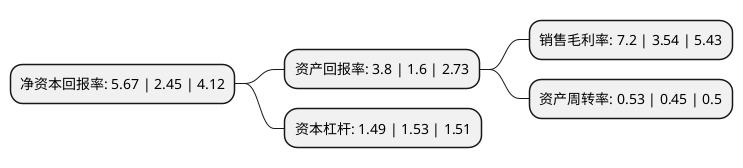

> 本页面由自动化程序生成于 2022年5月20日 01:24
> 内容可能存在错误，如有bug请提交issue至：https://github.com/Eroleice/doc-pi/issues
{.is-warning}

# 上市公司基本情况

## 基本资料

福建省青山纸业股份有限公司（以下简称“青山纸业”）成立于1993年04月01日，福州市。于1997年07月03日在上交所主板上市。

青山纸业注册资本230,581.781万元，主要产品:纸，卡，浆及副产品，碱，电产品，医药产品，营林业，商业贸易，光电子。以下是详细信息：

- 公司名称: 福建省青山纸业股份有限公司
- 股票代码: 600103.SH
- 所在地: 福建 - 福州市
- 成立日期: 1993年04月01日
- 注册资本: 230,581.781万元
- 法定代表人: 张小强
- 主营业务: 主要产品:纸，卡，浆及副产品，碱，电产品，医药产品，营林业，商业贸易，光电子
- 公司官网: www.qingshanpaper.com
- 公司介绍: 公司是集制浆、造纸、发电供热、碱回收、医药、光电子、原料林基地开发于一体的国有大型上市企业。公司是全国纸袋纸、牛皮箱板纸、高强瓦楞纸重点生产企业，先后通过了ISO9001质量管理体系和ISO14001环境管理体系国际标准认证。公司拥有省级企业技术中心，技术力量雄厚。公司立足纸业，巩固其行业领先地位的同时，积极推进产品结构调整和产业结构转型，规划营造的第一期原料林基地项目被列入国家首批林纸一体化实施计划，目前已投资建成造纸林基地，公司还通过投资医药及光纤通信等高科技领域，推进多元化的经营格局已基本形成。公司坚持“以人为本、竟业至新”的企业理念，按照“造就时代的青山人，创造世界的青山牌”的企业宗旨，以发展为主题，以创新为动力，通过低成本扩张及高端产品研发，确立长纤维本色包装纸在行业中的独特优势，打造百万吨级的制浆造纸综合性大型包装纸基地。

## 股东及高管情况

上市公司第一大股东为福建省能源集团有限责任公司，持股220,338,982股，占比9.56%，**疑似为**上市公司实际控制人。

截至2022年03月31日，上市公司的前十大股东中，共有5名自然人股东，4名机构股东，1个产品账户，其中5%以上大股东共有4名。上市公司前十大股东明细如下：

> 未能通过持股比例判定出上市公司实际控制人（持股30%以上）
> 可能存在通过间接持股、联合持股、协议控制等方式拥有实际控制权的主体，具体请参考上市公司定期公告！
{.is-warning}

> 上市公司第一大股东持股不超过10%，请检查是否存在公司控制权风险！
{.is-danger}

> 截至2022年03月31日，上市公司前十大股东信息如下：

| 股东名称 | 持股数量（股） | 持股比例 |
| --- | --- | --- |
| 福建省能源集团有限责任公司 | 220,338,982 | 9.56% |
| 福建省轻纺(控股)有限责任公司 | 193,673,889 | 8.4% |
| 福建省盐业集团有限责任公司 | 180,064,233 | 7.81% |
| 中信建投基金-中信证券-中信建投基金定增10号资产管理计划 | 132,203,389 | 5.73% |
| 福建省金皇贸易有限责任公司 | 53,204,102 | 2.31% |
| 寿稚岗 | 23,330,001 | 1.01% |
| 寿刚 | 10,700,000 | 0.46% |
| 范睿 | 10,570,100 | 0.46% |
| 季跃平 | 10,199,700 | 0.44% |
| 王佐臣 | 6,994,700 | 0.3% |

## 利润表分析

上市公司2021年总收入为28.67亿元，净利润为2.06亿元，实现盈利。

## 杜邦分析

> 数据列示周期：2021年 | 2020年 | 2019年
{.is-info}

上市公司的净资产收益率在近一年有所上升，上升幅度为131.43%，其变化情况分解如下：
- 上市公司的销售毛利率在近一年上升了103.39%，可能是生产效率的提升、商品原材料价格下跌或商品价格的上涨所致。
- 上市公司的资产周转率在近一年上升了17.78%，可能是源自于更快的销售回款或库存管理效果提升。
- 上市公司的财务杠杆比率在近一年下降了-2.61%，可能是减少负债降低财务费用。

