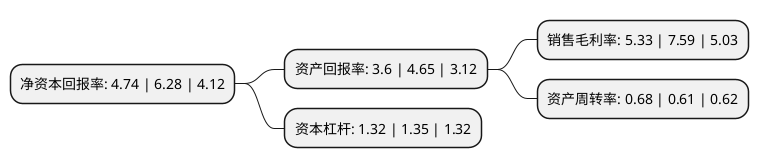

> 本页面由自动化程序生成于 2022年5月20日 01:26
> 内容可能存在错误，如有bug请提交issue至：https://github.com/Eroleice/doc-pi/issues
{.is-warning}

# 上市公司基本情况

## 基本资料

牡丹江恒丰纸业股份有限公司（以下简称“恒丰纸业”）成立于1994年03月06日，牡丹江市。于2001年04月19日在上交所主板上市。

恒丰纸业注册资本29,873.138万元，主要产品:卷烟纸，滤嘴棒纸，铝箔衬纸。以下是详细信息：

- 公司名称: 牡丹江恒丰纸业股份有限公司
- 股票代码: 600356.SH
- 所在地: 黑龙江 - 牡丹江市
- 成立日期: 1994年03月06日
- 注册资本: 29,873.138万元
- 法定代表人: 徐祥
- 主营业务: 主要产品:卷烟纸，滤嘴棒纸，铝箔衬纸
- 公司官网: www.hengfengpaper.com
- 公司介绍: 公司是国家烟草总公司确定的卷烟辅料生产基地，国内首家通过科技部和中国科学院认定的造纸行业重点高新技术企业。公司产品包括各种系列卷烟纸、滤嘴棒成型纸、滤嘴棒接装原纸、铝箔衬纸、无碳复写原纸等，主要产品均为国家专营产品，主导产品“天鹅”牌卷烟纸销往国内多家卷烟厂和材料厂。公司产品行销全国，同时还销往俄罗斯、东南亚、朝鲜等国际市场。公司致力于安全环保型特色产品的研制开发。公司技术中心是黑龙江省省级技术中心，同时也是黑龙江省特种纸中试基地，拥有以“省级重点专业带头人梯队”为核心的技术创新人才队伍，建有博士后科研工作站。公司荣获“全国先进基层党组织”、“全国五一劳动奖状”、全国“守合同重信用”企业等称号。公司将以成为世界上最好的林浆纸综合利用开发公司为愿景，积极践行“客户满意、员工满意、股东满意、社会满意”办企宗旨。

## 股东及高管情况

上市公司第一大股东为牡丹江恒丰纸业集团有限责任公司，持股89,423,083股，占比29.93%，**疑似为**上市公司实际控制人。

截至2022年03月31日，上市公司的前十大股东中，共有7名自然人股东，2名机构股东，1个产品账户，其中5%以上大股东共有1名。上市公司前十大股东明细如下：

> 未能通过持股比例判定出上市公司实际控制人（持股30%以上）
> 可能存在通过间接持股、联合持股、协议控制等方式拥有实际控制权的主体，具体请参考上市公司定期公告！
{.is-warning}

> 截至2022年03月31日，上市公司前十大股东信息如下：

| 股东名称 | 持股数量（股） | 持股比例 |
| --- | --- | --- |
| 牡丹江恒丰纸业集团有限责任公司 | 89,423,083 | 29.93% |
| 黑龙江省投资控股有限公司 | 9,240,000 | 3.09% |
| 牡丹江恒丰纸业股份有限公司-第一期员工持股计划 | 8,153,940 | 2.73% |
| 董延明 | 5,980,000 | 2% |
| 岳红云 | 2,095,900 | 0.7% |
| 鲍瑞 | 2,065,100 | 0.69% |
| 毛长山 | 1,967,700 | 0.66% |
| 张理国 | 1,571,200 | 0.53% |
| 吴广君 | 1,504,400 | 0.5% |
| 蔡永超 | 1,471,400 | 0.49% |

## 利润表分析

上市公司2021年总收入为20.21亿元，净利润为1.07亿元，实现盈利。

## 杜邦分析

> 数据列示周期：2021年 | 2020年 | 2019年
{.is-info}

上市公司的净资产收益率在近一年有所下降，下降幅度为-24.52%，其变化情况分解如下：
- 上市公司的销售毛利率在近一年下降了-29.78%，可能是生产效率的下降、商品原材料价格上涨或商品价格的下跌所致。
- 上市公司的资产周转率在近一年上升了11.48%，可能是源自于更快的销售回款或库存管理效果提升。
- 上市公司的财务杠杆比率在近一年下降了-2.22%，可能是减少负债降低财务费用。

