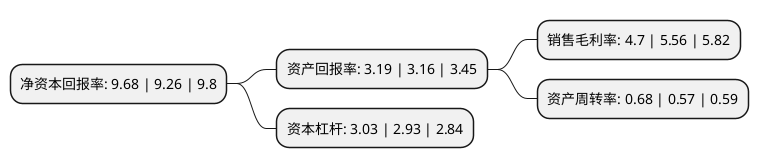

> 本页面由自动化程序生成于 2022年5月20日 01:27
> 内容可能存在错误，如有bug请提交issue至：https://github.com/Eroleice/doc-pi/issues
{.is-warning}

# 上市公司基本情况

## 基本资料

山鹰国际控股股份公司（以下简称“山鹰国际”）成立于1999年10月20日，马鞍山市。于2001年12月18日在上交所主板上市。

山鹰国际注册资本461,616.671万元，主要产品:箱纸板，纸箱以下是详细信息：

- 公司名称: 山鹰国际控股股份公司
- 股票代码: 600567.SH
- 所在地: 安徽 - 马鞍山市
- 成立日期: 1999年10月20日
- 注册资本: 461,616.671万元
- 法定代表人: 吴明武
- 主营业务: 主要产品:箱纸板，纸箱
- 公司官网: www.shanyingintl.com
- 公司介绍: 公司是一家集再生纤维、造纸、包装、印刷、环保、贸易、物流、港口码头等为一体的国际化企业。公司主营“山鹰牌”各类包装纸板、纸箱、新闻纸及其它纸制品的生产和销售，主导产品为箱纸板、瓦楞纸、瓦楞箱板纸箱等包装纸和新闻纸、胶印书刊纸等文化纸，“山鹰”牌被评为“中国著名品牌”,“山鹰牌”箱纸板为国家免检产品，广泛用于家电、纺织、医药、电子、水果饮料等多种商品的外包装和报纸书刊，市场前景广阔。公司在发展造纸的同时持续扩大纸箱经营规模，积极向下游产业链延伸，先后在马鞍山、苏州、扬州、杭州等地设立了多家子公司，大力发展瓦楞箱板纸箱业务，并且已建立了覆盖多个城市的原料回收网络和铁路专用线、水运专用码头及自备电站等一系列配套设施体系。公司秉承“诚信、关爱、激情、责任”的企业价值观，以“引领共创、共享、共赢的产业文明”为使命，以“成为全球最具价值创造力的生态型企业”为愿景，致力于构筑产业生态新格局。

## 股东及高管情况

上市公司第一大股东为福建泰盛实业有限公司，持股1,297,936,672股，占比28.12%，**疑似为**上市公司实际控制人。

截至2022年04月29日，上市公司的前十大股东中，共有6名自然人股东，1名机构股东，2个产品账户，1个海外主体，其中5%以上大股东共有1名。上市公司前十大股东明细如下：

> 未能通过持股比例判定出上市公司实际控制人（持股30%以上）
> 可能存在通过间接持股、联合持股、协议控制等方式拥有实际控制权的主体，具体请参考上市公司定期公告！
{.is-warning}

> 截至2022年04月29日，上市公司前十大股东信息如下：

| 股东名称 | 持股数量（股） | 持股比例 |
| --- | --- | --- |
| 福建泰盛实业有限公司 | 1,297,936,672 | 28.12% |
| 山鹰国际控股股份公司回购专用证券账户 | 206,026,573 | 4.46% |
| 吴丽萍 | 122,414,516 | 2.65% |
| 林文新 | 64,141,768 | 1.39% |
| 山鹰国际控股股份公司-创享激励基金合伙人第一期持股计划 | 58,646,137 | 1.27% |
| 香港中央结算有限公司(陆股通) | 49,722,886 | 1.08% |
| 何广亮 | 43,135,235 | 0.93% |
| 魏敏 | 40,613,874 | 0.88% |
| 王姬 | 27,967,102 | 0.61% |
| 李建成 | 25,420,130 | 0.55% |

## 利润表分析

上市公司2021年总收入为330.32亿元，净利润为15.53亿元，实现盈利。

## 杜邦分析

> 数据列示周期：2021年 | 2020年 | 2019年
{.is-info}

上市公司的净资产收益率在近一年有所上升，上升幅度为4.54%，其变化情况分解如下：
- 上市公司的销售毛利率在近一年下降了-15.47%，可能是生产效率的下降、商品原材料价格上涨或商品价格的下跌所致。
- 上市公司的资产周转率在近一年上升了19.3%，可能是源自于更快的销售回款或库存管理效果提升。
- 上市公司的财务杠杆比率在近一年上升了3.41%，可能是增加负债扩大生产规模。

