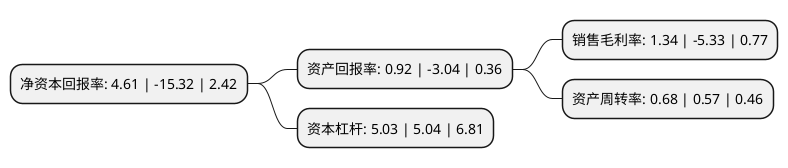

> 本页面由自动化程序生成于 2022年5月20日 01:29
> 内容可能存在错误，如有bug请提交issue至：https://github.com/Eroleice/doc-pi/issues
{.is-warning}

# 上市公司基本情况

## 基本资料

宜宾纸业股份有限公司（以下简称“宜宾纸业”）成立于1996年08月22日，宜宾市。于1997年02月20日在上交所主板上市。

宜宾纸业注册资本17,690.4万元，主要产品为低定量彩印新闻纸，高强度高白彩新闻纸，普通胶印新闻纸，食品包装原纸，文化原纸等。主营业务为生产销售新闻纸，文化纸，食品包装原纸。以下是详细信息：

- 公司名称: 宜宾纸业股份有限公司
- 股票代码: 600793.SH
- 所在地: 四川 - 宜宾市
- 成立日期: 1996年08月22日
- 注册资本: 17,690.4万元
- 法定代表人: 陈洪
- 主营业务: 主要产品为低定量彩印新闻纸，高强度高白彩新闻纸，普通胶印新闻纸，食品包装原纸，文化原纸等主营业务为生产销售新闻纸，文化纸，食品包装原纸
- 公司官网: www.yb-zy.com
- 公司介绍: 公司前身为“中国造纸厂”，始建于1944年，是中国第一张新闻纸的诞生地。公司以产销机制纸为主营业务，主要产品是高档纸杯原纸(高松厚度、中松厚度)、竹浆板。公司将以本地资源为依托，以竹浆造纸为核心，全力实施“竹浆纸一体化”发展战略，将公司建设成全国最大的竹浆造纸企业，成为国内纸浆造纸技术标准的制定者和引领者。

## 股东及高管情况

上市公司第一大股东为四川省宜宾五粮液集团有限公司，持股79,368,520股，占比44.87%，为上市公司实际控制人。

截至2022年03月31日，上市公司的前十大股东中，共有8名自然人股东，2名机构股东，其中5%以上大股东共有2名。上市公司前十大股东明细如下：

> 截至2022年03月31日，上市公司前十大股东信息如下：

| 股东名称 | 持股数量（股） | 持股比例 |
| --- | --- | --- |
| 四川省宜宾五粮液集团有限公司 | 79,368,520 | 44.87% |
| 四川省铁路产业投资集团有限责任公司 | 29,484,000 | 16.67% |
| 周徽 | 1,832,442 | 1.04% |
| 薛元富 | 1,034,260 | 0.58% |
| 吴柳花 | 872,600 | 0.49% |
| 洪顺兴 | 824,000 | 0.47% |
| 薛晓莉 | 675,560 | 0.38% |
| 李克力 | 542,500 | 0.31% |
| 龚岚 | 542,500 | 0.31% |
| 吴蕊 | 500,022 | 0.28% |

## 利润表分析

上市公司2021年总收入为21.16亿元，净利润为0.28亿元，实现盈利。

## 杜邦分析

> 数据列示周期：2021年 | 2020年 | 2019年
{.is-info}

上市公司的净资产收益率在近一年有所下降，下降幅度为-130.09%，其变化情况分解如下：
- 上市公司的销售毛利率在近一年下降了-125.14%，可能是生产效率的下降、商品原材料价格上涨或商品价格的下跌所致。
- 上市公司的资产周转率在近一年上升了19.3%，可能是源自于更快的销售回款或库存管理效果提升。
- 上市公司的财务杠杆比率在近一年下降了-0.2%，可能是减少负债降低财务费用。

