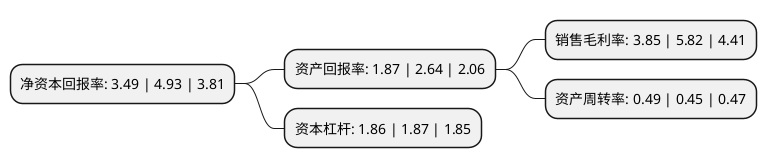

> 本页面由自动化程序生成于 2022年5月20日 01:30
> 内容可能存在错误，如有bug请提交issue至：https://github.com/Eroleice/doc-pi/issues
{.is-warning}

# 上市公司基本情况

## 基本资料

岳阳林纸股份有限公司（以下简称“岳阳林纸”）成立于2000年09月28日，岳阳市。于2004年05月25日在上交所主板上市。

岳阳林纸注册资本180,445.311万元，颜料整饰纸，轻涂纸，淋膜原纸和包装纸以下是详细信息：

- 公司名称: 岳阳林纸股份有限公司
- 股票代码: 600963.SH
- 所在地: 湖南 - 岳阳市
- 成立日期: 2000年09月28日
- 注册资本: 180,445.311万元
- 法定代表人: 李战
- 主营业务: 颜料整饰纸，轻涂纸，淋膜原纸和包装纸
- 公司官网: www.yypaper.com
- 公司介绍: 公司是国内造纸类上市公司中林纸一体化的央企龙头企业，区位优势明显，技术实力雄厚，为国内大型文化用纸、工业用原纸、包装纸、商品浆板生产企业，并从事林木、小化工经营。主导纸产品为颜料整饰胶版纸、静电复印纸、精制轻量涂布纸、低定量铜版纸、轻型印刷纸、工业用原纸、环保轻型纸、精品牛皮纸、伸性纸袋纸等，主导浆产品为漂白针叶浆、漂白阔叶浆、改性溶解浆等，市场分布全国多省、市、自治区以及亚洲和东非地区。公司产品采用直销和经销相结合的销售模式，主要面向的客户包括出版社、杂志社、大型印刷厂、纸制品加工企业、粘胶纤维厂、纸品经销商等。公司属国家高新技术企业，依托国家级技术中心，技术研发能力强。公司近年研发了国家级与省级新产品多个。公司高度重视环保工作，坚持科学发展，积极推行清洁生产、重视节能降耗和环境保护。公司曾先后荣获“全国用户满意单位”、“全国五一劳动奖状”、全国设备管理优秀单位、中国企业信息化500强湖南省节能减排科技示范企业等光荣称号。

## 股东及高管情况

上市公司第一大股东为泰格林纸集团股份有限公司，持股361,424,101股，占比20.03%，**疑似为**上市公司实际控制人。

截至2022年03月31日，上市公司的前十大股东中，共有4名自然人股东，6名机构股东，其中5%以上大股东共有3名。上市公司前十大股东明细如下：

> 未能通过持股比例判定出上市公司实际控制人（持股30%以上）
> 可能存在通过间接持股、联合持股、协议控制等方式拥有实际控制权的主体，具体请参考上市公司定期公告！
{.is-warning}

> 截至2022年03月31日，上市公司前十大股东信息如下：

| 股东名称 | 持股数量（股） | 持股比例 |
| --- | --- | --- |
| 泰格林纸集团股份有限公司 | 361,424,101 | 20.03% |
| 中国纸业投资有限公司 | 260,000,000 | 14.41% |
| 泰格林纸集团股份有限公司-泰格林纸集团股份有限公司2021年面向专业投资者非公开发行可交换公司债券质押专户 | 145,000,000 | 8.04% |
| 刘建国 | 67,446,729 | 3.74% |
| 山东省国有资产投资控股有限公司 | 32,500,000 | 1.8% |
| 陆斌 | 16,816,682 | 0.93% |
| 民生证券股份有限公司 | 8,991,995 | 0.5% |
| 王建飞 | 8,238,800 | 0.46% |
| 康育红 | 6,750,000 | 0.37% |
| 湖北新海天投资有限公司 | 6,429,720 | 0.36% |

## 利润表分析

上市公司2021年总收入为78.38亿元，净利润为3.02亿元，实现盈利。

## 杜邦分析

> 数据列示周期：2021年 | 2020年 | 2019年
{.is-info}

上市公司的净资产收益率在近一年有所下降，下降幅度为-29.21%，其变化情况分解如下：
- 上市公司的销售毛利率在近一年下降了-33.85%，可能是生产效率的下降、商品原材料价格上涨或商品价格的下跌所致。
- 上市公司的资产周转率在近一年上升了8.89%，可能是源自于更快的销售回款或库存管理效果提升。
- 上市公司的财务杠杆比率在近一年下降了-0.53%，可能是减少负债降低财务费用。

