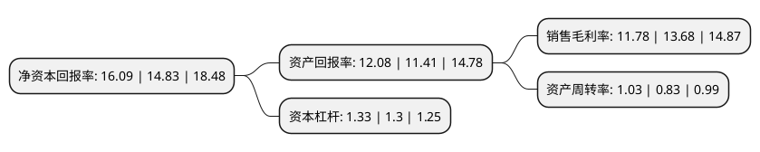

> 本页面由自动化程序生成于 2022年5月20日 01:33
> 内容可能存在错误，如有bug请提交issue至：https://github.com/Eroleice/doc-pi/issues
{.is-warning}

# 上市公司基本情况

## 基本资料

浙江荣晟环保纸业股份有限公司（以下简称“荣晟环保”）成立于1998年11月09日，嘉兴市。于2017年01月17日在上交所主板上市。

荣晟环保注册资本26,320.189万元，公司主要从事各种中高档包装用再生环保纸的研发，生产和销售。主要产品包括牛皮箱板纸和高强瓦楞原纸，纸箱和蒸汽，其中牛皮箱板纸和高强瓦楞原纸两大类包装纸为核心产品。以下是详细信息：

- 公司名称: 浙江荣晟环保纸业股份有限公司
- 股票代码: 603165.SH
- 所在地: 浙江 - 嘉兴市
- 成立日期: 1998年11月09日
- 注册资本: 26,320.189万元
- 法定代表人: 冯荣华
- 主营业务: 公司主要从事各种中高档包装用再生环保纸的研发，生产和销售主要产品包括牛皮箱板纸和高强瓦楞原纸，纸箱和蒸汽，其中牛皮箱板纸和高强瓦楞原纸两大类包装纸为核心产品
- 公司官网: www.rszy.com
- 公司介绍: 公司是以造纸为龙头，集热电、包装为一体的现代企业，现拥有四条造纸生产流水线，生产各类高档牛皮箱纸板、瓦楞原纸和包装用纸板，公司顺利通过ISO9001：2000质量体系认证，通过技术监督局质量认证，全项指标高于GB/T13024——91标准，达到ISP3902——85国际标准，指定为出口纸箱专用纸。热电联产、集中供热项目不仅满足公司的用电用热需求，并为平湖市经济开发区集中供热，既降低企业的运营成本，也提升了开发区的投资环境。公司成立至今，一直在不断投入资金，引进先进技术，提高产品质量。为进一步提升营运和管理系统，公司采用国际先进的管理技术，并推行世界级的企业资源规划系统，以求完善公司的运作。同时公司经常开展员工外派学习和企业内训活动，培养技术和管理人员，提升企业凝聚力。

## 股东及高管情况

上市公司第一大股东为冯荣华，持股104,428,865股，占比39.5%，为上市公司实际控制人。

截至2022年04月29日，上市公司的前十大股东中，共有8名自然人股东，1名机构股东，1个产品账户，其中5%以上大股东共有1名。上市公司前十大股东明细如下：

> 截至2022年04月29日，上市公司前十大股东信息如下：

| 股东名称 | 持股数量（股） | 持股比例 |
| --- | --- | --- |
| 冯荣华 | 104,428,865 | 39.5% |
| 张云芳 | 13,004,022 | 4.92% |
| 冯晟伟 | 11,760,000 | 4.45% |
| 冯晟宇 | 11,760,000 | 4.45% |
| 陈雄伟 | 11,657,762 | 4.41% |
| 陆祥根 | 11,321,828 | 4.28% |
| 姚元熙 | 4,206,188 | 1.59% |
| 圆信永丰基金-昆仑健康保险股份有限公司-圆信永丰优选金股1号单一资产管理计划 | 3,404,426 | 1.29% |
| 郑佐关 | 2,895,476 | 1.1% |
| 周口城投控股投资有限公司 | 2,092,586 | 0.79% |

## 利润表分析

上市公司2021年总收入为24.14亿元，净利润为2.84亿元，实现盈利。

## 杜邦分析

> 数据列示周期：2021年 | 2020年 | 2019年
{.is-info}

上市公司的净资产收益率在近一年有所上升，上升幅度为8.5%，其变化情况分解如下：
- 上市公司的销售毛利率在近一年下降了-13.89%，可能是生产效率的下降、商品原材料价格上涨或商品价格的下跌所致。
- 上市公司的资产周转率在近一年上升了24.1%，可能是源自于更快的销售回款或库存管理效果提升。
- 上市公司的财务杠杆比率在近一年上升了2.31%，可能是增加负债扩大生产规模。

