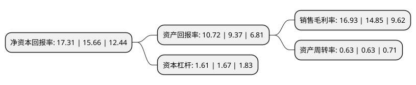

> 本页面由自动化程序生成于 2022年5月20日 01:35
> 内容可能存在错误，如有bug请提交issue至：https://github.com/Eroleice/doc-pi/issues
{.is-warning}

# 上市公司基本情况

## 基本资料

仙鹤股份有限公司（以下简称“仙鹤股份”）成立于2001年12月19日，衢州市。于2018年04月20日在上交所主板上市。

仙鹤股份注册资本70,597.227万元，特种纸研发，生产和销售。根据产品的下游应用领域与生产工艺相似程度，发行人主要产品可划分为烟草行业用纸，家居装饰用纸，商务交流及防伪用纸，食品与医疗包装用纸，标签离型用纸，电气及工业用纸，热转印用纸，低定量出版印刷用纸和其他共九大系列产品。以下是详细信息：

- 公司名称: 仙鹤股份有限公司
- 股票代码: 603733.SH
- 所在地: 浙江 - 衢州市
- 成立日期: 2001年12月19日
- 注册资本: 70,597.227万元
- 法定代表人: 王敏良
- 主营业务: 特种纸研发，生产和销售根据产品的下游应用领域与生产工艺相似程度，发行人主要产品可划分为烟草行业用纸，家居装饰用纸，商务交流及防伪用纸，食品与医疗包装用纸，标签离型用纸，电气及工业用纸，热转印用纸，低定量出版印刷用纸和其他共九大系列产品
- 公司官网: www.xianhepaper.com
- 公司介绍: 公司专注并致力于各类特种纸，纸浆，纸制品和相应化学助剂的开发和生产。公司致力于提供高品质的特种纸产品，包括烟草行业用纸、家居装饰用纸、商务交流及防伪用纸、食品与医疗包装用纸、标签离型用纸、电气及工业用纸、转印原纸等系列产品，年产量巨大。公司现场全面推行6S管理，积极推进ISO9001(质量管理体系认证)、ISO14001(环境管理体系认证)、OHSAS18001(职业健康安全管理体系认证)三体系管理方针，仙鹤产品已通过FSCCOC(FSC-C110766)产销监管链认证、QS生产许可和CMA计量认证，先后获得首批“浙江省绿色企业”和“浙江省名牌产品”、浙江省转型引领示范企业、“浙江省著名商标”等荣誉。公司以特种纸研发制造为核心，积极推动新材料、新能源等多元化产业的发展。

## 股东及高管情况

上市公司第一大股东为浙江仙鹤控股集团有限公司，持股540,000,000股，占比76.49%，为上市公司实际控制人。

截至2022年03月31日，上市公司的前十大股东中，共有2名自然人股东，1名机构股东，4个产品账户，2个海外主体，1名其他股东，其中5%以上大股东共有2名。上市公司前十大股东明细如下：

> 截至2022年03月31日，上市公司前十大股东信息如下：

| 股东名称 | 持股数量（股） | 持股比例 |
| --- | --- | --- |
| 浙江仙鹤控股集团有限公司 | 540,000,000 | 76.49% |
| 香港中央结算有限公司(陆股通) | 35,899,612 | 5.09% |
| 兴业银行股份有限公司-博时汇兴回报一年持有期灵活配置混合型证券投资基金 | 24,212,061 | 3.43% |
| 王明龙 | 10,000,600 | 1.42% |
| 江苏银行股份有限公司-博时汇融回报一年持有期混合型证券投资基金 | 4,918,676 | 0.7% |
| 澳门金融管理局-自有资金 | 3,536,927 | 0.5% |
| BILL & MELINDA GATES FOUNDATION TRUST | 3,327,480 | 0.47% |
| 华夏银行股份有限公司-博时博盈稳健6个月持有期混合型证券投资基金 | 2,084,600 | 0.3% |
| 张雁 | 1,790,000 | 0.25% |
| 上海立龙资产管理合伙企业(有限合伙)-立龙丰华一号私募证券投资基金 | 1,650,049 | 0.23% |

## 杜邦分析

> 数据列示周期：2021年 | 2020年 | 2019年
{.is-info}

上市公司的净资产收益率在近一年有所上升，上升幅度为10.54%，其变化情况分解如下：
- 上市公司的销售毛利率在近一年上升了14.01%，可能是生产效率的提升、商品原材料价格下跌或商品价格的上涨所致。
- 上市公司的资产周转率在近一年下降了0%，可能是源自于更慢的销售回款或库存管理效果下降。
- 上市公司的财务杠杆比率在近一年下降了-3.59%，可能是减少负债降低财务费用。

