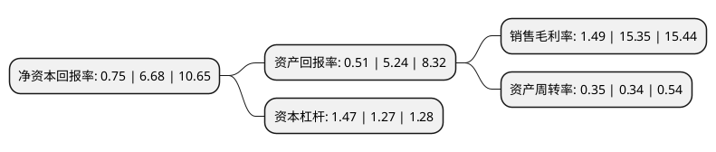

> 本页面由自动化程序生成于 2022年5月20日 01:35
> 内容可能存在错误，如有bug请提交issue至：https://github.com/Eroleice/doc-pi/issues
{.is-warning}

# 上市公司基本情况

## 基本资料

广东松炀再生资源股份有限公司（以下简称“松炀资源”）成立于2008年09月28日，汕头市。于2019年06月21日在上交所主板上市。

松炀资源注册资本20,589.4万元，主营业务:主要从事环保再生纸的研发，生产和销售，主要产品为灰底涂布白板纸。以下是详细信息：

- 公司名称: 广东松炀再生资源股份有限公司
- 股票代码: 603863.SH
- 所在地: 广东 - 汕头市
- 成立日期: 2008年09月28日
- 注册资本: 20,589.4万元
- 法定代表人: 王壮鹏
- 主营业务: 主营业务:主要从事环保再生纸的研发，生产和销售，主要产品为灰底涂布白板纸
- 公司官网: www.sypaper.cn
- 公司介绍: 公司是一家集再生纸张的研发、生产及销售为一体的高新材料企业。公司自成立以来，坚持“诚信、务实、创新、优质”的企业宗旨，秉承“环保造纸”的经营理念，推行技术创新、优化配置、加强管理、提高质量及健全网络等一系列改革，实施科学的企业管理，严格按ISO9001：2008质量管理体系的标准执行，以完善的质量体系贯穿于整个生产过程的始终。产品畅销粤东、珠三角和福建沿海等地区，赢得客户的认为及好评，销售业绩不断攀升。松炀公司拥有一支技术力量雄厚的专业团队，专业学科涉及造纸工艺、机电设备、高分子材料、检验分析、项目管理、经济分析、人力资源及计算机应用等。公司成立了企业技术研发中心，并与国内知名院校结成产学研战略联盟，还聘请国内知名高等院校和科研院所的专家为技术顾问，为产品开发和技术研究提供强有力的支撑。现已拥有自主知识产权若干项，并成功转化为生产力。

## 股东及高管情况

上市公司第一大股东为王壮鹏，持股61,064,000股，占比29.66%，**疑似为**上市公司实际控制人。

截至2022年03月31日，上市公司的前十大股东中，共有4名自然人股东，3名机构股东，3个产品账户，其中5%以上大股东共有3名。上市公司前十大股东明细如下：

> 未能通过持股比例判定出上市公司实际控制人（持股30%以上）
> 可能存在通过间接持股、联合持股、协议控制等方式拥有实际控制权的主体，具体请参考上市公司定期公告！
{.is-warning}

> 截至2022年03月31日，上市公司前十大股东信息如下：

| 股东名称 | 持股数量（股） | 持股比例 |
| --- | --- | --- |
| 王壮鹏 | 61,064,000 | 29.66% |
| 王壮加 | 19,470,000 | 9.46% |
| 深圳市前海金兴阳投资有限公司 | 10,366,000 | 5.03% |
| 汕头市新联新投资合伙企业(有限合伙) | 5,000,000 | 2.43% |
| 宁波宁聚资产管理中心(有限合伙)-宁聚量化多策略证券投资基金 | 2,000,000 | 0.97% |
| 宁波宁聚资产管理中心(有限合伙)-宁聚量化优选证券投资基金 | 2,000,000 | 0.97% |
| 上海宜业投资有限公司 | 2,000,000 | 0.97% |
| 上海子午投资管理有限公司-子午卓远三号私募证券投资基金 | 1,185,400 | 0.58% |
| 杨春梅 | 1,156,000 | 0.56% |
| 蔡丹虹 | 1,000,000 | 0.49% |

## 利润表分析

上市公司2021年总收入为5.97亿元，净利润为0.08亿元，实现盈利。

## 杜邦分析

> 数据列示周期：2021年 | 2020年 | 2019年
{.is-info}

上市公司的净资产收益率在近一年有所下降，下降幅度为-88.77%，其变化情况分解如下：
- 上市公司的销售毛利率在近一年下降了-90.29%，可能是生产效率的下降、商品原材料价格上涨或商品价格的下跌所致。
- 上市公司的资产周转率在近一年上升了2.94%，可能是源自于更快的销售回款或库存管理效果提升。
- 上市公司的财务杠杆比率在近一年上升了15.75%，可能是增加负债扩大生产规模。

