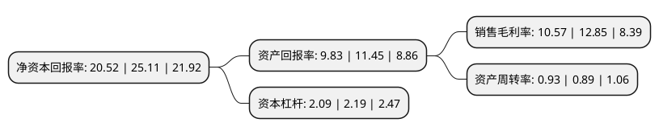

> 本页面由自动化程序生成于 2022年5月20日 01:36
> 内容可能存在错误，如有bug请提交issue至：https://github.com/Eroleice/doc-pi/issues
{.is-warning}

# 上市公司基本情况

## 基本资料

五洲特种纸业集团股份有限公司（以下简称“五洲特纸”）成立于2008年01月09日，衢州市。于2020年11月10日在上交所主板上市。

五洲特纸注册资本40,001万元，主营业务为特种纸的研发，生产和销售。根据产品下游应用领域不同，公司专注于生产食品包装纸，格拉辛纸以及描图纸，根据客户需求提供优质的产品及服务。以下是详细信息：

- 公司名称: 五洲特种纸业集团股份有限公司
- 股票代码: 605007.SH
- 所在地: 浙江 - 衢州市
- 成立日期: 2008年01月09日
- 注册资本: 40,001万元
- 法定代表人: 赵磊
- 主营业务: 主营业务为特种纸的研发，生产和销售根据产品下游应用领域不同，公司专注于生产食品包装纸，格拉辛纸以及描图纸，根据客户需求提供优质的产品及服务
- 公司官网: www.wztzzy.com
- 公司介绍: 公司是国内规模较大的食品包装纸生产企业和国内重要的格拉辛纸、描图纸生产企业。公司食品包装纸的主要客户为顶正包材、禾康包装、永康包装、统奕包装、岸宝集团等，最终用户为康师傅、统一等大型的食品饮料公司；公司格拉辛纸的主要客户为Avery Dennison(艾利丹尼森)、冠豪高新等国内外知名标签纸生产企业；公司描图纸的主要客户为无锡尚瑞等国内知名企业。发行人设立之初便十分注重工艺技术创新，通过引进行业内的技术人才，快速提升公司的技术水平。公司目前拥有一支经验丰富的生产和研发团队，核心技术人员均有15年以上造纸工作经验，对产品研发和工艺创新有深刻的理解和认识，较高的起点使得发行人较早成为顶正包材、禾康包装、统奕包装、岸宝集团、Avery Dennison(艾利丹尼森)等大型集团的供应商。在与大型高端客户合作的过程中，为进一步增加客户粘性，保持行业领先地位，发行人的生产和研发团队持续改进生产工艺、丰富产品类型、提升产品质量。目前，发行人已经获得了2项发明专利，9项实用新型专利。

## 股东及高管情况

上市公司第一大股东为赵磊，持股119,586,584股，占比29.9%，**疑似为**上市公司实际控制人。

截至2022年03月31日，上市公司的前十大股东中，共有5名自然人股东，3名机构股东，2个产品账户，其中5%以上大股东共有4名。上市公司前十大股东明细如下：

> 未能通过持股比例判定出上市公司实际控制人（持股30%以上）
> 可能存在通过间接持股、联合持股、协议控制等方式拥有实际控制权的主体，具体请参考上市公司定期公告！
{.is-warning}

> 截至2022年03月31日，上市公司前十大股东信息如下：

| 股东名称 | 持股数量（股） | 持股比例 |
| --- | --- | --- |
| 赵磊 | 119,586,584 | 29.9% |
| 赵晨佳 | 79,286,199 | 19.82% |
| 赵云福 | 61,150,620 | 15.29% |
| 林彩玲 | 50,032,326 | 12.51% |
| 嘉兴古道煦沣二期股权投资合伙企业(有限合伙) | 10,325,159 | 2.58% |
| 交通银行股份有限公司-创金合信数字经济主题股票型发起式证券投资基金 | 7,104,531 | 1.78% |
| 深圳市纵贯资本管理有限公司-纵贯策略三号私募证券投资基金 | 4,930,000 | 1.23% |
| 胡维德 | 4,390,000 | 1.1% |
| 宁波云蓝投资合伙企业(有限合伙) | 3,871,354 | 0.97% |
| 宁波浚泉信德投资合伙企业(有限合伙) | 2,676,093 | 0.67% |

## 利润表分析

上市公司2021年总收入为36.89亿元，净利润为3.9亿元，实现盈利。

## 杜邦分析

> 数据列示周期：2021年 | 2020年 | 2019年
{.is-info}

上市公司的净资产收益率在近一年有所下降，下降幅度为-18.28%，其变化情况分解如下：
- 上市公司的销售毛利率在近一年下降了-17.74%，可能是生产效率的下降、商品原材料价格上涨或商品价格的下跌所致。
- 上市公司的资产周转率在近一年上升了4.49%，可能是源自于更快的销售回款或库存管理效果提升。
- 上市公司的财务杠杆比率在近一年下降了-4.57%，可能是减少负债降低财务费用。

