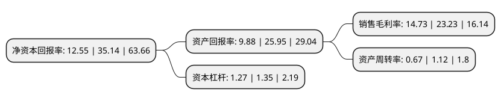

> 本页面由自动化程序生成于 2022年5月20日 01:36
> 内容可能存在错误，如有bug请提交issue至：https://github.com/Eroleice/doc-pi/issues
{.is-warning}

# 上市公司基本情况

## 基本资料

杭州豪悦护理用品股份有限公司（以下简称“豪悦护理”）成立于2008年03月11日，杭州市。于2020年09月11日在上交所主板上市。

豪悦护理注册资本15,983.83万元，主要产品为婴儿卫生用品，成人失禁用品和女性卫生用品等吸收性卫生用品。以下是详细信息：

- 公司名称: 杭州豪悦护理用品股份有限公司
- 股票代码: 605009.SH
- 所在地: 浙江 - 杭州市
- 成立日期: 2008年03月11日
- 注册资本: 15,983.83万元
- 法定代表人: 李志彪
- 主营业务: 主要产品为婴儿卫生用品，成人失禁用品和女性卫生用品等吸收性卫生用品
- 公司官网: www.hz-haoyue.com
- 公司介绍: 公司是国内个人卫生护理用品领域领先的制造商，专注于妇、幼、成人卫生护理用品的研发、制造与销售业务，产品涵盖婴儿纸尿裤、成人纸尿裤、经期裤、卫生巾、湿巾等一次性卫生用品。公司自成立以来，凭借较强的研发能力、严格的质量管控体系和可靠的生产供应能力，成为众多领先品牌商的合作伙伴，在业内积累了较多优质的客户，包括宝洁、金佰利、尤妮佳、SCA(维达)、花王等全球著名跨国公司，以及凯儿得乐、蜜芽、BEABA、子初、Eleser、景兴健护、重庆百亚等国内知名护理用品企业和母婴品牌商等。同时公司在多年的生产经营过程中，逐步打造出自身的品牌，获得了一定的市场知名度和美誉度。公司产品主要销售国内市场，同时还出口到非洲、亚洲、欧洲以及大洋洲等世界各地。公司为国家高新技术企业，设有杭州市级企业技术研发中心、浙江省级企业研发中心，产品研发技术力量雄厚，截止目前已取得94项专利证书，参与起草了国家标准《纸尿裤规格与尺寸》(GB/T33280-2016)，作为主要起草单位编制了浙江制造标准《裤型卫生巾》(T/ZZB0744-2018)标准，目前公司正受邀起草国家标准《妇女用纸质卫生裤》。

## 股东及高管情况

上市公司第一大股东为李志彪，持股53,593,085股，占比33.53%，为上市公司实际控制人。

截至2022年05月05日，上市公司的前十大股东中，共有6名自然人股东，2名机构股东，1个产品账户，1个海外主体，其中5%以上大股东共有3名。上市公司前十大股东明细如下：

> 截至2022年05月05日，上市公司前十大股东信息如下：

| 股东名称 | 持股数量（股） | 持股比例 |
| --- | --- | --- |
| 李志彪 | 53,593,085 | 33.53% |
| 朱威莉 | 33,920,744 | 21.22% |
| 李诗源 | 9,370,312 | 5.86% |
| 温州瓯泰投资企业(有限合伙) | 6,302,018 | 3.94% |
| 杭州希望众创实业投资合伙企业(有限合伙) | 6,247,272 | 3.91% |
| 杭州豪悦护理用品股份有限公司回购专用证券账户 | 4,218,652 | 2.64% |
| 香港中央结算有限公司(陆股通) | 847,479 | 0.53% |
| 胡凤华 | 640,830 | 0.4% |
| 薛青锋 | 411,240 | 0.26% |
| 戴银苑 | 267,668 | 0.17% |

## 利润表分析

上市公司2021年总收入为24.62亿元，净利润为3.62亿元，实现盈利。

## 杜邦分析

> 数据列示周期：2021年 | 2020年 | 2019年
{.is-info}

上市公司的净资产收益率在近一年有所下降，下降幅度为-64.29%，其变化情况分解如下：
- 上市公司的销售毛利率在近一年下降了-36.59%，可能是生产效率的下降、商品原材料价格上涨或商品价格的下跌所致。
- 上市公司的资产周转率在近一年下降了-40.18%，可能是源自于更慢的销售回款或库存管理效果下降。
- 上市公司的财务杠杆比率在近一年下降了-5.93%，可能是减少负债降低财务费用。

