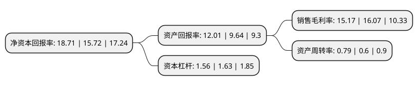

> 本页面由自动化程序生成于 2022年5月20日 01:37
> 内容可能存在错误，如有bug请提交issue至：https://github.com/Eroleice/doc-pi/issues
{.is-warning}

# 上市公司基本情况

## 基本资料

杭州华旺新材料科技股份有限公司（以下简称“华旺科技”）成立于2009年12月30日，杭州市。于2020年12月28日在上交所主板上市。

华旺科技注册资本28,705.738万元，主要从事可印刷装饰原纸和素色装饰原纸的研发，生产和销售业务，以及木浆的贸易业务。以下是详细信息：

- 公司名称: 杭州华旺新材料科技股份有限公司
- 股票代码: 605377.SH
- 所在地: 浙江 - 杭州市
- 成立日期: 2009年12月30日
- 注册资本: 28,705.738万元
- 法定代表人: 张延成
- 主营业务: 主要从事可印刷装饰原纸和素色装饰原纸的研发，生产和销售业务，以及木浆的贸易业务
- 公司官网: www.hwpaper.cn
- 公司介绍: 公司是国内从事装饰原纸生产的主要企业之一，主要从事可印刷装饰原纸和素色装饰原纸的研发、生产和销售业务，以及木浆的贸易业务。公司生产的装饰原纸广泛用于家具、地板、木门等产品的贴面装饰。多年来始终专注于装饰原纸品质的提升，积累了丰富的生产与管理经验。公司的装饰原纸产品种类齐全、质地均匀、性能良好，具有较强的市场竞争力。作为高新技术企业，发行人不断进行研发与创新，拥有多项专利，并获得“中国地板行业科技创新奖”、“中国林业产业创新奖”等荣誉。发行人是“中国林产工业协会装饰纸与饰面板专业委员会”副理事长单位，并参与起草了《人造板饰面专用纸》国家标准。

## 股东及高管情况

上市公司第一大股东为杭州华旺实业集团有限公司，持股84,084,000股，占比25.31%，**疑似为**上市公司实际控制人。

截至2022年03月31日，上市公司的前十大股东中，共有7名自然人股东，3名机构股东，其中5%以上大股东共有2名。上市公司前十大股东明细如下：

> 未能通过持股比例判定出上市公司实际控制人（持股30%以上）
> 可能存在通过间接持股、联合持股、协议控制等方式拥有实际控制权的主体，具体请参考上市公司定期公告！
{.is-warning}

> 截至2022年03月31日，上市公司前十大股东信息如下：

| 股东名称 | 持股数量（股） | 持股比例 |
| --- | --- | --- |
| 杭州华旺实业集团有限公司 | 84,084,000 | 25.31% |
| 钭江浩 | 60,352,550 | 18.17% |
| 王泽龙 | 14,576,457 | 4.39% |
| 钭正良 | 9,812,550 | 2.95% |
| 肖力铭 | 5,925,214 | 1.78% |
| 济南江山投资合伙企业(有限合伙) | 5,500,550 | 1.66% |
| 嘉兴致君投资管理有限公司-嘉兴致君格致投资合伙企业(有限合伙) | 5,121,034 | 1.54% |
| 张延成 | 5,023,500 | 1.51% |
| 李英 | 4,638,720 | 1.4% |
| 钭正贤 | 3,640,000 | 1.1% |

## 利润表分析

上市公司2021年总收入为29.4亿元，净利润为4.46亿元，实现盈利。

## 杜邦分析

> 数据列示周期：2021年 | 2020年 | 2019年
{.is-info}

上市公司的净资产收益率在近一年有所上升，上升幅度为19.02%，其变化情况分解如下：
- 上市公司的销售毛利率在近一年下降了-5.6%，可能是生产效率的下降、商品原材料价格上涨或商品价格的下跌所致。
- 上市公司的资产周转率在近一年上升了31.67%，可能是源自于更快的销售回款或库存管理效果提升。
- 上市公司的财务杠杆比率在近一年下降了-4.29%，可能是减少负债降低财务费用。

