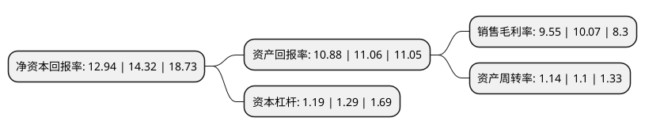

> 本页面由自动化程序生成于 2022年5月20日 01:37
> 内容可能存在错误，如有bug请提交issue至：https://github.com/Eroleice/doc-pi/issues
{.is-warning}

# 上市公司基本情况

## 基本资料

森林包装集团股份有限公司（以下简称“森林包装”）成立于1998年09月03日，台州市。于2020年12月22日在上交所主板上市。

森林包装注册资本20,000万元，主营业务系原纸，瓦楞纸板，瓦楞纸箱的研发，生产及销售，主要产品包括原纸，瓦楞纸板，瓦楞纸箱。以下是详细信息：

- 公司名称: 森林包装集团股份有限公司
- 股票代码: 605500.SH
- 所在地: 浙江 - 台州市
- 成立日期: 1998年09月03日
- 注册资本: 20,000万元
- 法定代表人: 林启军
- 主营业务: 主营业务系原纸，瓦楞纸板，瓦楞纸箱的研发，生产及销售，主要产品包括原纸，瓦楞纸板，瓦楞纸箱
- 公司官网: www.forestpacking.com
- 公司介绍: 公司是一家从事包装用纸及其制品研发、生产、销售的高新技术企业，主营业务系原纸、瓦楞纸板、瓦楞纸箱的研发、生产及销售，主要产品包括原纸、瓦楞纸板、瓦楞纸箱。公司产品广泛应用于包装物制造及工业品、消费品包装。公司通过了ISO9001、ISO14001体系认证、劳氏/GMI认证、FSC认证等资格，连续获得中国包装印刷企业百强，是一家集废纸利用、热电联产、生态造纸、绿色包装为一体的高新技术企业。

## 股东及高管情况

上市公司第一大股东为林启军，持股44,680,851股，占比22.34%，**疑似为**上市公司实际控制人。

截至2022年03月31日，上市公司的前十大股东中，共有8名自然人股东，2名机构股东，其中5%以上大股东共有4名。上市公司前十大股东明细如下：

> 未能通过持股比例判定出上市公司实际控制人（持股30%以上）
> 可能存在通过间接持股、联合持股、协议控制等方式拥有实际控制权的主体，具体请参考上市公司定期公告！
{.is-warning}

> 截至2022年03月31日，上市公司前十大股东信息如下：

| 股东名称 | 持股数量（股） | 持股比例 |
| --- | --- | --- |
| 林启军 | 44,680,851 | 22.34% |
| 林启群 | 38,297,872 | 19.15% |
| 林加连 | 25,531,915 | 12.77% |
| 林启法 | 25,531,915 | 12.77% |
| 台州森林投资合伙企业(有限合伙) | 8,074,468 | 4.04% |
| 温岭森林全创企业管理咨询合伙企业(有限合伙) | 6,382,979 | 3.19% |
| 陈清贤 | 1,500,000 | 0.75% |
| 许喆 | 1,120,000 | 0.56% |
| 许磊 | 1,110,000 | 0.56% |
| 吴醒钟 | 664,800 | 0.33% |

## 利润表分析

上市公司2021年总收入为29.55亿元，净利润为2.82亿元，实现盈利。

## 杜邦分析

> 数据列示周期：2021年 | 2020年 | 2019年
{.is-info}

上市公司的净资产收益率在近一年有所下降，下降幅度为-9.64%，其变化情况分解如下：
- 上市公司的销售毛利率在近一年下降了-5.16%，可能是生产效率的下降、商品原材料价格上涨或商品价格的下跌所致。
- 上市公司的资产周转率在近一年上升了3.64%，可能是源自于更快的销售回款或库存管理效果提升。
- 上市公司的财务杠杆比率在近一年下降了-7.75%，可能是减少负债降低财务费用。

