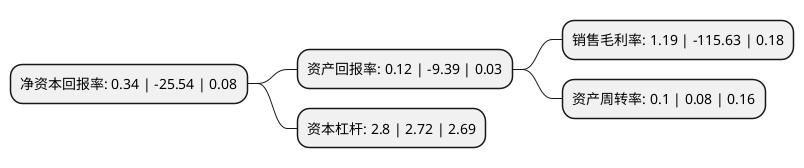

> 本页面由自动化程序生成于 2022年5月20日 01:01
> 内容可能存在错误，如有bug请提交issue至：https://github.com/Eroleice/doc-pi/issues
{.is-warning}

# 上市公司基本情况

## 基本资料

华天酒店集团股份有限公司（以下简称“华天酒店”）成立于1996年08月03日，长沙市。于1996年08月08日在深交所主板上市。

华天酒店注册资本101,892.6万元，主营业务:酒店服务，房地产，酒店资产运营，生产制造业等。主要产品:餐饮，客房，娱乐，光电子产品。以下是详细信息：

- 公司名称: 华天酒店集团股份有限公司
- 股票代码: 000428.SZ
- 所在地: 湖南 - 长沙市
- 成立日期: 1996年08月03日
- 注册资本: 101,892.6万元
- 法定代表人: 杨国平
- 主营业务: 主营业务:酒店服务，房地产，酒店资产运营，生产制造业等主要产品:餐饮，客房，娱乐，光电子产品
- 公司官网: www.huatian-hotel.com
- 公司介绍: 公司是一家以酒店业为核心，以房地产与旅游为两翼，誉满三湘、比肩国际的现代旅游服务企业，湖南省首家享有盛誉的超豪华五星级酒店。公司经过多年的积累，形成优质品牌、服务文化及管理文化等核心竞争力，是重要的接待基地、服务窗口；沉淀了优质的酒店物业，是湖南省旅游酒店支柱企业。公司大力改革，激发管理活力、优化资源配置。改革转型持续赋能，保证公司核心价值及企业文化精神传递，促使华天品牌文化、华天服务文化、进取管理团队等构成要素的公司核心竞争力能得到不断完善与提升。作为我国酒店业的“湘军”，公司荣膺“中国饭店业集团20强”、“全球饭店集团300强”，成为我国中西部地区最大的民族酒店品牌。先后获得“中国饭店业集团20强”、“全球饭店业300强”、服务领域国际最高荣誉“五星钻石奖”等称号。

## 股东及高管情况

上市公司第一大股东为湖南省酒店旅游发展集团有限公司，持股330,908,920股，占比32.48%，为上市公司实际控制人。

截至2022年04月07日，上市公司的前十大股东中，共有5名自然人股东，3名机构股东，2个产品账户，其中5%以上大股东共有3名。上市公司前十大股东明细如下：

> 截至2022年04月07日，上市公司前十大股东信息如下：

| 股东名称 | 持股数量（股） | 持股比例 |
| --- | --- | --- |
| 湖南省酒店旅游发展集团有限公司 | 330,908,920 | 32.48% |
| 湖南华信恒源股权投资企业(有限合伙) | 231,500,000 | 22.72% |
| 湖南华信恒源股权投资企业(有限合伙) | 231,500,000 | 22.72% |
| 张朝阳 | 6,580,000 | 0.65% |
| 姜雅芳 | 6,000,000 | 0.59% |
| 中国银行股份有限公司-富国中证旅游主题交易型开放式指数证券投资基金 | 4,570,800 | 0.45% |
| 李思乐 | 3,530,000 | 0.35% |
| 深圳昭阳投资管理有限公司-昭阳1号私募证券投资基金 | 3,504,435 | 0.34% |
| 贾云鹏 | 3,300,000 | 0.32% |
| 王燕 | 3,091,700 | 0.3% |

## 利润表分析

上市公司2021年总收入为5.94亿元，净利润为0.07亿元，实现盈利。

## 杜邦分析

> 数据列示周期：2021年 | 2020年 | 2019年
{.is-info}

上市公司的净资产收益率在近一年有所下降，下降幅度为-101.33%，其变化情况分解如下：
- 上市公司的销售毛利率在近一年下降了-101.03%，可能是生产效率的下降、商品原材料价格上涨或商品价格的下跌所致。
- 上市公司的资产周转率在近一年上升了25%，可能是源自于更快的销售回款或库存管理效果提升。
- 上市公司的财务杠杆比率在近一年上升了2.94%，可能是增加负债扩大生产规模。

