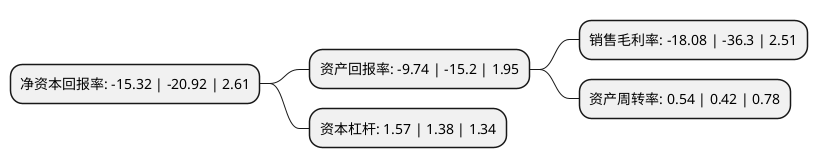

> 本页面由自动化程序生成于 2022年5月20日 01:06
> 内容可能存在错误，如有bug请提交issue至：https://github.com/Eroleice/doc-pi/issues
{.is-warning}

# 上市公司基本情况

## 基本资料

中国全聚德(集团)股份有限公司（以下简称“全聚德”）成立于1994年06月16日，北京市。于2007年11月20日在深交所中小板上市。

全聚德注册资本30,846.396万元，主要产品:全聚德烤鸭，特色菜品。主营业务:中式餐饮服务和食品工业两大板块。以下是详细信息：

- 公司名称: 中国全聚德(集团)股份有限公司
- 股票代码: 002186.SZ
- 所在地: 北京 - 北京市
- 成立日期: 1994年06月16日
- 注册资本: 30,846.396万元
- 法定代表人: 白凡
- 主营业务: 主要产品:全聚德烤鸭，特色菜品主营业务:中式餐饮服务和食品工业两大板块
- 公司官网: www.quanjude.com.cn
- 公司介绍: 公司创建于1864年，经过不断创新发展，形成了以独具特色的全聚德烤鸭为龙头，集“全鸭席”和400多道特色菜品于一体的全聚德菜系，被誉为“中华第一吃”。公司主营业务为中式餐饮服务和食品工业两大板块，中式餐饮服务方面主要有以“全聚德”烤鸭、“全鸭席”系列菜品为主的全聚德中高档餐饮服务，同时有以经营“满汉全席”为特色的餐饮明珠仿膳饭庄、以经营“葱烧海参”为代表的高档鲁菜丰泽园饭店和以经营“京派”特色川菜的四川饭店。食品工业板块主要生产和销售全聚德真空包装和系列熟食产品、荷叶饼、甜面酱等烤鸭辅料，适应节日市场需求的仿膳、全聚德月饼、仿膳元宵和仿膳经典宫廷糕点等传统面食品。“全聚德挂炉烤鸭技艺”和“仿膳(清廷御膳)制作技艺”分别被列入国家级非物质文化遗产项目。公司先后获得“中国十大文化品牌”、“中国餐饮十佳企业”、“中国最具竞争力的大企业集团”、“北京十大影响力企业”和“北京城市名片”等荣誉。

## 股东及高管情况

上市公司第一大股东为北京首都旅游集团有限责任公司，持股134,691,476股，占比43.67%，为上市公司实际控制人。

截至2022年03月31日，上市公司的前十大股东中，共有7名自然人股东，3名机构股东，其中5%以上大股东共有1名。上市公司前十大股东明细如下：

> 截至2022年03月31日，上市公司前十大股东信息如下：

| 股东名称 | 持股数量（股） | 持股比例 |
| --- | --- | --- |
| 北京首都旅游集团有限责任公司 | 134,691,476 | 43.67% |
| 李明军 | 3,570,983 | 1.16% |
| 北京轫开投资有限公司 | 2,738,160 | 0.89% |
| 王建国 | 1,925,000 | 0.62% |
| 凌舒宇 | 1,275,300 | 0.41% |
| 张亮 | 1,178,700 | 0.38% |
| 邢颖 | 1,045,000 | 0.34% |
| 黄河戟 | 952,700 | 0.31% |
| 西藏融睿投资有限公司 | 874,100 | 0.28% |
| 张澄 | 800,000 | 0.26% |

## 利润表分析

上市公司2021年总收入为9.47亿元，净利润为-1.72亿元，**未实现盈利**。

## 杜邦分析

> 数据列示周期：2021年 | 2020年 | 2019年
{.is-info}

上市公司的净资产收益率在近一年有所下降，下降幅度为-26.77%，其变化情况分解如下：
- 上市公司的销售毛利率在近一年下降了-50.19%，可能是生产效率的下降、商品原材料价格上涨或商品价格的下跌所致。
- 上市公司的资产周转率在近一年上升了28.57%，可能是源自于更快的销售回款或库存管理效果提升。
- 上市公司的财务杠杆比率在近一年上升了13.77%，可能是增加负债扩大生产规模。

