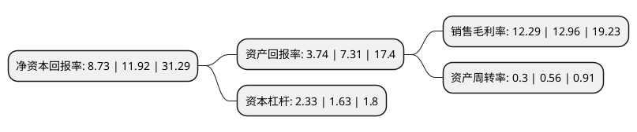

> 本页面由自动化程序生成于 2022年5月20日 01:22
> 内容可能存在错误，如有bug请提交issue至：https://github.com/Eroleice/doc-pi/issues
{.is-warning}

# 上市公司基本情况

## 基本资料

浙江君亭酒店管理股份有限公司（以下简称“君亭酒店”）成立于2007年08月08日，杭州市。于2021年09月30日在深交所创业板上市。

君亭酒店注册资本8,054万元，主营业务包括酒店运营及酒店管理业务，以住宿业高品质客房及餐饮，会务服务为核心产品。以下是详细信息：

- 公司名称: 浙江君亭酒店管理股份有限公司
- 股票代码: 301073.SZ
- 所在地: 浙江 - 杭州市
- 成立日期: 2007年08月08日
- 注册资本: 8,054万元
- 法定代表人: 吴启元
- 主营业务: 主营业务包括酒店运营及酒店管理业务，以住宿业高品质客房及餐饮，会务服务为核心产品
- 公司官网: www.ssawhotels.com
- 公司介绍: 公司主要从事于中高端精选服务连锁酒店的运营及管理。公司自成立以来以长三角城市群为核心发展区域，并逐步向全国范围重点城市有序拓展。公司已经建立了成熟的多层次的中高端酒店品牌，其中“君亭酒店”品牌定位为东方艺术特色的中档精选服务酒店；“寓君亭”品牌定位为中档公寓酒店；“夜泊君亭”品牌定位为高档历史文化旅游目的地酒店；“Pagoda君亭”定位为高档艺术设计酒店。至本招股说明书签署日，公司已开业酒店36家、已签约待开业酒店19家，其中已开业酒店中直营酒店16家、合营酒店1家和受托管理酒店19家。公司凭借在我国中高端连锁酒店行业的多年深耕优势和良好的市场口碑，2017年“君亭”酒店商标被浙江省工商行政管理局认定为“浙江省著名商标”、“中国旅游饭店业协会2016年度中国饭店集团60强”、“2018年中国旅游饭店业协会最佳股东投资回报奖”、“2018年中国饭店协会中国酒店集团规模50强”等行业权威荣誉。

## 股东及高管情况

上市公司第一大股东为吴启元，持股29,323,125股，占比36.41%，为上市公司实际控制人。

截至2022年03月31日，上市公司的前十大股东中，共有6名自然人股东，4个产品账户，其中5%以上大股东共有3名。上市公司前十大股东明细如下：

> 截至2022年03月31日，上市公司前十大股东信息如下：

| 股东名称 | 持股数量（股） | 持股比例 |
| --- | --- | --- |
| 吴启元 | 29,323,125 | 36.41% |
| 从波 | 15,619,500 | 19.39% |
| 施晨宁 | 8,292,375 | 10.3% |
| 吴海浩 | 2,632,500 | 3.27% |
| 中国农业银行股份有限公司-中邮核心优选混合型证券投资基金 | 1,500,014 | 1.86% |
| 中国建设银行股份有限公司-华泰柏瑞富利灵活配置混合型证券投资基金 | 1,424,024 | 1.77% |
| 中国工商银行股份有限公司-财通价值动量混合型证券投资基金 | 1,230,868 | 1.53% |
| 徐汉杰 | 1,200,000 | 1.49% |
| 中国工商银行股份有限公司-财通优势行业轮动混合型证券投资基金 | 1,188,388 | 1.48% |
| 沈玮 | 877,500 | 1.09% |

## 利润表分析

上市公司2021年总收入为2.77亿元，净利润为0.34亿元，实现盈利。

## 杜邦分析

> 数据列示周期：2021年 | 2020年 | 2019年
{.is-info}

上市公司的净资产收益率在近一年有所下降，下降幅度为-26.76%，其变化情况分解如下：
- 上市公司的销售毛利率在近一年下降了-5.17%，可能是生产效率的下降、商品原材料价格上涨或商品价格的下跌所致。
- 上市公司的资产周转率在近一年下降了-46.43%，可能是源自于更慢的销售回款或库存管理效果下降。
- 上市公司的财务杠杆比率在近一年上升了42.94%，可能是增加负债扩大生产规模。

