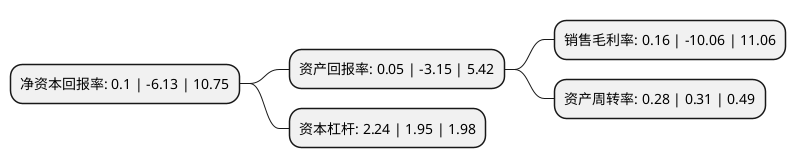

> 本页面由自动化程序生成于 2022年5月20日 01:25
> 内容可能存在错误，如有bug请提交issue至：https://github.com/Eroleice/doc-pi/issues
{.is-warning}

# 上市公司基本情况

## 基本资料

北京首旅酒店(集团)股份有限公司（以下简称“首旅酒店”）成立于1999年02月12日，北京市。于2000年06月01日在上交所主板上市。

首旅酒店注册资本112,138.312万元，主营业务:经济连锁型及中高端酒店的投资与运营管理，并兼有景区经营业务。以下是详细信息：

- 公司名称: 北京首旅酒店(集团)股份有限公司
- 股票代码: 600258.SH
- 所在地: 北京 - 北京市
- 成立日期: 1999年02月12日
- 注册资本: 112,138.312万元
- 法定代表人: 白凡
- 主营业务: 主营业务:经济连锁型及中高端酒店的投资与运营管理，并兼有景区经营业务
- 公司官网: www.bthhotels.com
- 公司介绍: 公司是一家领先的、具有市场规模较为突出优势的酒店集团公司，专注于经济连锁型及中高端酒店的投资与运营管理，并兼有景区经营业务。公司酒店业务包括酒店运营和酒店管理两种模式。第一，酒店运营模式主要指通过租赁物业来经营酒店，公司通过向顾客提供住宿及相关服务取得收入，并承担酒店房屋租金，装修及运营过程中的管理、维护、运营费用及相关税费后实现盈利。第二，酒店管理业务包括品牌加盟、输出管理和其他特许业务。对于景区业务，公司海南南山景区运营主要通过景区的门票、餐饮、商品、住宿、园区内交通等获得收入利润。公司拥有强大的信息化系统，面客系统、运营系统和支持系统分别应用服务、经营和管理，并作持续地改进和研发，为连锁酒店的高效管理和服务效率提供强大的IT工具支撑。公司本着“产品全系列”、“信息全覆盖”、“会员全流通”、“价值全方位”的目标，会员权益全面贯通，“如旅随行”的移动端规划、设计实施已迈向新高度。未来公司仍将以住宿为核心，充分利用自身品牌、规模、资源、平台、技术优势，继续加大资源整合力度，提高经营效率、效益，优化、改造服务和产品，践行中国服务，不忘初心地实践，牢牢把握住酒店行业内核。

## 股东及高管情况

上市公司第一大股东为北京首都旅游集团有限责任公司，持股385,677,344股，占比34.39%，为上市公司实际控制人。

截至2022年03月31日，上市公司的前十大股东中，共有3名机构股东，6个产品账户，1个海外主体，其中5%以上大股东共有2名。上市公司前十大股东明细如下：

> 截至2022年03月31日，上市公司前十大股东信息如下：

| 股东名称 | 持股数量（股） | 持股比例 |
| --- | --- | --- |
| 北京首都旅游集团有限责任公司 | 385,677,344 | 34.39% |
| 携程旅游信息技术(上海)有限公司 | 142,178,735 | 12.68% |
| 香港中央结算有限公司(陆股通) | 46,497,414 | 4.15% |
| 中国农业银行股份有限公司-交银施罗德先进制造混合型证券投资基金 | 11,146,148 | 0.99% |
| 中国工商银行股份有限公司-华安媒体互联网混合型证券投资基金 | 10,591,449 | 0.94% |
| 平安安赢股票型养老金产品-中国银行股份有限公司 | 9,326,044 | 0.83% |
| 招商银行股份有限公司-交银施罗德均衡成长一年持有期混合型证券投资基金 | 8,813,028 | 0.79% |
| 中信银行股份有限公司-交银施罗德新生活力灵活配置混合型证券投资基金 | 8,716,658 | 0.78% |
| 广发证券股份有限公司 | 8,693,485 | 0.78% |
| 基本养老保险基金一六零二一组合 | 8,300,056 | 0.74% |

## 利润表分析

上市公司2021年总收入为61.53亿元，净利润为0.1亿元，实现盈利。

## 杜邦分析

> 数据列示周期：2021年 | 2020年 | 2019年
{.is-info}

上市公司的净资产收益率在近一年有所下降，下降幅度为-101.63%，其变化情况分解如下：
- 上市公司的销售毛利率在近一年下降了-101.59%，可能是生产效率的下降、商品原材料价格上涨或商品价格的下跌所致。
- 上市公司的资产周转率在近一年下降了-9.68%，可能是源自于更慢的销售回款或库存管理效果下降。
- 上市公司的财务杠杆比率在近一年上升了14.87%，可能是增加负债扩大生产规模。

