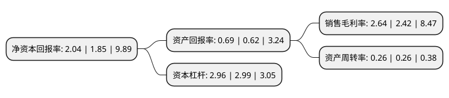

> 本页面由自动化程序生成于 2022年5月20日 01:28
> 内容可能存在错误，如有bug请提交issue至：https://github.com/Eroleice/doc-pi/issues
{.is-warning}

# 上市公司基本情况

## 基本资料

上海锦江国际酒店股份有限公司（以下简称“锦江酒店”）成立于1994年12月13日，上海市。于1996年10月11日在上交所主板上市。

锦江酒店注册资本107,004.406万元，主要业务:“有限服务型酒店营运及管理业务”和“食品及餐饮业务”。以下是详细信息：

- 公司名称: 上海锦江国际酒店股份有限公司
- 股票代码: 600754.SH
- 所在地: 上海 - 上海市
- 成立日期: 1994年12月13日
- 注册资本: 107,004.406万元
- 法定代表人: 张晓强
- 主营业务: “有限服务型酒店营运及管理业务”和“食品及餐饮业务”
- 公司官网: www.jinjianghotels.sh.cn
- 公司介绍: 公司是中国最大的酒店、餐饮业上市公司之一，主要业务为“有限服务型酒店营运及管理业务”和“食品及餐饮业务”。根据公司“全球布局、跨国经营”的发展战略，公司先后成功收购了法国卢浮集团、战略投资铂涛集团，在提升公司酒店规模的同时成功实施公司有限服务酒店业务的全球布局。目前公司旗下拥有“Golden Tulip”、“锦江都城”、“Campanile”、“锦江之星”、“丽枫”、“喆啡”、“七天”等酒店品牌。公司将通过实施“国际化、品牌化、市场化”的发展战略，以星级酒店管理业务为发展方向，并将通过锦江之星旅馆有限公司参与经济型酒店管理业务，继续拓展连锁中西快餐的投资经营，进一步提升公司在“管理、品牌、网络、人才”等方面的核心竞争能力。目前，酒店管理公司在人才建设、品牌建设、网络建设及质量标准管理等方面均呈现出良好的发展态势。

## 股东及高管情况

上市公司第一大股东为上海锦江资本股份有限公司，持股482,007,225股，占比45.05%，为上市公司实际控制人。

截至2022年03月31日，上市公司的前十大股东中，共有2名机构股东，6个产品账户，2个海外主体，其中5%以上大股东共有1名。上市公司前十大股东明细如下：

> 截至2022年03月31日，上市公司前十大股东信息如下：

| 股东名称 | 持股数量（股） | 持股比例 |
| --- | --- | --- |
| 上海锦江资本股份有限公司 | 482,007,225 | 45.05% |
| 香港中央结算有限公司(陆股通) | 40,301,146 | 3.77% |
| 招商银行股份有限公司-兴全合润混合型证券投资基金 | 18,591,646 | 1.74% |
| 招商银行股份有限公司-兴全合宜灵活配置混合型证券投资基金(LOF) | 16,004,853 | 1.5% |
| 华安未来资产-工商银行-安信信托股份有限公司 | 15,244,482 | 1.42% |
| 弘毅(上海)股权投资基金中心(有限合伙) | 12,882,972 | 1.2% |
| 安联环球投资新加坡有限公司-安联神州A股基金(交易所) | 9,876,251 | 0.92% |
| INVESCO FUNDS SICAV | 8,864,887 | 0.83% |
| 兴业银行股份有限公司-兴全新视野灵活配置定期开放混合型发起式证券投资基金 | 8,555,167 | 0.8% |
| 中国光大银行股份有限公司-兴全商业模式优选混合型证券投资基金(LOF) | 7,939,204 | 0.74% |

## 利润表分析

上市公司2021年总收入为113.39亿元，净利润为2.99亿元，实现盈利。

## 杜邦分析

> 数据列示周期：2021年 | 2020年 | 2019年
{.is-info}

上市公司的净资产收益率在近一年有所上升，上升幅度为10.27%，其变化情况分解如下：
- 上市公司的销售毛利率在近一年上升了9.09%，可能是生产效率的提升、商品原材料价格下跌或商品价格的上涨所致。
- 上市公司的资产周转率在近一年下降了0%，可能是源自于更慢的销售回款或库存管理效果下降。
- 上市公司的财务杠杆比率在近一年下降了-1%，可能是减少负债降低财务费用。

