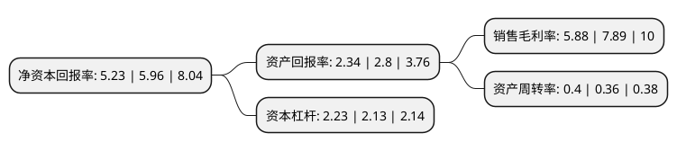

> 本页面由自动化程序生成于 2022年5月20日 01:30
> 内容可能存在错误，如有bug请提交issue至：https://github.com/Eroleice/doc-pi/issues
{.is-warning}

# 上市公司基本情况

## 基本资料

金陵饭店股份有限公司（以下简称“金陵饭店”）成立于2002年12月30日，南京市。于2007年04月06日在上交所主板上市。

金陵饭店注册资本39,000万元，主营业务:酒店经营，主要提供住宿，餐饮，会议等综合性服务。以下是详细信息：

- 公司名称: 金陵饭店股份有限公司
- 股票代码: 601007.SH
- 所在地: 江苏 - 南京市
- 成立日期: 2002年12月30日
- 注册资本: 39,000万元
- 法定代表人: 李茜
- 主营业务: 主营业务:酒店经营，主要提供住宿，餐饮，会议等综合性服务
- 公司官网: www.jinlinghotel.com
- 公司介绍: 公司由南京金陵饭店集团有限公司于2002年12月控股设立，2007年4月在上海证券交易所上市，成为全流通后国内酒店业首发上市第一股、江苏省首家上市旅游企业。公司以五星级金陵饭店为主体，坚持“品牌运营和资本扩张双轮驱动”，构建了“酒店投资管理、旅游资源开发、酒店物资贸易”三大板块的发展格局，创造性地走出了中国人创建世界一流酒店的成功之路，实现了从单体酒店向品牌连锁经营、跨区域旅游开发的飞跃，几十年来始终保持着中国酒店业的领先地位。公司创立了品牌营运、质量管理、市场营销、中央采供等十大专业化连锁系统，完善服务质量预警机制、营运质量评价机制、突发事件应急处理机制，不断提高整体绩效和管控水平，在全国酒店业率先通过ISO9001国际质量管理体系、ISO14001国际环境管理体系、OHSAS18001国际职业健康安全管理体系一体化认证，推动卓越绩效管理和标准化体系建设跃入更高层次。公司作为全国服务业的代表，摘取“全国质量工作先进单位标兵”；首届“中国质量奖提名奖”；“全国文明单位”称号；“全国旅游系统先进集体”等荣誉。

## 股东及高管情况

上市公司第一大股东为南京金陵饭店集团有限公司，持股169,667,918股，占比43.5%，为上市公司实际控制人。

截至2022年03月31日，上市公司的前十大股东中，共有4名自然人股东，5名机构股东，1个海外主体，其中5%以上大股东共有1名。上市公司前十大股东明细如下：

> 截至2022年03月31日，上市公司前十大股东信息如下：

| 股东名称 | 持股数量（股） | 持股比例 |
| --- | --- | --- |
| 南京金陵饭店集团有限公司 | 169,667,918 | 43.5% |
| SHING KWAN INVESTMENT (SINGAPORE) PTE LTD | 18,525,000 | 4.75% |
| 江苏交通控股有限公司 | 9,764,019 | 2.5% |
| 诗瑞德酒店管理(上海)有限公司 | 6,083,285 | 1.56% |
| 马红线 | 5,029,648 | 1.29% |
| 许尚龙 | 4,900,000 | 1.26% |
| 江苏凤凰文化贸易集团有限公司 | 4,702,255 | 1.21% |
| 许磊 | 2,700,000 | 0.69% |
| 南京邦驰百货贸易有限公司 | 2,671,221 | 0.68% |
| 王骏 | 2,090,000 | 0.54% |

## 利润表分析

上市公司2021年总收入为13.73亿元，净利润为0.8亿元，实现盈利。

## 杜邦分析

> 数据列示周期：2021年 | 2020年 | 2019年
{.is-info}

上市公司的净资产收益率在近一年有所下降，下降幅度为-12.25%，其变化情况分解如下：
- 上市公司的销售毛利率在近一年下降了-25.48%，可能是生产效率的下降、商品原材料价格上涨或商品价格的下跌所致。
- 上市公司的资产周转率在近一年上升了11.11%，可能是源自于更快的销售回款或库存管理效果提升。
- 上市公司的财务杠杆比率在近一年上升了4.69%，可能是增加负债扩大生产规模。

