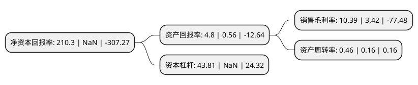

> 本页面由自动化程序生成于 2022年5月20日 01:04
> 内容可能存在错误，如有bug请提交issue至：https://github.com/Eroleice/doc-pi/issues
{.is-warning}

# 上市公司基本情况

## 基本资料

江苏法尔胜股份有限公司（以下简称“法尔胜”）成立于1993年06月30日，无锡市。于1999年01月19日在深交所主板上市。

法尔胜注册资本41,950.397万元，主要产品:主要用于航空，电脑，高档设备等的物资及动力传输的PU同步带用钢丝绳，应用于汽车门窗升降器，刹车制动装置等汽车配件的汽车用柔性钢丝绳;钢丝产品主要有产品规格涵盖0。5mm-12mm的各类钢丝及其制品，按照用途分有弹簧钢丝，打包钢丝，汽车座椅骨架钢丝，软轴软管钢丝，制绳钢丝等系列。主营业务:生产，销售多种用途，不同规格的钢丝，钢丝绳产品，提供以应收账款融资为主要服务内容的商业保理服务，以及与商业保理有关的咨询业务，专业提供应收账款及信用风险综合管理的新金融服务。以下是详细信息：

- 公司名称: 江苏法尔胜股份有限公司
- 股票代码: 000890.SZ
- 所在地: 江苏 - 无锡市
- 成立日期: 1993年06月30日
- 注册资本: 41,950.397万元
- 法定代表人: 陈明军
- 主营业务: 主要产品:主要用于航空，电脑，高档设备等的物资及动力传输的PU同步带用钢丝绳，应用于汽车门窗升降器，刹车制动装置等汽车配件的汽车用柔性钢丝绳;钢丝产品主要有产品规格涵盖05mm-12mm的各类钢丝及其制品，按照用途分有弹簧钢丝，打包钢丝，汽车座椅骨架钢丝，软轴软管钢丝，制绳钢丝等系列主营业务:生产，销售多种用途，不同规格的钢丝，钢丝绳产品，提供以应收账款融资为主要服务内容的商业保理服务，以及与商业保理有关的咨询业务，专业提供应收账款及信用风险综合管理的新金融服务
- 公司官网: www.chinafasten.cn
- 公司介绍: 公司作为国内知名的金属制品供应商，“法尔胜”品牌凭借着高效优质的形象，获得了市场的高度认可，也为产品的市场拓展打下了坚实基础。公司保理业务主要提供以应收账款融资为主要服务内容的商业保理服务、以及与商业保理有关的咨询业务，专业提供应收账款及信用风险综合管理的新金融服务，融资余额和业务收入规模处于国内领先地位。目前公司保理业务模式逐步由单一债权类业务向债权类业务、股权类业务联动发展的方向转型。公司金属制品业务主要是生产、销售多种用途、不同规格的钢丝、钢丝绳产品。其中钢丝绳产品主要有主要用于航空、电脑、高档设备等的物资及动力传输的PU同步带用钢丝绳、应用于汽车门窗升降器、刹车制动装置等汽车配件的汽车用柔性钢丝绳；钢丝产品主要有产品规格涵盖0.5mm-12mm的各类钢丝及其制品，按照用途分有弹簧钢丝、打包钢丝、汽车座椅骨架钢丝、软轴软管钢丝、制绳钢丝等系列。

## 股东及高管情况

上市公司第一大股东为法尔胜泓昇集团有限公司，持股120,892,486股，占比28.82%，**疑似为**上市公司实际控制人。

截至2022年03月31日，上市公司的前十大股东中，共有7名自然人股东，2名机构股东，1个产品账户，其中5%以上大股东共有2名。上市公司前十大股东明细如下：

> 未能通过持股比例判定出上市公司实际控制人（持股30%以上）
> 可能存在通过间接持股、联合持股、协议控制等方式拥有实际控制权的主体，具体请参考上市公司定期公告！
{.is-warning}

> 截至2022年03月31日，上市公司前十大股东信息如下：

| 股东名称 | 持股数量（股） | 持股比例 |
| --- | --- | --- |
| 法尔胜泓昇集团有限公司 | 120,892,486 | 28.82% |
| 江阴耀博泰邦企业管理合伙企业(有限合伙) | 56,946,224 | 13.57% |
| 张锡良 | 13,942,105 | 3.32% |
| 北京隆翔资产管理有限公司-隆翔3号私募证券投资基金 | 11,258,049 | 2.68% |
| 谷峰 | 3,235,411 | 0.77% |
| 陈照红 | 2,986,900 | 0.71% |
| 刘明 | 2,418,000 | 0.58% |
| 盛维 | 2,365,200 | 0.56% |
| 王晖 | 1,979,993 | 0.47% |
| 邵亚南 | 1,563,900 | 0.37% |

## 利润表分析

上市公司2021年总收入为6.67亿元，净利润为0.69亿元，实现盈利。

## 杜邦分析

> 数据列示周期：2021年 | 2020年 | 2019年
{.is-info}

上市公司的净资产收益率在近一年有所下降，下降幅度为NaN%，其变化情况分解如下：
- 上市公司的销售毛利率在近一年上升了203.8%，可能是生产效率的提升、商品原材料价格下跌或商品价格的上涨所致。
- 上市公司的资产周转率在近一年上升了187.5%，可能是源自于更快的销售回款或库存管理效果提升。
- 上市公司的财务杠杆比率在近一年下降了NaN%，可能是减少负债降低财务费用。

