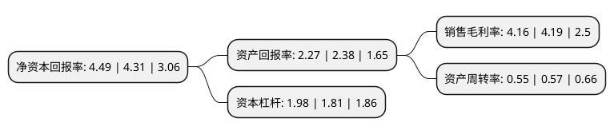

> 本页面由自动化程序生成于 2022年5月20日 01:06
> 内容可能存在错误，如有bug请提交issue至：https://github.com/Eroleice/doc-pi/issues
{.is-warning}

# 上市公司基本情况

## 基本资料

河南恒星科技股份有限公司（以下简称“恒星科技”）成立于1995年07月12日，郑州市。于2007年04月27日在深交所中小板上市。

恒星科技注册资本140,154.47万元，主营业务:金属制品领域的生产经营活动，产品主要应用于电力电缆，汽车轮胎，道路桥梁建设等领域。主要产品及劳务:钢帘线，胶管钢丝，镀锌钢绞线，镀锌钢丝，预应力钢绞线。以下是详细信息：

- 公司名称: 河南恒星科技股份有限公司
- 股票代码: 002132.SZ
- 所在地: 河南 - 郑州市
- 成立日期: 1995年07月12日
- 注册资本: 140,154.47万元
- 法定代表人: 谢晓博
- 主营业务: 主营业务:金属制品领域的生产经营活动，产品主要应用于电力电缆，汽车轮胎，道路桥梁建设等领域主要产品及劳务:钢帘线，胶管钢丝，镀锌钢绞线，镀锌钢丝，预应力钢绞线
- 公司官网: www.hengxingchinese.com
- 公司介绍: 公司主要生产子午轮胎用钢帘线、胶管钢丝、超精细钢丝、镀锌及合金镀层钢丝、钢绞线、PC钢绞线。产品广泛应用于汽车轮胎、橡胶软管、电力电缆、架空电力线、高速铁路、港口、光伏太阳能用硅晶片切割等行业，隶属于七大战略性新型产业中新材料领域。公司年产特种钢丝制品40多万吨，是国内金属制品行业细分龙头企业。公司钢绞线产品经上海电缆研究所、中国水电物资总公司实地检测，被指定为三峡电力外送、西电东输及特大型工程专用产品，并参与制定了《架空绞线用镀锌钢线》、《橡胶软管增强用钢丝》国家标准。公司先后被授予“河南省优秀民营企业”、“河南省百高企业”、“中国民营500强”。

## 股东及高管情况

上市公司第一大股东为谢保军，持股265,927,345股，占比18.97%，**疑似为**上市公司实际控制人。

截至2022年05月09日，上市公司的前十大股东中，共有6名自然人股东，1名机构股东，3个产品账户，其中5%以上大股东共有1名。上市公司前十大股东明细如下：

> 未能通过持股比例判定出上市公司实际控制人（持股30%以上）
> 可能存在通过间接持股、联合持股、协议控制等方式拥有实际控制权的主体，具体请参考上市公司定期公告！
{.is-warning}

> 截至2022年05月09日，上市公司前十大股东信息如下：

| 股东名称 | 持股数量（股） | 持股比例 |
| --- | --- | --- |
| 谢保军 | 265,927,345 | 18.97% |
| 焦耀中 | 47,007,395 | 3.35% |
| 冯小佳 | 43,549,000 | 3.11% |
| 焦会芬 | 38,806,900 | 2.77% |
| 谭士泓 | 30,550,060 | 2.18% |
| 成都振兴嘉业股权投资中心(有限合伙) | 27,272,727 | 1.95% |
| 河南恒星科技股份有限公司-第二期员工持股计划 | 25,445,700 | 1.82% |
| 李国强 | 21,277,700 | 1.52% |
| 中国工商银行股份有限公司-广发鑫享灵活配置混合型证券投资基金 | 15,738,500 | 1.12% |
| 河南恒星科技股份有限公司回购专用证券账户 | 14,116,097 | 1.01% |

## 利润表分析

上市公司2021年总收入为33.96亿元，净利润为1.41亿元，实现盈利。

## 杜邦分析

> 数据列示周期：2021年 | 2020年 | 2019年
{.is-info}

上市公司的净资产收益率在近一年有所上升，上升幅度为4.18%，其变化情况分解如下：
- 上市公司的销售毛利率在近一年下降了-0.72%，可能是生产效率的下降、商品原材料价格上涨或商品价格的下跌所致。
- 上市公司的资产周转率在近一年下降了-3.51%，可能是源自于更慢的销售回款或库存管理效果下降。
- 上市公司的财务杠杆比率在近一年上升了9.39%，可能是增加负债扩大生产规模。

