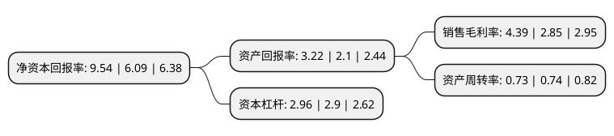

> 本页面由自动化程序生成于 2022年5月20日 01:06
> 内容可能存在错误，如有bug请提交issue至：https://github.com/Eroleice/doc-pi/issues
{.is-warning}

# 上市公司基本情况

## 基本资料

浙江东南网架股份有限公司（以下简称“东南网架”）成立于2001年12月29日，杭州市。于2007年05月30日在深交所中小板上市。

东南网架注册资本116,554.974万元，主营业务:大跨度空间钢结构，高层重钢结构，轻钢结构产品及钢结构围护产品的生产和销售。以下是详细信息：

- 公司名称: 浙江东南网架股份有限公司
- 股票代码: 002135.SZ
- 所在地: 浙江 - 杭州市
- 成立日期: 2001年12月29日
- 注册资本: 116,554.974万元
- 法定代表人: 徐春祥
- 主营业务: 主营业务:大跨度空间钢结构，高层重钢结构，轻钢结构产品及钢结构围护产品的生产和销售
- 公司官网: www.dongnanwangjia.com
- 公司介绍: 公司是国内外知名的钢结构、网架制作安装壹级资质企业，是首批建设部中国建筑金属结构协会定点生产企业，具有钢结构、网架及相关附属工程甲级设计资质的单位。公司要产品包括聚酯切片、涤纶预取向丝(POY)、涤纶牵引丝(FDY)等产品系列。公司在行业中率先通过ISO9001国际质量体系认证，具有年生产钢结构、网架46万吨，建筑板材600万平米的制造能力。公司产品辐射全国并打入国际市场，已成为国内同行业中经营规模最大、产品市场最宽的钢结构、网架工程专业承包企业。

## 股东及高管情况

上市公司第一大股东为浙江东南网架集团有限公司，持股314,515,000股，占比26.98%，**疑似为**上市公司实际控制人。

截至2022年03月31日，上市公司的前十大股东中，共有6名自然人股东，3名机构股东，1个海外主体，其中5%以上大股东共有2名。上市公司前十大股东明细如下：

> 未能通过持股比例判定出上市公司实际控制人（持股30%以上）
> 可能存在通过间接持股、联合持股、协议控制等方式拥有实际控制权的主体，具体请参考上市公司定期公告！
{.is-warning}

> 截至2022年03月31日，上市公司前十大股东信息如下：

| 股东名称 | 持股数量（股） | 持股比例 |
| --- | --- | --- |
| 浙江东南网架集团有限公司 | 314,515,000 | 26.98% |
| 杭州浩天物业管理有限公司 | 74,860,000 | 6.42% |
| 郭明明 | 50,445,991 | 4.33% |
| 余芳琴 | 19,672,131 | 1.69% |
| 徐春祥 | 18,000,000 | 1.54% |
| 周观根 | 18,000,000 | 1.54% |
| 殷建木 | 13,410,000 | 1.15% |
| 香港中央结算有限公司(陆股通) | 12,157,098 | 1.04% |
| 郭林林 | 12,020,000 | 1.03% |
| 中信里昂资产管理有限公司-客户资金 | 11,052,871 | 0.95% |

## 利润表分析

上市公司2021年总收入为112.87亿元，净利润为4.95亿元，实现盈利。

## 杜邦分析

> 数据列示周期：2021年 | 2020年 | 2019年
{.is-info}

上市公司的净资产收益率在近一年有所上升，上升幅度为56.65%，其变化情况分解如下：
- 上市公司的销售毛利率在近一年上升了54.04%，可能是生产效率的提升、商品原材料价格下跌或商品价格的上涨所致。
- 上市公司的资产周转率在近一年下降了-1.35%，可能是源自于更慢的销售回款或库存管理效果下降。
- 上市公司的财务杠杆比率在近一年上升了2.07%，可能是增加负债扩大生产规模。

