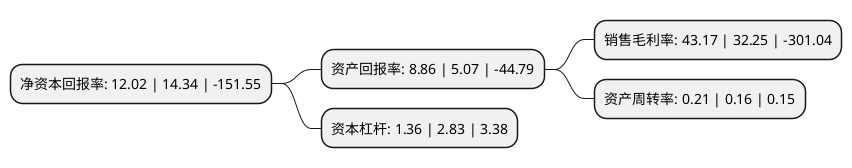

> 本页面由自动化程序生成于 2022年5月20日 01:09
> 内容可能存在错误，如有bug请提交issue至：https://github.com/Eroleice/doc-pi/issues
{.is-warning}

# 上市公司基本情况

## 基本资料

中南红文化集团股份有限公司（以下简称“中南文化”）成立于2003年05月28日，无锡市。于2010年07月13日在深交所中小板上市。

中南文化注册资本239,166.833万元，主营业务已由原有的制造业务逐渐转型为文化传媒业务。文化板块主要业务:电视剧，电影项目的投资，策划，制作，发行，营销及其衍生品开发业务;艺人培养和艺人经纪;版权开发，运营;游戏制作，发行;文化产业的股权投资。制造板块主要业务:金属管件，法兰，管系，压力容器的生产和销售。公司产品应用范围广泛，大量销售并应用于石油，化工，海洋工程，船舶，建筑，燃气，核电等行业。以下是详细信息：

- 公司名称: 中南红文化集团股份有限公司
- 股票代码: 002445.SZ
- 所在地: 江苏 - 无锡市
- 成立日期: 2003年05月28日
- 注册资本: 239,166.833万元
- 法定代表人: 薛健
- 主营业务: 主营业务已由原有的制造业务逐渐转型为文化传媒业务文化板块电视剧，电影项目的投资，策划，制作，发行，营销及其衍生品开发业务;艺人培养和艺人经纪;版权开发，运营;游戏制作，发行;文化产业的股权投资制造板块主要业务:金属管件，法兰，管系，压力容器的生产和销售公司产品应用范围广泛，大量销售并应用于石油，化工，海洋工程，船舶，建筑，燃气，核电等行业
- 公司官网: www.znhi.com.cn
- 公司介绍: 公司目前主营业务已由原有的制造业务逐渐转型为文化传媒业务。公司原专门从事金属管件、法兰、管系、压力容器的生产和销售，产品应用范围广泛，大量销售并应用于石油、化工、海洋工程、船舶、建筑、燃气、核电等行业。公司在金属管件制造行业十余年，积累良好的市场品牌与口碑，在技术、销售、管理方面，以及对行业发展方向等具有独到的经验与掌控能力，拥有优秀的制造、销售、管理团队，形成独特的核心竞争力。目前，公司文化板块主要业务包括电视剧、电影项目的投资、策划、制作、发行、营销及其衍生品开发业务；艺人培养和艺人经纪；版权开发、运营；游戏制作、发行；文化产业的股权投资。公司通过投资、收购、设立合资公司、建立工作室等形式，聚集了大批影视文化方面的优秀人才，使公司具有显著的人才优势。通过系列投资并购，公司已打造完成从文学IP开发到影视剧开发、游戏联动及衍生品开发一条完备的文娱内容开发产业链。

## 股东及高管情况

上市公司第一大股东为江阴澄邦企业管理发展中心(有限合伙)，持股699,451,852股，占比29.25%，**疑似为**上市公司实际控制人。

截至2022年03月31日，上市公司的前十大股东中，共有3名自然人股东，6名机构股东，1个产品账户，其中5%以上大股东共有3名。上市公司前十大股东明细如下：

> 未能通过持股比例判定出上市公司实际控制人（持股30%以上）
> 可能存在通过间接持股、联合持股、协议控制等方式拥有实际控制权的主体，具体请参考上市公司定期公告！
{.is-warning}

> 截至2022年03月31日，上市公司前十大股东信息如下：

| 股东名称 | 持股数量（股） | 持股比例 |
| --- | --- | --- |
| 江阴澄邦企业管理发展中心(有限合伙) | 699,451,852 | 29.25% |
| 华润深国投信托有限公司-华润信托·招利21号单一资金信托 | 260,686,437 | 10.9% |
| 北京中融鼎新投资管理有限公司-中融鼎新-鼎融嘉盈6号投资基金 | 160,539,072 | 6.71% |
| 铜陵志方企业管理中心(有限合伙) | 92,618,098 | 3.87% |
| 江苏新扬子造船有限公司 | 45,000,000 | 1.88% |
| 姚晓燕 | 28,900,000 | 1.21% |
| 孙剑平 | 28,819,326 | 1.2% |
| 高玉华 | 26,759,100 | 1.12% |
| 浙商银行股份有限公司南京分行 | 22,500,000 | 0.94% |
| 芒果创意投资管理有限公司 | 22,368,418 | 0.94% |

## 利润表分析

上市公司2021年总收入为4.81亿元，净利润为2.07亿元，实现盈利。

## 杜邦分析

> 数据列示周期：2021年 | 2020年 | 2019年
{.is-info}

上市公司的净资产收益率在近一年有所下降，下降幅度为-16.18%，其变化情况分解如下：
- 上市公司的销售毛利率在近一年上升了33.86%，可能是生产效率的提升、商品原材料价格下跌或商品价格的上涨所致。
- 上市公司的资产周转率在近一年上升了31.25%，可能是源自于更快的销售回款或库存管理效果提升。
- 上市公司的财务杠杆比率在近一年下降了-51.94%，可能是减少负债降低财务费用。

