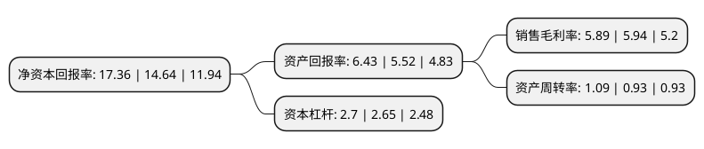

> 本页面由自动化程序生成于 2022年5月20日 01:10
> 内容可能存在错误，如有bug请提交issue至：https://github.com/Eroleice/doc-pi/issues
{.is-warning}

# 上市公司基本情况

## 基本资料

安徽鸿路钢结构(集团)股份有限公司（以下简称“鸿路钢构”）成立于2002年09月19日，合肥市。于2011年01月18日在深交所中小板上市。

鸿路钢构注册资本53,077.716万元，主营业务为钢结构及相关围护产品的制造和销售，以钢结构生产制造为主，工程承包业务为辅。主要产品为设备钢结构，建筑重钢结构，建筑轻钢结构，桥梁钢结构，空间钢结构，围护产品。以下是详细信息：

- 公司名称: 安徽鸿路钢结构(集团)股份有限公司
- 股票代码: 002541.SZ
- 所在地: 安徽 - 合肥市
- 成立日期: 2002年09月19日
- 注册资本: 53,077.716万元
- 法定代表人: 王军民
- 主营业务: 主营业务为钢结构及相关围护产品的制造和销售，以钢结构生产制造为主，工程承包业务为辅主要产品为设备钢结构，建筑重钢结构，建筑轻钢结构，桥梁钢结构，空间钢结构，围护产品
- 公司官网: www.hong-lu.com
- 公司介绍: 公司是目前中国大型钢结构企业集团之一。公司主营业务有钢结构及其配套产品加工、钢结构工业建筑、新型建材产品生产销售、装配式高层钢结构住宅、定制化洋房、高端智能立体车库制造运营、工业地产投资建设运营、绿色钢结构房产开发等，产品销往全球多个国家和地区。公司凭借强大的钢结构技术团队，加快创新驱动和转型升级，“一体化装配式高层钢结构住宅成套技术”，“高端智能车库存取技术”，“装配式低层住宅集成技术”等三大技术体系，处于国内领先地位。现已具备房屋建筑施工总承包一级资质、钢结构专项安装一级、钢结构制造特级资质，国家商务部对外承包工程经营资格证。先后获得国家住宅产业化基地、国家认定企业技术中心、中国驰名商标、国家高新技术企业、钢结构制造企业检测综合特级、安徽省行业技术中心、安徽省建筑产业化基地、安徽省两化融合企业等荣誉。鸿路将凭借强大的科技研发制造品牌实力，为绿色建筑和智慧城市发展做出努力。

## 股东及高管情况

上市公司第一大股东为商晓波，持股196,205,972股，占比36.97%，为上市公司实际控制人。

截至2022年03月31日，上市公司的前十大股东中，共有2名自然人股东，6个产品账户，1个海外主体，1名其他股东，其中5%以上大股东共有3名。上市公司前十大股东明细如下：

> 截至2022年03月31日，上市公司前十大股东信息如下：

| 股东名称 | 持股数量（股） | 持股比例 |
| --- | --- | --- |
| 商晓波 | 196,205,972 | 36.97% |
| 邓烨芳 | 57,367,200 | 10.81% |
| 香港中央结算有限公司(陆股通) | 37,053,504 | 6.98% |
| 中国工商银行股份有限公司-海富通改革驱动灵活配置混合型证券投资基金 | 8,213,265 | 1.55% |
| 澳门金融管理局-自有资金 | 7,476,836 | 1.41% |
| 中国银行股份有限公司-嘉实价值精选股票型证券投资基金 | 7,171,714 | 1.35% |
| 中国银行股份有限公司-嘉实价值驱动一年持有期混合型证券投资基金 | 6,046,633 | 1.14% |
| 中国银行股份有限公司-嘉实领先优势混合型证券投资基金 | 6,039,117 | 1.14% |
| 招商银行股份有限公司-嘉实价值长青混合型证券投资基金 | 5,635,443 | 1.06% |
| 中国银行股份有限公司-招商安华债券型证券投资基金 | 5,486,053 | 1.03% |

## 利润表分析

上市公司2021年总收入为195.14亿元，净利润为11.5亿元，实现盈利。

## 杜邦分析

> 数据列示周期：2021年 | 2020年 | 2019年
{.is-info}

上市公司的净资产收益率在近一年有所上升，上升幅度为18.58%，其变化情况分解如下：
- 上市公司的销售毛利率在近一年下降了-0.84%，可能是生产效率的下降、商品原材料价格上涨或商品价格的下跌所致。
- 上市公司的资产周转率在近一年上升了17.2%，可能是源自于更快的销售回款或库存管理效果提升。
- 上市公司的财务杠杆比率在近一年上升了1.89%，可能是增加负债扩大生产规模。

