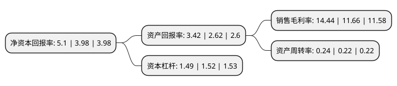

> 本页面由自动化程序生成于 2022年5月20日 01:10
> 内容可能存在错误，如有bug请提交issue至：https://github.com/Eroleice/doc-pi/issues
{.is-warning}

# 上市公司基本情况

## 基本资料

青岛东方铁塔股份有限公司（以下简称“东方铁塔”）成立于1996年08月01日，青岛市。于2011年02月11日在深交所中小板上市。

东方铁塔注册资本124,406.208万元，主营业务:主要从事钢结构(电厂钢结构，石化钢结构，民用建筑钢结构)和铁塔类产品(输电线路铁塔，广播电视塔，通信塔)研发，设计，生产，销售和安装，以及氯化钾的开采，生产和销售业务。主要产品:有电厂厂房钢结构，空冷平台钢结构，锅炉钢支架，输电线铁塔，广播电视塔，氯化钾等。以下是详细信息：

- 公司名称: 青岛东方铁塔股份有限公司
- 股票代码: 002545.SZ
- 所在地: 山东 - 青岛市
- 成立日期: 1996年08月01日
- 注册资本: 124,406.208万元
- 法定代表人: 韩方如
- 主营业务: 主营业务:主要从事钢结构(电厂钢结构，石化钢结构，民用建筑钢结构)和铁塔类产品(输电线路铁塔，广播电视塔，通信塔)研发，设计，生产，销售和安装，以及氯化钾的开采，生产和销售业务主要产品:有电厂厂房钢结构，空冷平台钢结构，锅炉钢支架，输电线铁塔，广播电视塔，氯化钾等
- 公司官网: www.qddftt.cn
- 公司介绍: 公司是一家主营钢结构与钾肥业务的双主业上市公司，产品涉及石油化工(锅炉钢支架、管廊支架、炬塔架等)、电力(厂房钢结构、电厂空冷平台、锅炉钢支架、大型变电站钢构架、高压输电线路塔、大跨越塔)、广电(广播电视塔、中波天线塔、短波塔)、通讯(微波线路塔、移动、联通通讯塔、长中短波塔)、建筑钢结构(高层建筑、体育场馆、会展建筑、工业厂房、抗震建筑、桥梁船舶等)、市政(市政桥梁及交通设施、了望塔、水塔、大型广告牌、灯柱、杆等)等领域。钢结构部件的加工精度、镀锌质量、焊接质量、垂直度等指标均达到或超过国家标准，深受施工单位、建设单位和用户的好评。

## 股东及高管情况

上市公司第一大股东为韩汇如，持股582,131,859股，占比46.79%，为上市公司实际控制人。

截至2022年04月27日，上市公司的前十大股东中，共有5名自然人股东，2名机构股东，3个产品账户，其中5%以上大股东共有6名。上市公司前十大股东明细如下：

> 截至2022年04月27日，上市公司前十大股东信息如下：

| 股东名称 | 持股数量（股） | 持股比例 |
| --- | --- | --- |
| 韩汇如 | 582,131,859 | 46.79% |
| 韩方如 | 75,932,300 | 6.1% |
| 韩方如 | 75,932,300 | 6.1% |
| 韩真如 | 75,932,200 | 6.1% |
| 汝州市顺成咨询服务合伙企业(有限合伙) | 67,961,234 | 5.46% |
| 汝州市顺成咨询服务合伙企业(有限合伙) | 64,511,234 | 5.1855% |
| 何艳 | 31,463,700 | 2.53% |
| 招商银行股份有限公司-华夏经典配置混合型证券投资基金 | 8,734,700 | 0.7% |
| 交通银行股份有限公司-广发中证基建工程交易型开放式指数证券投资基金 | 7,629,600 | 0.61% |
| 中国工商银行-华安安信消费服务股票型证券投资基金 | 6,911,200 | 0.56% |

## 利润表分析

上市公司2021年总收入为27.81亿元，净利润为4.01亿元，实现盈利。

## 杜邦分析

> 数据列示周期：2021年 | 2020年 | 2019年
{.is-info}

上市公司的净资产收益率在近一年有所上升，上升幅度为28.14%，其变化情况分解如下：
- 上市公司的销售毛利率在近一年上升了23.84%，可能是生产效率的提升、商品原材料价格下跌或商品价格的上涨所致。
- 上市公司的资产周转率在近一年上升了9.09%，可能是源自于更快的销售回款或库存管理效果提升。
- 上市公司的财务杠杆比率在近一年下降了-1.97%，可能是减少负债降低财务费用。

