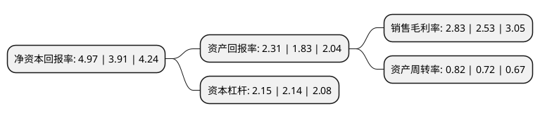

> 本页面由自动化程序生成于 2022年5月20日 01:10
> 内容可能存在错误，如有bug请提交issue至：https://github.com/Eroleice/doc-pi/issues
{.is-warning}

# 上市公司基本情况

## 基本资料

厦门日上集团股份有限公司（以下简称“日上集团”）成立于1995年08月01日，厦门市。于2011年06月28日在深交所中小板上市。

日上集团注册资本80,805.803万元，主要产品:无内胎钢轮，型钢钢轮与锻造铝轮。主营业务:金属制品的研发，制作与销售。以下是详细信息：

- 公司名称: 厦门日上集团股份有限公司
- 股票代码: 002593.SZ
- 所在地: 福建 - 厦门市
- 成立日期: 1995年08月01日
- 注册资本: 80,805.803万元
- 法定代表人: 吴子文
- 主营业务: 主要产品:无内胎钢轮，型钢钢轮与锻造铝轮主营业务:金属制品的研发，制作与销售
- 公司官网: www.sunrise-ncc.com
- 公司介绍: 公司一直专注于金属制品的研发、制作与销售，已成为集汽车车轮、钢结构+预制墙板+楼承板+金属围护系统于一体，在区域市场竞争实力最强的综合性金属制品企业集团。公司拥有自主完善的钢结构及围护配套系统，工程项目涉及大型工业厂房、物流仓储、公共建筑、住宅建筑、高层建筑、电力电厂、石油化工、桥梁轨道等领域。公司的汽车车轮产品包含了无内胎钢轮、型钢钢轮与锻造铝轮，产品系列已基本满足全球卡客车用户的需求。

## 股东及高管情况

上市公司第一大股东为吴子文，持股287,783,400股，占比35.61%，为上市公司实际控制人。

截至2022年03月31日，上市公司的前十大股东中，共有7名自然人股东，1名机构股东，1个产品账户，1个海外主体，其中5%以上大股东共有2名。上市公司前十大股东明细如下：

> 截至2022年03月31日，上市公司前十大股东信息如下：

| 股东名称 | 持股数量（股） | 持股比例 |
| --- | --- | --- |
| 吴子文 | 287,783,400 | 35.61% |
| 吴丽珠 | 82,416,600 | 10.2% |
| 中兵顺景股权投资管理有限公司-中兵国调(厦门)股权投资基金合伙企业(有限合伙) | 36,818,181 | 4.56% |
| 吴志良 | 21,375,000 | 2.65% |
| 吴伟洋 | 14,990,700 | 1.86% |
| 杭州龙蠡投资管理有限公司-台州路桥华瞬健行投资合伙企业(有限合伙) | 6,493,506 | 0.8% |
| 阮水龙 | 5,396,203 | 0.67% |
| 崔一鸣 | 4,612,800 | 0.57% |
| 高华-汇丰-GOLDMAN, SACHS & CO.LLC | 3,596,500 | 0.45% |
| 康月凤 | 3,306,499 | 0.41% |

## 利润表分析

上市公司2021年总收入为37.78亿元，净利润为1.06亿元，实现盈利。

## 杜邦分析

> 数据列示周期：2021年 | 2020年 | 2019年
{.is-info}

上市公司的净资产收益率在近一年有所上升，上升幅度为27.11%，其变化情况分解如下：
- 上市公司的销售毛利率在近一年上升了11.86%，可能是生产效率的提升、商品原材料价格下跌或商品价格的上涨所致。
- 上市公司的资产周转率在近一年上升了13.89%，可能是源自于更快的销售回款或库存管理效果提升。
- 上市公司的财务杠杆比率在近一年上升了0.47%，可能是增加负债扩大生产规模。

