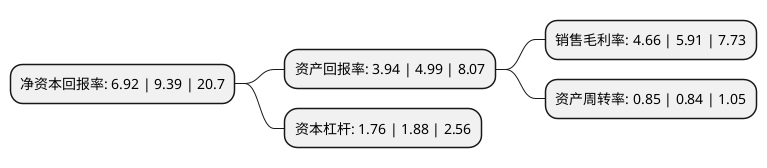

> 本页面由自动化程序生成于 2022年5月20日 01:21
> 内容可能存在错误，如有bug请提交issue至：https://github.com/Eroleice/doc-pi/issues
{.is-warning}

# 上市公司基本情况

## 基本资料

盛德鑫泰新材料股份有限公司（以下简称“盛德鑫泰”）成立于2001年10月15日，常州市。于2020年09月01日在深交所创业板上市。

盛德鑫泰注册资本10,000万元，公司主营业务包括研发，生产并销售合金钢，不锈钢和碳素钢无缝钢管以及钢格板类产品。公司生产的无缝钢管按照材质分类，主要包括合金钢钢管，不锈钢钢管和碳钢钢管。以下是详细信息：

- 公司名称: 盛德鑫泰新材料股份有限公司
- 股票代码: 300881.SZ
- 所在地: 江苏 - 常州市
- 成立日期: 2001年10月15日
- 注册资本: 10,000万元
- 法定代表人: 周文庆
- 主营业务: 公司主营业务包括研发，生产并销售合金钢，不锈钢和碳素钢无缝钢管以及钢格板类产品公司生产的无缝钢管按照材质分类，主要包括合金钢钢管，不锈钢钢管和碳钢钢管
- 公司官网: www.shengdechina.com
- 公司介绍: 公司主要从事各类工业用能源设备类无缝钢管的生产、研发和销售，产品主要应用于电站锅炉设备制造、石油炼化等行业，客户包括上海锅炉厂、哈尔滨锅炉厂、东方锅炉等国内大型电站锅炉制造企业以及中石化、中海油等大型石油炼化企业。公司生产的无缝钢管按照材质分类，主要包括合金钢钢管、不锈钢钢管和碳钢钢管；产品外径覆盖16mm-159mm、长度覆盖6m-18m的各种型号。公司产品主要用于电站锅炉设备领域与石油炼化领域。公司2009年起连续被评为高新技术企业，目前在小口径电站锅炉用合金钢领域拥有很强的行业竞争力。根据中国钢结构协会钢管分会的数据，公司生产的小口径高压锅炉用无缝钢管产量2014年、2015年和2016年连续3年在国内同行业中排名第一。

## 股东及高管情况

上市公司第一大股东为周文庆，持股43,500,000股，占比43.5%，为上市公司实际控制人。

截至2022年03月31日，上市公司的前十大股东中，共有6名自然人股东，4名机构股东，其中5%以上大股东共有3名。上市公司前十大股东明细如下：

> 截至2022年03月31日，上市公司前十大股东信息如下：

| 股东名称 | 持股数量（股） | 持股比例 |
| --- | --- | --- |
| 周文庆 | 43,500,000 | 43.5% |
| 宗焕琴 | 20,250,000 | 20.25% |
| 常州联泓企业管理中心(有限合伙) | 7,850,000 | 7.85% |
| 常州鑫泰企业管理中心(有限合伙) | 1,900,000 | 1.9% |
| 深圳南通博电子科技有限公司 | 1,500,000 | 1.5% |
| 华泰证券股份有限公司 | 185,041 | 0.19% |
| 江世文 | 184,400 | 0.18% |
| 杨宇 | 167,834 | 0.17% |
| 马宏 | 166,800 | 0.17% |
| 高晨 | 149,400 | 0.15% |

## 利润表分析

上市公司2021年总收入为11.22亿元，净利润为0.52亿元，实现盈利。

## 杜邦分析

> 数据列示周期：2021年 | 2020年 | 2019年
{.is-info}

上市公司的净资产收益率在近一年有所下降，下降幅度为-26.3%，其变化情况分解如下：
- 上市公司的销售毛利率在近一年下降了-21.15%，可能是生产效率的下降、商品原材料价格上涨或商品价格的下跌所致。
- 上市公司的资产周转率在近一年上升了1.19%，可能是源自于更快的销售回款或库存管理效果提升。
- 上市公司的财务杠杆比率在近一年下降了-6.38%，可能是减少负债降低财务费用。

