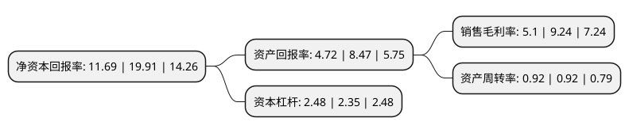

> 本页面由自动化程序生成于 2022年5月20日 01:26
> 内容可能存在错误，如有bug请提交issue至：https://github.com/Eroleice/doc-pi/issues
{.is-warning}

# 上市公司基本情况

## 基本资料

杭萧钢构股份有限公司（以下简称“杭萧钢构”）成立于2000年12月28日，杭州市。于2003年11月10日在上交所主板上市。

杭萧钢构注册资本236,911.115万元，主要产品:轻型钢结构，多高层钢结构，商品销售。以下是详细信息：

- 公司名称: 杭萧钢构股份有限公司
- 股票代码: 600477.SH
- 所在地: 浙江 - 杭州市
- 成立日期: 2000年12月28日
- 注册资本: 236,911.115万元
- 法定代表人: 单银木
- 主营业务: 主要产品:轻型钢结构，多高层钢结构，商品销售
- 公司官网: www.hxss.com.cn
- 公司介绍: 公司主营业务包括多高层钢结构、轻钢结构、空间钢结构、建材产品，专业设计、制造、施工(安装)厂房钢结构、多(超)高层钢结构、大跨度空间钢结构、钢结构住宅、绿色建材(包括TD、钢筋桁架、钢筋桁架模板及连接件、CCA墙体部件、防火包梁柱体系等产品)。公司是建筑钢结构定点企业、国家火炬计划重点高新技术企业、国家住宅产业化基地和装配式建筑产业基地。公司拥有房屋建筑工程施工总承包壹级资质、建筑行业工程设计乙级资质、钢结构工程专业承包壹级资质、中国钢结构制造企业资质(特级)、轻型钢结构工程设计专项甲级资质、钢结构专项施工壹级资质，同时拥有美国钢结构协会AISC认证、新加坡SSSS认证、欧盟EN1090认证、ISO9001质量管理体系认证、ISO14001环境管理体系认证、ISO45001职业健康安全管理体系认证、ISO3834欧盟焊接管理体系认证、ISO10012AAA测量管理体系认证、GB/T50430工程建设施工企业质量管理规范认证、对外承包企业信用等级证书(A级)。公司主编、参编多项国家、地方、行业标准及规程规范，获得多项工程获鲁班奖、中国钢结构金奖、省(市)钢结构金奖等行业奖项。

## 股东及高管情况

上市公司第一大股东为单银木，持股904,713,764股，占比38.19%，为上市公司实际控制人。

截至2022年04月27日，上市公司的前十大股东中，共有6名自然人股东，2名机构股东，1个产品账户，1个海外主体，其中5%以上大股东共有1名。上市公司前十大股东明细如下：

> 截至2022年04月27日，上市公司前十大股东信息如下：

| 股东名称 | 持股数量（股） | 持股比例 |
| --- | --- | --- |
| 单银木 | 904,713,764 | 38.19% |
| 国泰君安证券股份有限公司 | 29,356,044 | 1.24% |
| 陆拥军 | 26,246,741 | 1.11% |
| 交通银行股份有限公司-广发中证基建工程交易型开放式指数证券投资基金 | 23,573,500 | 1% |
| 张振勇 | 22,037,700 | 0.93% |
| 浙江国泰建设集团有限公司 | 21,805,433 | 0.92% |
| 陈辉 | 18,125,472 | 0.77% |
| UBS AG | 16,192,709 | 0.68% |
| 陈素琴 | 15,173,885 | 0.64% |
| 单际华 | 14,904,900 | 0.63% |

## 利润表分析

上市公司2021年总收入为95.77亿元，净利润为4.88亿元，实现盈利。

## 杜邦分析

> 数据列示周期：2021年 | 2020年 | 2019年
{.is-info}

上市公司的净资产收益率在近一年有所下降，下降幅度为-41.29%，其变化情况分解如下：
- 上市公司的销售毛利率在近一年下降了-44.81%，可能是生产效率的下降、商品原材料价格上涨或商品价格的下跌所致。
- 上市公司的资产周转率在近一年下降了0%，可能是源自于更慢的销售回款或库存管理效果下降。
- 上市公司的财务杠杆比率在近一年上升了5.53%，可能是增加负债扩大生产规模。

