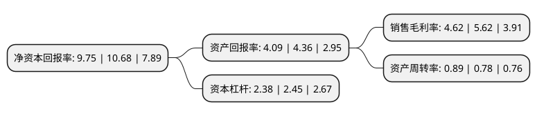

> 本页面由自动化程序生成于 2022年5月20日 01:26
> 内容可能存在错误，如有bug请提交issue至：https://github.com/Eroleice/doc-pi/issues
{.is-warning}

# 上市公司基本情况

## 基本资料

长江精工钢结构(集团)股份有限公司（以下简称“精工钢构”）成立于1999年06月28日，六安市。于2002年06月05日在上交所主板上市。

精工钢构注册资本201,287.435万元，主营业务:钢结构行业，农业机械行业。以下是详细信息：

- 公司名称: 长江精工钢结构(集团)股份有限公司
- 股票代码: 600496.SH
- 所在地: 安徽 - 六安市
- 成立日期: 1999年06月28日
- 注册资本: 201,287.435万元
- 法定代表人: 方朝阳
- 主营业务: 主营业务:钢结构行业，农业机械行业
- 公司官网: www.600496.com
- 公司介绍: 公司是一家集国际、国内大型建筑钢结构、钢结构建筑及金属屋面墙面等的设计、研发、销售、制造、施工于一体的大型上市集团公司。公司的主要业务为钢结构建筑及围护系统的设计、制作、施工和工程服务，是集设计、制作、安装、服务于一体的业务经营模式。主要产品体系包括用于轻型工业厂房、仓库等的工业建筑体系(轻型钢结构)、用于写字楼、商业用房、民用建筑的商业建筑系统(多高层重型钢结构)以及用于机场航站楼、火车站、文化体育场馆等的公共建筑系统(空间大跨度钢结构产品)。，公司积极开展装配式建筑的研发和推广，并形成了PSC住宅体系、公寓体系、学校体系、医院体系、办公楼体系五大产品体系。公司拥有建筑工程施工总承包一级资质、钢结构工程专业承包壹级资质、轻型钢结构工程设计专项甲级、中国钢结构制造企业特级资质、中国金属围护系统承包商资质证书。已取得《环境管理体系认证证书》、《质量管理体系认证证书》、《职业健康安全管理体系认证证书》，荣获多项“国家科学技术进步奖”、“詹天佑工程大奖”、“鲁班奖”、“国家钢结构金奖”。

## 股东及高管情况

上市公司第一大股东为精工控股集团(浙江)投资有限公司，持股300,000,000股，占比14.9%，**疑似为**上市公司实际控制人。

截至2022年03月31日，上市公司的前十大股东中，共有5名机构股东，5个产品账户，其中5%以上大股东共有2名。上市公司前十大股东明细如下：

> 未能通过持股比例判定出上市公司实际控制人（持股30%以上）
> 可能存在通过间接持股、联合持股、协议控制等方式拥有实际控制权的主体，具体请参考上市公司定期公告！
{.is-warning}

> 截至2022年03月31日，上市公司前十大股东信息如下：

| 股东名称 | 持股数量（股） | 持股比例 |
| --- | --- | --- |
| 精工控股集团(浙江)投资有限公司 | 300,000,000 | 14.9% |
| 精工控股集团有限公司 | 237,069,604 | 11.78% |
| 六安市产业投资发展有限公司 | 43,782,152 | 2.18% |
| 交通银行股份有限公司-广发中证基建工程交易型开放式指数证券投资基金 | 25,094,100 | 1.25% |
| 友邦人寿保险有限公司-分红 | 16,636,000 | 0.83% |
| 华夏人寿保险股份有限公司-分红-个险分红 | 16,512,300 | 0.82% |
| 交通银行-华夏蓝筹核心混合型证券投资基金(LOF) | 12,802,500 | 0.64% |
| 中国建设银行股份有限公司-兴全多维价值混合型证券投资基金 | 12,615,975 | 0.63% |
| 中国建设银行股份有限公司-华夏兴和混合型证券投资基金 | 10,350,100 | 0.51% |
| 招商银行股份有限公司-华夏鸿阳6个月持有期混合型证券投资基金 | 9,207,700 | 0.46% |

## 利润表分析

上市公司2021年总收入为151.41亿元，净利润为6.99亿元，实现盈利。

## 杜邦分析

> 数据列示周期：2021年 | 2020年 | 2019年
{.is-info}

上市公司的净资产收益率在近一年有所下降，下降幅度为-8.71%，其变化情况分解如下：
- 上市公司的销售毛利率在近一年下降了-17.79%，可能是生产效率的下降、商品原材料价格上涨或商品价格的下跌所致。
- 上市公司的资产周转率在近一年上升了14.1%，可能是源自于更快的销售回款或库存管理效果提升。
- 上市公司的财务杠杆比率在近一年下降了-2.86%，可能是减少负债降低财务费用。

